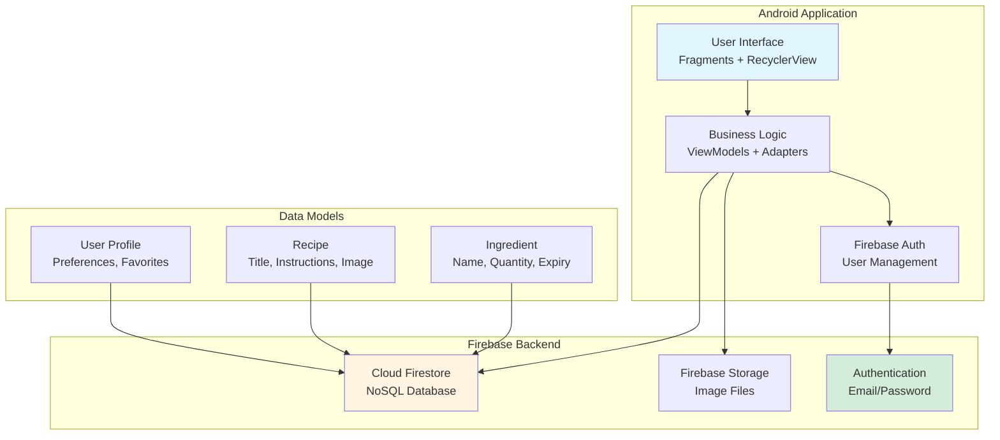
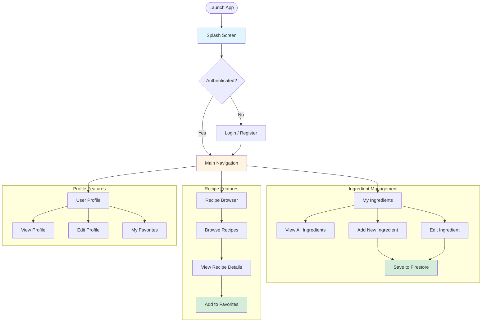
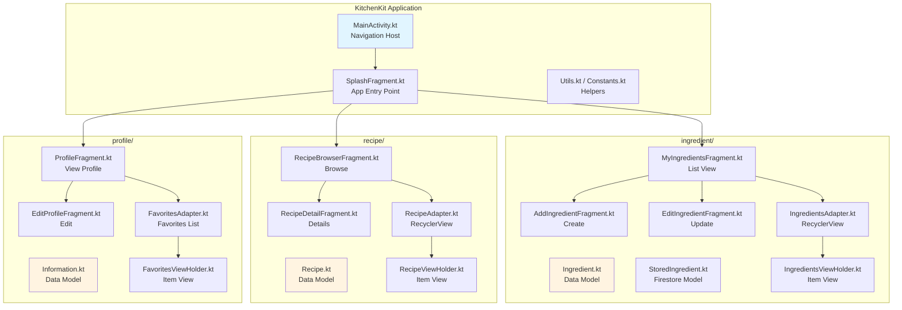
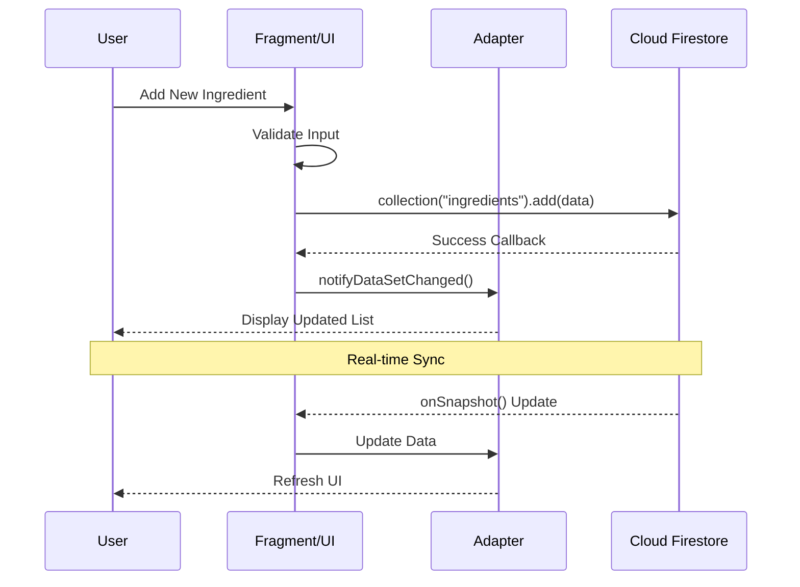
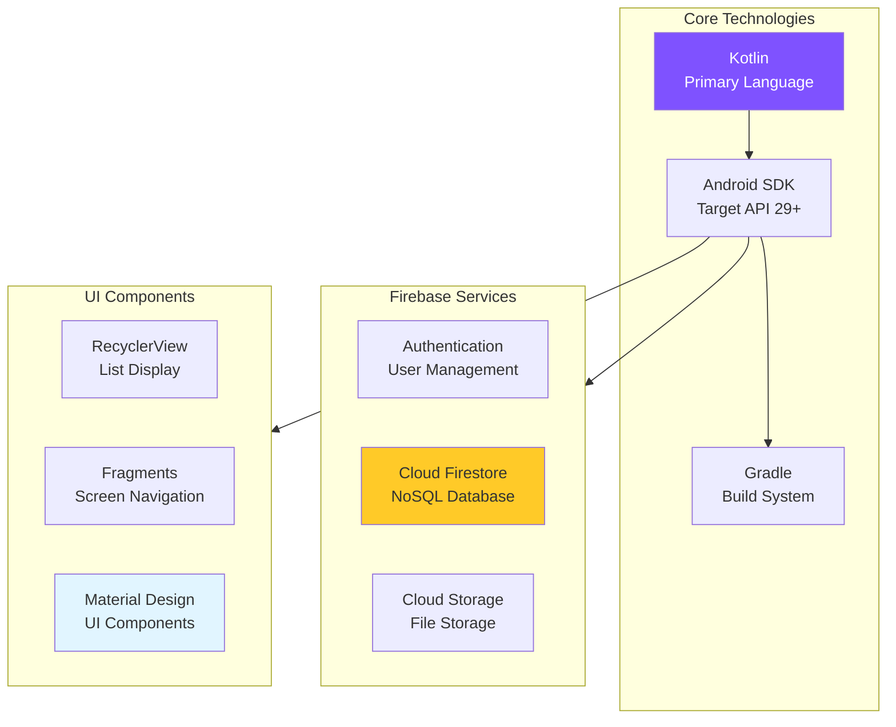

<div class="content-en" markdown="1">

Android, Kotlin, Firebase, Firestore, Authentication, CRUD, Mobile Development

[View This Project on GitHub](https://github.com/nu-jliu/CSSE483_Team_Project)

[Figma Design](https://www.figma.com/design/zLoVGME063NUiGjuXjQFZ7/Kitchen-Kit) | [Project Documentation](https://docs.google.com/document/d/1dXJyXBQQhVCJyxOmel_rmhNG07zNHCaK0wcTT7sSRu8/edit)

# Project Description

Kitchen Kit is an Android mobile application designed to help users manage their kitchen inventory and discover recipes based on available ingredients. Built as a team project for CSSE483 (Android Application Development) at Rose-Hulman Institute of Technology, the app provides a comprehensive solution for tracking ingredients, browsing recipes, and maintaining personalized favorites.

The application leverages Firebase for cloud-based data synchronization, enabling users to access their kitchen inventory across multiple devices in real-time.

**Team Members:** Allen Liu, Ray Fang

# System Architecture



# Application Features



**Key Features:**

- **Ingredient Tracking**: Add, edit, and delete kitchen ingredients with details like name, quantity, and expiration date
- **Recipe Browser**: Discover recipes with detailed instructions and ingredient lists
- **User Authentication**: Secure login and registration via Firebase Authentication
- **Favorites System**: Save favorite recipes for quick access
- **Cloud Sync**: Real-time data synchronization across devices via Firestore
- **Image Support**: Upload and display photos for recipes and ingredients
- **User Profiles**: Personalized user profiles with customizable settings

# Technical Implementation

## Module Architecture



## CRUD Operations

The application implements full CRUD (Create, Read, Update, Delete) operations for ingredients:

| Operation | Component | Firebase Method |
|-----------|-----------|-----------------|
| **Create** | AddIngredientFragment | `collection.add()` |
| **Read** | MyIngredientsFragment | `collection.get()` with listeners |
| **Update** | EditIngredientFragment | `document.update()` |
| **Delete** | IngredientsAdapter | `document.delete()` |

## Data Flow



# Demo

<iframe width="560" height="315" src="https://www.youtube.com/embed/3pT0qUzxewI" title="YouTube video player" frameborder="0" allow="accelerometer; autoplay; clipboard-write; encrypted-media; gyroscope; picture-in-picture; web-share" referrerpolicy="strict-origin-when-cross-origin" allowfullscreen></iframe>

# Technical Stack



| Component | Technology | Purpose |
|-----------|------------|---------|
| **Language** | Kotlin | Primary development language (99.2% of codebase) |
| **Platform** | Android | Native mobile application |
| **Build System** | Gradle | Dependency management and build automation |
| **Database** | Cloud Firestore | Real-time NoSQL cloud database |
| **Authentication** | Firebase Auth | User login and registration |
| **Storage** | Firebase Storage | Image and file storage |
| **UI Pattern** | Fragment + RecyclerView | Modern Android UI architecture |
| **Design** | Material Design | Google's design system for Android |

# Project Structure

```
KitchenKit/
├── app/
│   └── src/main/java/edu/rosehulman/fangr/kitchenkit/
│       ├── MainActivity.kt           # Main entry point
│       ├── SplashFragment.kt          # Splash screen
│       ├── Constants.kt               # App constants
│       ├── Utils.kt                   # Utility functions
│       ├── BitmapUtils.kt             # Image processing
│       ├── ingredient/
│       │   ├── Ingredient.kt          # Ingredient model
│       │   ├── StoredIngredient.kt    # Firestore model
│       │   ├── MyIngredientsFragment.kt
│       │   ├── AddIngredientFragment.kt
│       │   ├── EditIngredientFragment.kt
│       │   ├── IngredientsAdapter.kt
│       │   └── IngredientsViewHolder.kt
│       ├── recipe/
│       │   ├── Recipe.kt              # Recipe model
│       │   ├── RecipeBrowserFragment.kt
│       │   ├── RecipeDetailFragment.kt
│       │   ├── RecipeAdapter.kt
│       │   └── RecipeViewHolder.kt
│       └── profile/
│           ├── Information.kt         # User info model
│           ├── ProfileFragment.kt
│           ├── EditProfileFragment.kt
│           ├── FavoritesAdapter.kt
│           └── FavoritesViewHolder.kt
├── build.gradle
└── README.md
```

</div>

<div class="content-zh" markdown="1">

Android, Kotlin, Firebase, Firestore, 身份验证, CRUD, 移动开发

[在 GitHub 上查看此项目](https://github.com/nu-jliu/CSSE483_Team_Project)

[Figma 设计](https://www.figma.com/design/zLoVGME063NUiGjuXjQFZ7/Kitchen-Kit) | [项目文档](https://docs.google.com/document/d/1dXJyXBQQhVCJyxOmel_rmhNG07zNHCaK0wcTT7sSRu8/edit)

# 项目描述

Kitchen Kit 是一款 Android 移动应用程序，旨在帮助用户管理厨房库存并根据现有食材发现食谱。该应用作为罗斯-霍尔曼理工学院 CSSE483（Android 应用开发）课程的团队项目开发，为跟踪食材、浏览食谱和维护个性化收藏提供了全面的解决方案。

该应用程序利用 Firebase 进行基于云的数据同步，使用户能够在多个设备上实时访问其厨房库存。

**团队成员：** Allen Liu, Ray Fang

# 应用功能

**主要功能：**

- **食材追踪**：添加、编辑和删除厨房食材，包括名称、数量和过期日期等详细信息
- **食谱浏览器**：发现带有详细说明和食材清单的食谱
- **用户身份验证**：通过 Firebase Authentication 进行安全登录和注册
- **收藏系统**：保存喜爱的食谱以便快速访问
- **云同步**：通过 Firestore 实现跨设备实时数据同步
- **图片支持**：上传和显示食谱和食材的照片
- **用户资料**：个性化用户资料和可自定义设置

# 演示

<iframe width="560" height="315" src="https://www.youtube.com/embed/3pT0qUzxewI" title="YouTube video player" frameborder="0" allow="accelerometer; autoplay; clipboard-write; encrypted-media; gyroscope; picture-in-picture; web-share" referrerpolicy="strict-origin-when-cross-origin" allowfullscreen></iframe>

# 技术栈

| 组件 | 技术 | 用途 |
|-----------|------------|---------|
| **编程语言** | Kotlin | 主要开发语言（占代码库的 99.2%）|
| **平台** | Android | 原生移动应用 |
| **构建系统** | Gradle | 依赖管理和构建自动化 |
| **数据库** | Cloud Firestore | 实时 NoSQL 云数据库 |
| **身份验证** | Firebase Auth | 用户登录和注册 |
| **存储** | Firebase Storage | 图片和文件存储 |
| **UI 模式** | Fragment + RecyclerView | 现代 Android UI 架构 |
| **设计** | Material Design | Google 的 Android 设计系统 |

</div>
