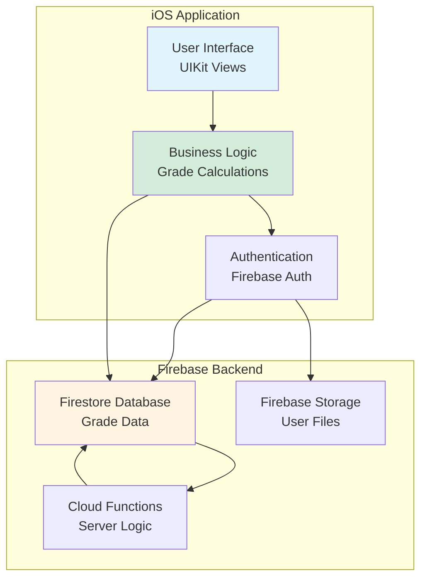
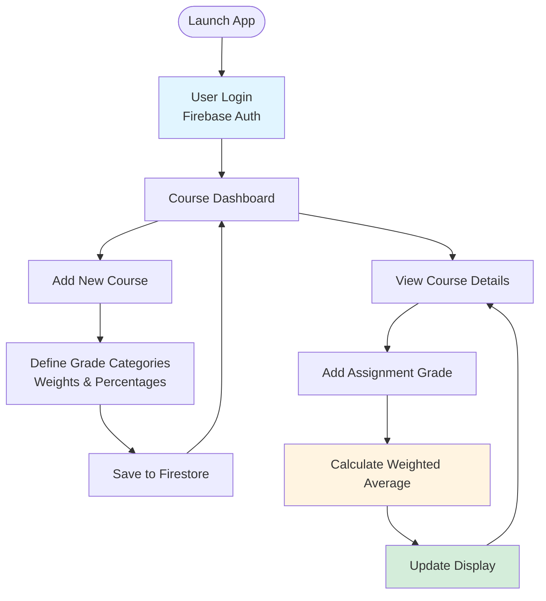
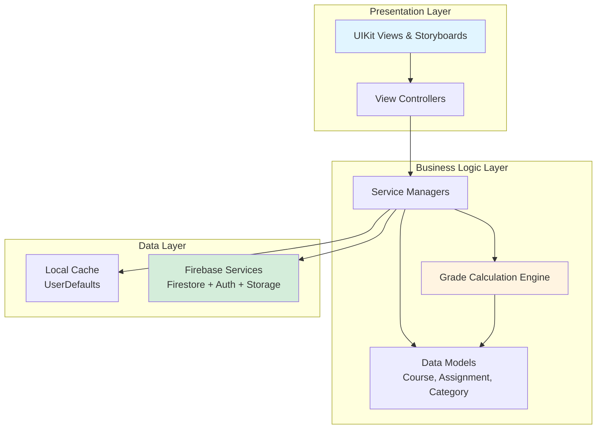

iOS Application Development, Firebase, Firestore, Storage, Cloud Function, CRUD

# Project Description

An iOS mobile application for tracking weighted course grades at Rose-Hulman Institute of Technology. The app enables students to monitor academic performance in real-time without waiting for professors to update online grade portals.

## System Architecture

## Application Features

**Key Features:**
- **User Authentication**: Secure login with Firebase Authentication
- **CRUD Operations**: Create, Read, Update, Delete courses and assignments
- **Weighted Grade Calculation**: Automatic computation of course grades based on category weights
- **Cloud Sync**: Real-time data synchronization across devices via Firestore
- **Persistent Storage**: All data backed up to Firebase Cloud Storage 

# Result
<iframe width="560" height="315" src="https://www.youtube.com/embed/GHCMnqXv9Ag?si=3u_7dJ0wV5REJ0S0" title="YouTube video player" frameborder="0" allow="accelerometer; autoplay; clipboard-write; encrypted-media; gyroscope; picture-in-picture; web-share" referrerpolicy="strict-origin-when-cross-origin" allowfullscreen></iframe>

# Three-Tier Architecture

The application follows a clean three-layer architecture pattern:

Original architecture diagram:

## Technical Stack

- **Frontend**: Swift, UIKit, Storyboard
- **Backend**: Firebase (Firestore, Authentication, Cloud Storage, Cloud Functions)
- **Architecture Pattern**: MVC (Model-View-Controller)
- **Data Persistence**: Firestore (cloud) + UserDefaults (local cache)
- **Networking**: Firebase SDK

## Grade Calculation Algorithm

The weighted grade calculation follows this formula:

$$
\text{Final Grade} = \sum_{i=1}^{n} \left( \text{Category}_i \times \text{Weight}_i \right)
$$

Where each category grade is computed as:

$$
\text{Category}_i = \frac{\sum_{j=1}^{m} \text{Score}_{ij}}{\sum_{j=1}^{m} \text{MaxScore}_{ij}} \times 100
$$
