

iOS Application Development, Firebase, Firestore, Storage, Cloud Function, CRUD

[View This Project on GitHub](https://github.com/nu-jliu/CSSE484/tree/main/Project)

# Project Description

An iOS mobile application for tracking weighted course grades at Rose-Hulman Institute of Technology. The app enables students to monitor academic performance in real-time without waiting for professors to update online grade portals. Built as part of the CSSE484 iOS App Development course, this application demonstrates proficiency in Swift, UIKit, and Firebase backend services.

**Key Features:**
- **Rosefire Authentication**: Secure single sign-on using Rose-Hulman's Rosefire authentication system
- **CRUD Operations**: Create, Read, Update, Delete courses and assignments with real-time synchronization
- **Weighted Grade Calculation**: Automatic computation of course grades based on customizable category weights
- **Real-time Cloud Sync**: Live data synchronization across devices via Firestore snapshot listeners
- **GPA Tracking**: Automatic cumulative GPA calculation across all enrolled courses
- **Internationalization**: Support for multiple languages including English and Chinese

# Demo Video

<iframe width="560" height="315" src="https://www.youtube.com/embed/GHCMnqXv9Ag?si=3u_7dJ0wV5REJ0S0" title="YouTube video player" frameborder="0" allow="accelerometer; autoplay; clipboard-write; encrypted-media; gyroscope; picture-in-picture; web-share" referrerpolicy="strict-origin-when-cross-origin" allowfullscreen></iframe>

# System Architecture

The application follows a clean Model-View-Controller (MVC) architecture with a singleton-based service layer for Firebase interactions.

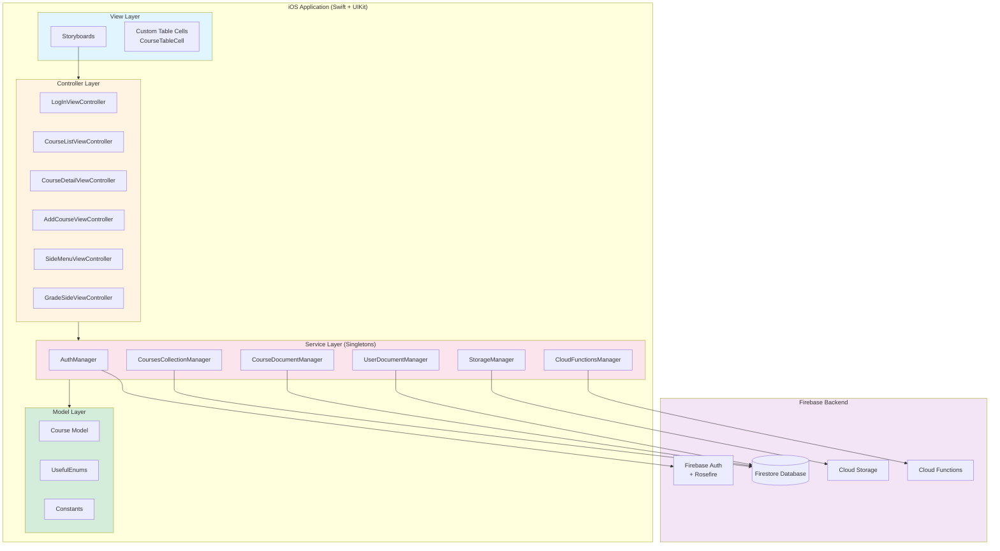

# Class Structure

## Data Model - Course

The `Course` class encapsulates all information about an academic course including grades and weights:

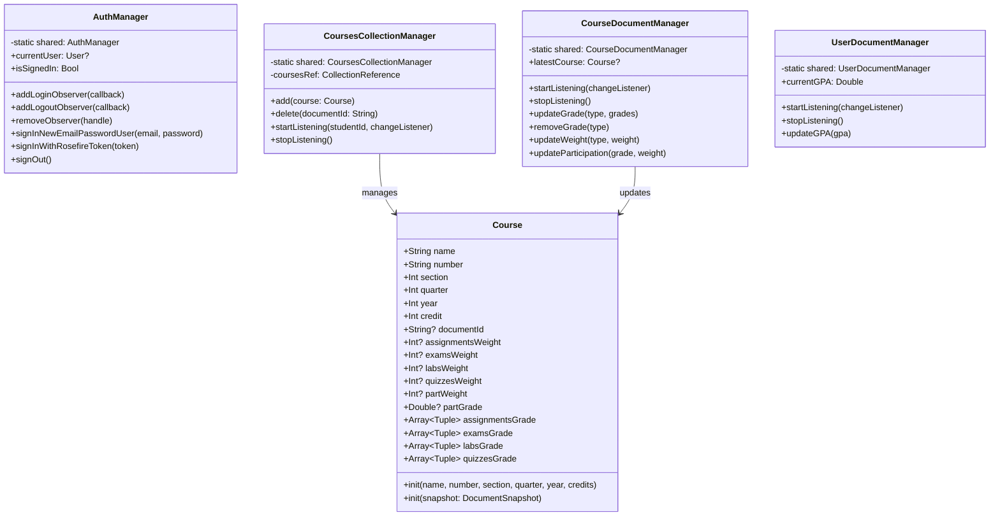

## Firestore Data Structure

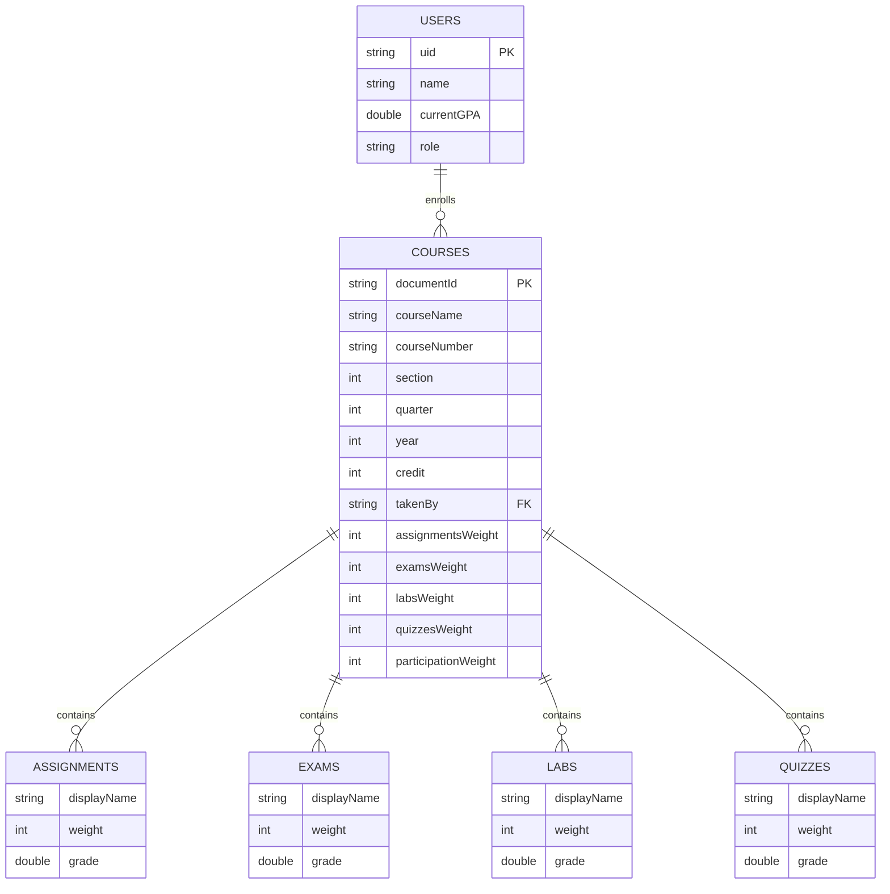

# Sequence Diagrams

## User Authentication Flow

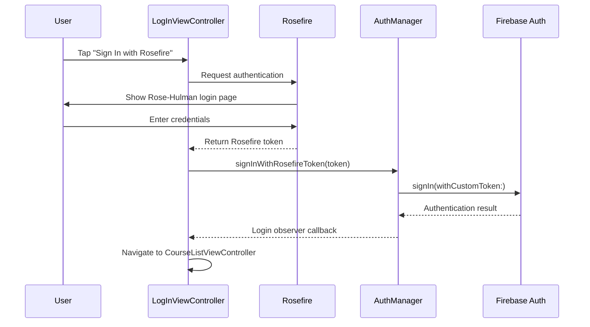

## Course List Loading Flow

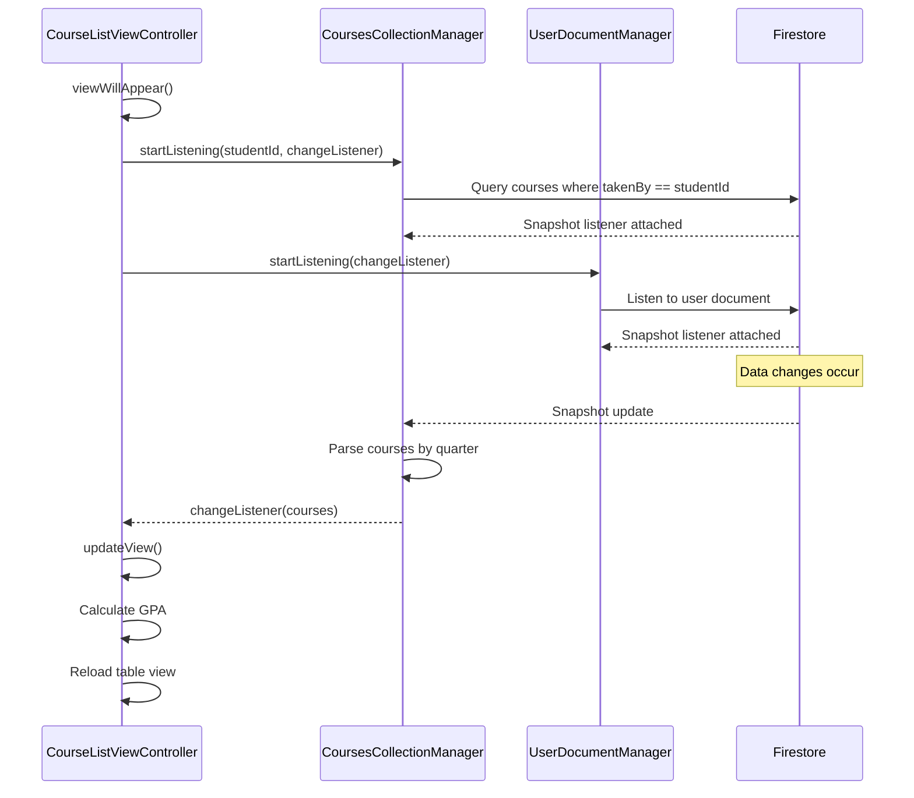

## Add New Course Flow

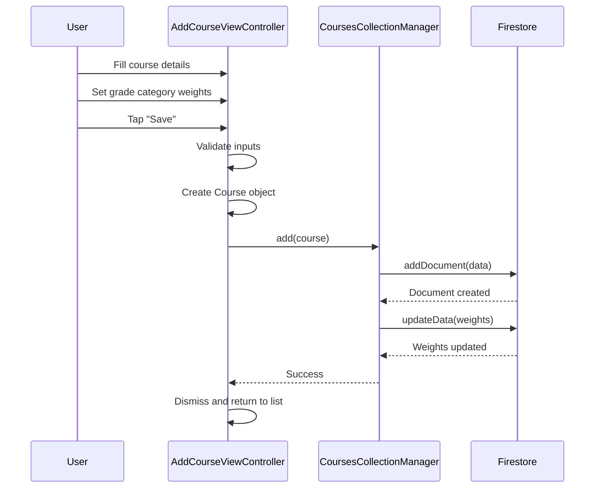

## Grade Entry Flow

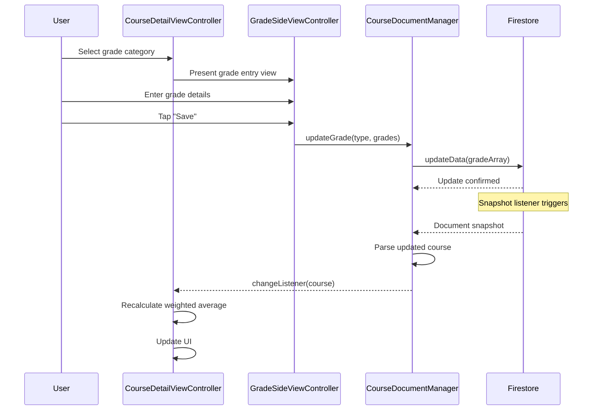

## Delete Course Flow

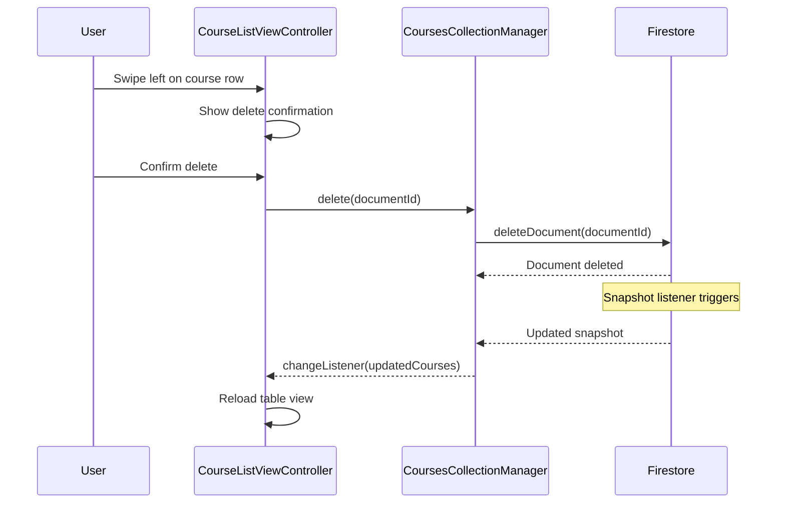

# Technical Implementation Details

## Manager Layer (Singleton Pattern)

The application uses a singleton-based service layer to manage Firebase interactions:

| Manager | Responsibility |
|---------|---------------|
| `AuthManager` | Handles user authentication via Firebase Auth and Rosefire SSO |
| `CoursesCollectionManager` | Manages the courses collection with CRUD operations |
| `CourseDocumentManager` | Handles individual course document updates (grades, weights) |
| `UserDocumentManager` | Manages user profile data and GPA |
| `StorageManager` | Handles file uploads/downloads to Firebase Storage |
| `CloudFunctionsManager` | Invokes Firebase Cloud Functions for server-side logic |

## Real-time Data Synchronization

The app uses Firestore snapshot listeners for real-time updates:

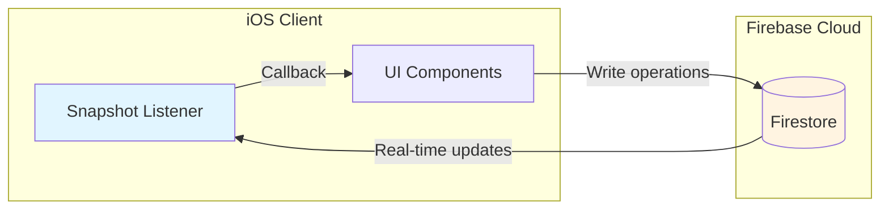

## Grade Calculation Algorithm

The weighted grade calculation follows this formula:

$$
\text{Final Grade} = \sum_{i=1}^{n} \left( \text{Category}_i \times \text{Weight}_i \right)
$$

Where each category grade is computed as:

$$
\text{Category}_i = \frac{\sum_{j=1}^{m} \text{Score}_{ij}}{\sum_{j=1}^{m} \text{MaxScore}_{ij}} \times 100
$$

**Grade Categories:**
- Assignments (configurable weight)
- Exams (configurable weight)
- Labs (configurable weight)
- Quizzes (configurable weight)
- Participation (configurable weight)

## Technical Stack

| Component | Technology |
|-----------|------------|
| **Language** | Swift 5 |
| **UI Framework** | UIKit with Storyboards |
| **Architecture** | MVC (Model-View-Controller) |
| **Backend** | Firebase (Auth, Firestore, Storage, Functions) |
| **Authentication** | Rosefire SSO + Firebase Custom Tokens |
| **Data Persistence** | Firestore (cloud) + UserDefaults (local cache) |
| **Dependency Management** | CocoaPods |

## View Controllers

| Controller | Purpose |
|-----------|---------|
| `LogInViewController` | Handles Rosefire authentication flow |
| `CourseListViewController` | Displays courses organized by quarter with GPA |
| `CourseDetailViewController` | Shows course details and grade breakdown |
| `AddCourseViewController` | Form for creating new courses with weights |
| `GradeSideViewController` | Slide-in panel for entering grades |
| `SideMenuViewController` | Navigation menu with settings and logout |

iOS 应用开发, Firebase, Firestore, 存储, 云函数, CRUD

[在 GitHub 上查看此项目](https://github.com/nu-jliu/CSSE484/tree/main/Project)

# 项目描述

一款用于追踪罗斯-霍尔曼理工学院加权课程成绩的 iOS 移动应用程序。该应用使学生能够实时监控学业表现，无需等待教授更新在线成绩门户。作为 CSSE484 iOS 应用开发课程的一部分，此应用展示了 Swift、UIKit 和 Firebase 后端服务的熟练使用。

**主要功能：**
- **Rosefire 身份验证**：使用罗斯-霍尔曼的 Rosefire 身份验证系统进行安全单点登录
- **CRUD 操作**：创建、读取、更新、删除课程和作业，支持实时同步
- **加权成绩计算**：根据可自定义的类别权重自动计算课程成绩
- **实时云同步**：通过 Firestore 快照监听器实现跨设备实时数据同步
- **GPA 追踪**：自动计算所有已注册课程的累计 GPA
- **国际化**：支持多种语言，包括英语和中文

# 演示视频

<iframe width="560" height="315" src="https://www.youtube.com/embed/GHCMnqXv9Ag?si=3u_7dJ0wV5REJ0S0" title="YouTube video player" frameborder="0" allow="accelerometer; autoplay; clipboard-write; encrypted-media; gyroscope; picture-in-picture; web-share" referrerpolicy="strict-origin-when-cross-origin" allowfullscreen></iframe>

# 系统架构

该应用程序遵循清晰的模型-视图-控制器 (MVC) 架构，并使用基于单例的服务层进行 Firebase 交互。

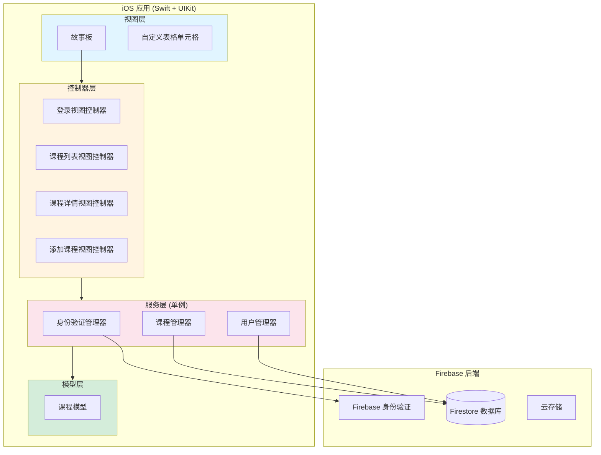

# 用户认证流程

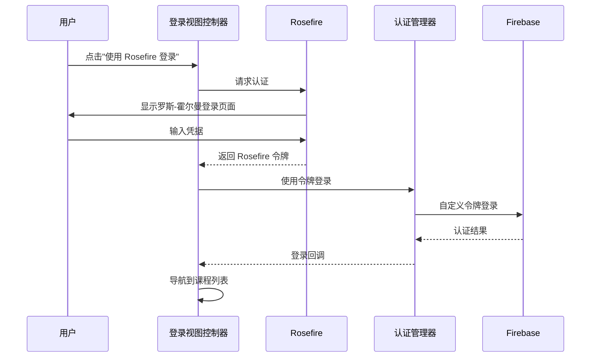

# 成绩计算算法

加权成绩计算遵循以下公式：

$$
\text{最终成绩} = \sum_{i=1}^{n} \left( \text{类别}_i \times \text{权重}_i \right)
$$

其中每个类别成绩计算为：

$$
\text{类别}_i = \frac{\sum_{j=1}^{m} \text{得分}_{ij}}{\sum_{j=1}^{m} \text{满分}_{ij}} \times 100
$$

## 技术栈

| 组件 | 技术 |
|------|------|
| **语言** | Swift 5 |
| **UI 框架** | UIKit + 故事板 |
| **架构** | MVC (模型-视图-控制器) |
| **后端** | Firebase (身份验证, Firestore, 存储, 云函数) |
| **认证** | Rosefire SSO + Firebase 自定义令牌 |
| **数据持久化** | Firestore (云端) + UserDefaults (本地缓存) |
| **依赖管理** | CocoaPods |

