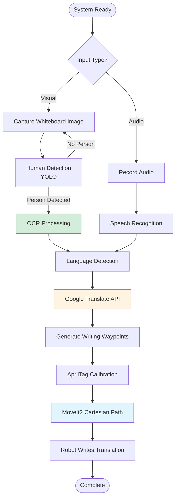
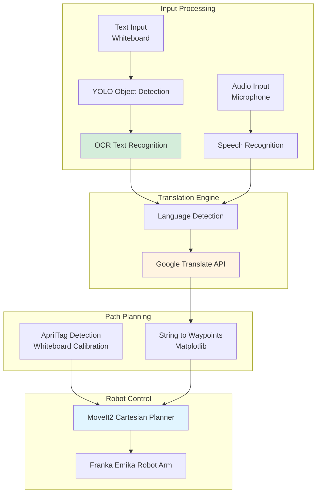

OCR, YOLO, Python, ROS2, MoveIt2, Emika Franka Robot Arm

**Authors**: Allen Liu, Damien Koh, Kassidy Shedd, Henry Brown, Megan Black

**GitHub**: [View this project on GitHub](https://github.com/nu-jliu/final-project-me495)

# Project Description

This project implements a multilingual translation robot system that processes input from either written text on a whiteboard or spoken audio through a microphone. The system performs real-time language detection, translation, and physically writes the translated output using a robotic arm.

## System Workflow

The system integrates natural language processing, machine learning, computer vision, and robotics to create a cohesive multilingual translation platform with physical output capabilities.

# System Architecture

This project integrates five specialized subsystems to enable multilingual translation and robotic writing.

**Subsystem Responsibilities:**
 - **`writer`** (Allen): Cartesian path planning using MoveIt2 for writing characters on the whiteboard, with AprilTag-based calibration
 - **`translation`** (Damien): Google Translate API integration for language translation
 - **`computer_vision`** (Megan): YOLO object detection and OCR for text recognition and human detection
 - **`string2waypoints`** (Kassidy): Matplotlib-based waypoint generation for character trajectories
 - **`apriltags`** (Henry): AprilTag detection for whiteboard localization and orientation 

# Features

## Translate from Chinese to English
<iframe width="560" height="315" src="https://www.youtube.com/embed/EdNptTr9Y0U?si=ZA9z5NeRokLx9CQw" title="YouTube video player" frameborder="0" allow="accelerometer; autoplay; clipboard-write; encrypted-media; gyroscope; picture-in-picture; web-share" allowfullscreen></iframe>

## Translate from German to French
<iframe width="560" height="315" src="https://www.youtube.com/embed/iFoNAHWQ9wE?si=es4q5_6K3KzxVzFM" title="YouTube video player" frameborder="0" allow="accelerometer; autoplay; clipboard-write; encrypted-media; gyroscope; picture-in-picture; web-share" allowfullscreen></iframe>

## Translate from Spanish to Korean
<iframe width="560" height="315" src="https://www.youtube.com/embed/Qjd3jGlU8Ds?si=3aTC0FWY6vf4mSaL" title="YouTube video player" frameborder="0" allow="accelerometer; autoplay; clipboard-write; encrypted-media; gyroscope; picture-in-picture; web-share" allowfullscreen></iframe>

## Translate from Simpified Chinese to Traditional Chinese 
<iframe width="560" height="315" src="https://www.youtube.com/embed/9GdGPy74Qwg?si=FwCUxvQhKl4Oi-Fo" title="YouTube video player" frameborder="0" allow="accelerometer; autoplay; clipboard-write; encrypted-media; gyroscope; picture-in-picture; web-share" allowfullscreen></iframe>

## Hindi Voice to English
<iframe width="560" height="315" src="https://www.youtube.com/embed/BeQzYUYSe5k?si=6rlJjthlDPSmCw-F" title="YouTube video player" frameborder="0" allow="accelerometer; autoplay; clipboard-write; encrypted-media; gyroscope; picture-in-picture; web-share" allowfullscreen></iframe>

## Spanish Voice to English
<iframe width="560" height="315" src="https://www.youtube.com/embed/9PCf_-gbIbU?si=YZCxg8eNQXIZg_Oy" title="YouTube video player" frameborder="0" allow="accelerometer; autoplay; clipboard-write; encrypted-media; gyroscope; picture-in-picture; web-share" allowfullscreen></iframe>

# Challenges
 - *Cartesian Path Planner*: When initially incorporating the `find cartesian path` functionality using the `MoveIt` API, we encountered a challenge where `RViz` indicated that the robot had identified the path but was unable to execute it. To address this issue, we examined our code related to the `MoveIt` API, specifically focusing on the function responsible for calling the `ComputeCartesianPath` service. Upon comparing our implementation with the official `MoveIt` documentation, we identified a crucial missing parameter known as `cartesian_speed_limit_link`, which had not been specified in our code. Once we addressed this omission and provided the necessary parameter, the robot successfully executed the intended movements.
 - *TF tree when integrating `apriltags`*: Upon the initial implementation of `apriltags` on the robot, we encountered an issue where the robot occasionally failed to move as intended, leading to collisions when approaching certain orientations and positions. To address this challenge, our debugging process involved a thorough examination of the `TF tree` associated with the robot. We conducted numerous experiments by sending various commands, instructing the robot to move in all possible directions. During this investigation, a crucial insight emerged when analyzing the `TF tree`. It was discovered that with the introduction of `apriltags` into the system, the root frame of the `TF tree` shifted from `panda_link0`, the base frame of the robot, to `camera_link`. Consequently, the commands we were sending were relative to the `camera_link` frame rather than the base frame. Upon rectifying this discrepancy, specifically aligning the commands with the correct base frame, the robot executed movements flawlessly.

# Possible Improvements
 - Some script language still fail to detect: To resolve this issue, we can try to refind the language model by training more dataset on the script languages making it easier to detect the script languages.
 - Sometimes, the camera source get dropped, need to re-launch all: This happened because sometimes the `realsense` camera package does not detect the camera successfully so that it will throw can error when that happens. To address this issue, we can surround that with a protect function that catch the error when it throws and try it again.

OCR, YOLO, Python, ROS2, MoveIt2, Emika Franka 机械臂

**作者**: Allen Liu, Damien Koh, Kassidy Shedd, Henry Brown, Megan Black

**GitHub**: [在 GitHub 上查看此项目](https://github.com/nu-jliu/final-project-me495)

# 项目描述

该项目实现了一个多语言翻译机器人系统，可以处理白板上的书写文字或通过麦克风输入的语音。系统进行实时语言检测、翻译，并使用机械臂物理书写翻译输出。

该系统集成了自然语言处理、机器学习、计算机视觉和机器人技术，创建了一个具有物理输出能力的统一多语言翻译平台。

# 系统架构

该项目集成了五个专业子系统，实现多语言翻译和机器人书写。

**子系统职责:**
 - **`writer`** (Allen): 使用 MoveIt2 进行笛卡尔路径规划，在白板上书写字符，并使用 AprilTag 进行标定
 - **`translation`** (Damien): Google Translate API 集成，用于语言翻译
 - **`computer_vision`** (Megan): YOLO 目标检测和 OCR，用于文字识别和人体检测
 - **`string2waypoints`** (Kassidy): 基于 Matplotlib 的字符轨迹航点生成
 - **`apriltags`** (Henry): AprilTag 检测，用于白板定位和方向确定

# 演示视频

## 中文翻译成英文
<iframe width="560" height="315" src="https://www.youtube.com/embed/EdNptTr9Y0U?si=ZA9z5NeRokLx9CQw" title="YouTube video player" frameborder="0" allow="accelerometer; autoplay; clipboard-write; encrypted-media; gyroscope; picture-in-picture; web-share" allowfullscreen></iframe>

## 德语翻译成法语
<iframe width="560" height="315" src="https://www.youtube.com/embed/iFoNAHWQ9wE?si=es4q5_6K3KzxVzFM" title="YouTube video player" frameborder="0" allow="accelerometer; autoplay; clipboard-write; encrypted-media; gyroscope; picture-in-picture; web-share" allowfullscreen></iframe>

## 简体中文翻译成繁体中文
<iframe width="560" height="315" src="https://www.youtube.com/embed/9GdGPy74Qwg?si=FwCUxvQhKl4Oi-Fo" title="YouTube video player" frameborder="0" allow="accelerometer; autoplay; clipboard-write; encrypted-media; gyroscope; picture-in-picture; web-share" allowfullscreen></iframe>

