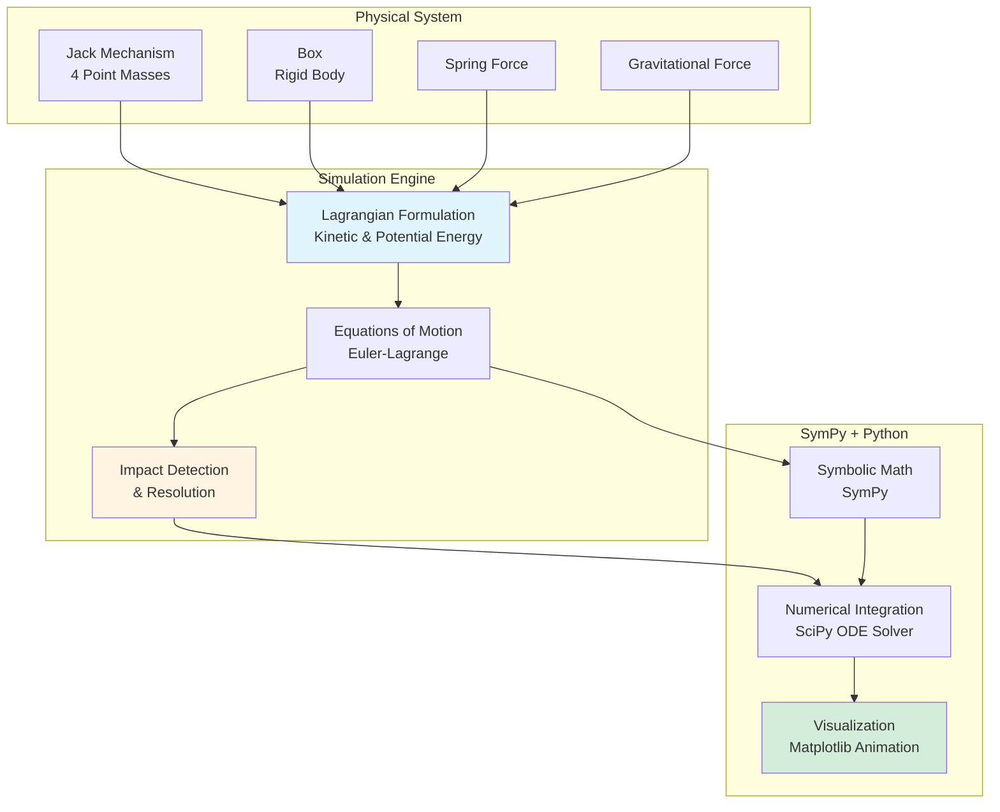
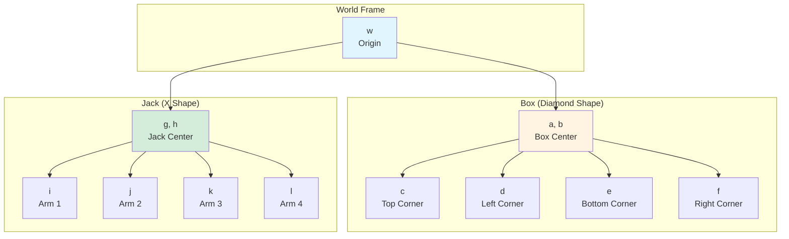

Python, SymPy, Dynamics

**Authors**: Allen Liu

**GitHub**: [View this Project on GitHub](https://github.com/nu-jliu/MECH_ENG_314/blob/main/Final%20Project/final_project_allen.ipynb)

# Project Description

Physics-based simulation of a jack-in-the-box system using Lagrangian mechanics and impact dynamics. The project models the coupled dynamics of a spring-loaded jack mechanism inside a box, including collision detection and impulse-based contact resolution.

## System Overview

# Amination
The result of the jack and box simulation can be shown in the video below

<iframe width="560" height="315" src="https://www.youtube.com/embed/fi4AyBE95MQ?si=xvtY0axu523nGuCj" title="YouTube video player" frameborder="0" allow="accelerometer; autoplay; clipboard-write; encrypted-media; gyroscope; picture-in-picture; web-share" referrerpolicy="strict-origin-when-cross-origin" allowfullscreen></iframe>

# Structure

## Rigit Body Transformation

To model the dynamics about the jack and the box, we defined all necessary frames as shown in figure below:

Then we can calculate the transformation between all frames:

**Box Frame Transformations:**

$$
\begin{align*}
g_{wa} &= G(0, x_b, y_b) \\
g_{ab} &= G(\theta_b, 0, 0) \\
g_{bc} &= G\left(0, \frac{L_b}{2}, \frac{L_b}{2}\right) \\
g_{cd} &= G\left(0, -\frac{L_b}{2}, \frac{L_b}{2}\right) \\
g_{de} &= G\left(0, -\frac{L_b}{2}, -\frac{L_b}{2}\right) \\
g_{ef} &= G\left(0, \frac{L_b}{2}, -\frac{L_b}{2}\right)
\end{align*}
$$

**Jack Frame Transformations:**

$$
\begin{align*}
g_{wg} &= G(0, x_j, y_j) \\
g_{gh} &= G(\theta_j, 0, 0) \\
g_{hi} &= G\left(0, \frac{L_j}{2}, 0\right) \\
g_{hj} &= G\left(0, 0, \frac{L_j}{2}\right) \\
g_{hk} &= G\left(0, -\frac{L_j}{2}, 0\right) \\
g_{hl} &= G\left(0, 0, -\frac{L_j}{2}\right)
\end{align*}
$$

## Euler-Language Equation Formulation

In this project, to simplify the problem, we model the jack as 4 point mass with same mass, $m_j$, and model the box with the mass $m_b$ and moment of intertia of $I_b$, so that the total kinetic energy and potential energy can be easily obtained by this 

$$
\begin{align*}
 I &= \frac{1}{3}ML^2 \\
 I^{**} &= 
\begin{bmatrix}
    M & 0 & 0 & 0 & 0 & 0 \\
    0 & M & 0 & 0 & 0 & 0 \\
    0 & 0 & M & 0 & 0 & 0 \\
    0 & 0 & 0 & 0 & 0 & 0 \\
    0 & 0 & 0 & 0 & 0 & 0 \\
    0 & 0 & 0 & 0 & 0 & {\cal I} \\
\end{bmatrix} \\
V^b &= \check{\left( g^{-1} \dot{g} \right)} \\
K &= \sum_i{V_{ib}^T I_i^{**}V_i^b} \\
P &= \sum_i{ m_igh_i }\\
L &= K - P

\end{align*}
$$

## Impact Dynamics

The collision between jack and box is resolved using impulse-momentum equations.

**Impact Equations:**

$$
\begin{align*}
P \big |^{\tau_+}_{\tau_-} &= \lambda \Delta \phi \quad \text{(Momentum jump)}\\
{\cal H} \big |^{\tau_+}_{\tau_-} &= 0 \quad \text{(Hamiltonian conservation)}\\
{\cal H} &= \frac{d {\cal L}}{\dot{q}} \cdot \dot{q} - {\cal L} \quad \text{(Hamiltonian definition)}
\end{align*}
$$

Where:
- $ P $: Generalized momentum
- $ \lambda $: Impact impulse magnitude
- $ \Delta \phi $: Contact constraint gradient
- $ {\cal H} $: Hamiltonian (total energy)

By solving these equations, we simulate the complete dynamics of the jack-in-the-box system including realistic collision behavior.

<!-- <iframe width="560" height="315" src="https://www.youtube.com/embed/QBnimOgBjeg?si=DBGshXhhqxGaSYix" title="YouTube video player" frameborder="0" allow="accelerometer; autoplay; clipboard-write; encrypted-media; gyroscope; picture-in-picture; web-share" allowfullscreen></iframe>

# Challenges
 - *Solver algorithm*: When first implementing the algorithm for two solvers, it was difficult for us to understand the concept for the solver so we spent most of time drawing the process on a paper to visualize it. After we had a clear concept about what it was it was a smooth process for all of us. -->

Python, SymPy, 动力学

**作者**: Allen Liu

**GitHub**: [在 GitHub 上查看此项目](https://github.com/nu-jliu/MECH_ENG_314/blob/main/Final%20Project/final_project_allen.ipynb)

# 项目描述

使用拉格朗日力学和碰撞动力学对弹簧玩偶盒系统进行物理仿真。该项目对盒子内弹簧加载的玩偶机构的耦合动力学进行建模，包括碰撞检测和基于冲量的接触求解。

# 动画演示
弹簧玩偶盒仿真的结果可以在下面的视频中看到

<iframe width="560" height="315" src="https://www.youtube.com/embed/fi4AyBE95MQ?si=xvtY0axu523nGuCj" title="YouTube video player" frameborder="0" allow="accelerometer; autoplay; clipboard-write; encrypted-media; gyroscope; picture-in-picture; web-share" referrerpolicy="strict-origin-when-cross-origin" allowfullscreen></iframe>

# 结构

## 欧拉-拉格朗日方程推导

在这个项目中，为了简化问题，我们将玩偶建模为4个具有相同质量 $m_j$ 的质点，将盒子建模为质量 $m_b$ 和转动惯量 $I_b$ 的刚体，这样可以轻松获得总动能和势能。

## 碰撞动力学

玩偶和盒子之间的碰撞使用冲量-动量方程求解。

通过求解这些方程，我们模拟了弹簧玩偶盒系统的完整动力学，包括真实的碰撞行为。

