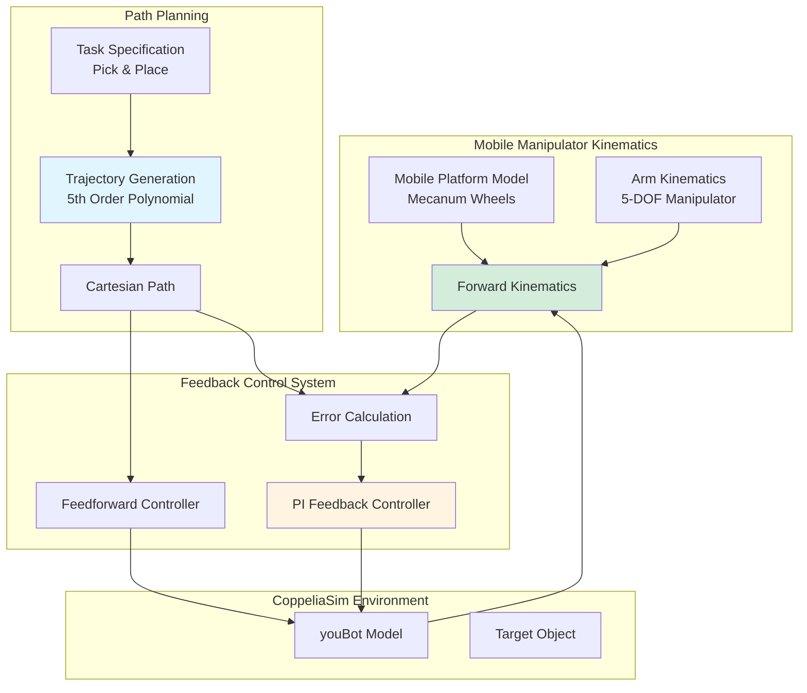
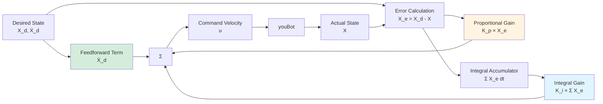

MATLAB, Robot Dynamics, Feedback Control, Feedforward Control, Mobile Manipulator, CoppeliaSim

**Authors**: Allen Liu

# Project Description
This project is to implement the feedforward/feedback control over the KUKA youBot to pick up a cube and place it at another place in the world.

# Goal
The goal of this project is to simulate the dynamics of the `KUKA youBot` in `CopeliaSim` and design the optimal controller given 3 scenarios: `Best`, `Overshoot` and `New Task`, in finding the values of proportinal gain `Kp` and integral gain `Ki` for each task.

 - `Best`: The robot follows the planned path without any overshoot and steady-state error.
 - `Overshoot`: The robot reaches the goal with zero steady-state error but overshoots along the way.
 - `New Task`: The robot follows the planned path to a new goal without overshoot and steady-state error.

# System Architecture

The project integrates three primary components to achieve autonomous mobile manipulation with feedback control.

**Key Components:**
 - **Kinematics**: Models the robot's motion, simulating how the platform responds to wheel velocities
 - **Path Planning**: Generates smooth 5th-order polynomial trajectories for the end-effector's pick-and-place task
 - **Feedback Control**: Implements PI control with feedforward to minimize tracking error along the planned trajectory

## Kinematic of the Mobile Platform
The KUKA youBot is a 4-wheel mobile robot, where each wheel can either moving in a stright-line or sliding sideways. The goal is to find the platform speed in `x`, `y` direction and the angular speed based on the speed of four wheels. The kinematics of the mobile platform can be modeled as:

$$
h_i(\phi) = \frac{1}{r_i \cos{\gamma_i}} \begin{bmatrix}
    x_i \sin{(\beta_i + \gamma_i)} - y_i \cos{(\beta_i + \gamma_i)} \\
    \cos{(\beta_i + \gamma_i + \phi)} \\
    \sin{(\beta_i + \gamma_i + \phi)}
\end{bmatrix}^\intercal
$$

And then by apply this model into the relationship between the `q_dot`, which is `[x_dot, y_dot, theta_dot]` and wheel speed vector `u`, we can get the platform speed based on the wheel speed:

$$
u = H(\phi)\dot{q} = \begin{bmatrix}
    h_1(\phi) \\
    h_2(\phi) \\
    \vdots \\
    h_m(\phi)
\end{bmatrix} \begin{bmatrix}
    \dot{\phi} \\
    \dot{x} \\
    \dot{y}
\end{bmatrix}
$$

## Cartesian Path Generator
To find the path from the start to the goal, I used the cartesian path planning to generate a 5th order cartesian path so that the robot starts and ends with zero accelerations. The path consists of 6 parts:
1. From home pose to the standoff pose relative to the start pose of the cube.
2. From standoff to reach to cube to grab it.
3. After grabing it, move back up to the stand-off pose.
4. Go to the stand-off pose relative to the goal pose of the cube.
5. Go to the cube final pose and release it. 
6. Go back to the stand-off pose relative to the goal pose of the cube.

## Feedback Control of the KUKA youBot

The control system combines feedforward and PI feedback for accurate trajectory tracking.

**Control Law:**

The control equation combines three terms:

$$
u = \text{Ad}_{X^{-1}X_d}\dot{X}_d + K_p X_e + K_i \int X_e \, dt
$$

Where:
- **Feedforward term**: $ \text{Ad}_{X^{-1}X_d}\dot{X}_d $ provides the desired velocity in the current frame
- **Proportional term**: $ K_p X_e $ corrects based on the current pose error
- **Integral term**: $ K_i \int X_e \, dt $ eliminates steady-state error by accumulating past errors

# Results
As shown in the error plot in the three senarios, on `Best` and `New Task`, after it converges, it stays on the planned path. And for the `Overshot`, it oscillates around the planned path and converges much slower than the other two scenarios.

## Best

<iframe width="890" height="500" src="https://www.youtube.com/embed/zywQvfy-PS4?si=zlTAs0RqH5aBKq7Y" title="YouTube video player" frameborder="0" allow="accelerometer; autoplay; clipboard-write; encrypted-media; gyroscope; picture-in-picture; web-share" allowfullscreen></iframe>

{: style="width: 890px, height: 550px"}

## Overshoot

<iframe width="890" height="500" src="https://www.youtube.com/embed/cx1av0MDxfc?si=9zS9ssWmjUnFb-OA" title="YouTube video player" frameborder="0" allow="accelerometer; autoplay; clipboard-write; encrypted-media; gyroscope; picture-in-picture; web-share" allowfullscreen></iframe>

## New Task

<iframe width="890" height="500" src="https://www.youtube.com/embed/cx1av0MDxfc?si=9zS9ssWmjUnFb-OA" title="YouTube video player" frameborder="0" allow="accelerometer; autoplay; clipboard-write; encrypted-media; gyroscope; picture-in-picture; web-share" allowfullscreen></iframe>

# Challenges
- *Finding Optimal `Kp` and `Ki`*: Discovering the ideal values for `Ki` and `Kp` poses a challenge in designing controllers that excel in various scenarios. Achieving optimal performance necessitates an iterative process for each parameter. Theoretical values alone often fall short of delivering the best results. To overcome this challenge, I invest a substantial amount of time in conducting extensive experiments. This approach allows me to identify and refine the most effective values for the controller, ensuring optimal performance across diverse situations.

<!-- # Possible improvements.
 - Some script language still fail to detect.
 - Sometimes, the camera source get dropped, need to re-launch all. -->

MATLAB, 机器人动力学, 反馈控制, 前馈控制, 移动机械臂, CoppeliaSim

**作者**: Allen Liu

# 项目描述
该项目旨在实现 KUKA youBot 的前馈/反馈控制，使其能够拾取一个立方体并将其放置到世界中的另一个位置。

# 目标
该项目的目标是在 CoppeliaSim 中模拟 KUKA youBot 的动力学，并在三种场景下设计最优控制器：`最佳`、`超调` 和 `新任务`，为每个任务找到比例增益 `Kp` 和积分增益 `Ki` 的值。

 - `最佳`: 机器人沿着规划路径行进，没有任何超调和稳态误差。
 - `超调`: 机器人到达目标时稳态误差为零，但在过程中有超调。
 - `新任务`: 机器人沿着规划路径到达新目标，没有超调和稳态误差。

# 结果

## 最佳

<iframe width="890" height="500" src="https://www.youtube.com/embed/zywQvfy-PS4?si=zlTAs0RqH5aBKq7Y" title="YouTube video player" frameborder="0" allow="accelerometer; autoplay; clipboard-write; encrypted-media; gyroscope; picture-in-picture; web-share" allowfullscreen></iframe>

## 超调

<iframe width="890" height="500" src="https://www.youtube.com/embed/cx1av0MDxfc?si=9zS9ssWmjUnFb-OA" title="YouTube video player" frameborder="0" allow="accelerometer; autoplay; clipboard-write; encrypted-media; gyroscope; picture-in-picture; web-share" allowfullscreen></iframe>

# 挑战
- *寻找最优 Kp 和 Ki*：发现 Ki 和 Kp 的理想值是设计在各种场景下表现出色的控制器时面临的挑战。实现最佳性能需要对每个参数进行迭代过程。仅凭理论值往往无法提供最佳结果。为了克服这一挑战，我花费大量时间进行广泛的实验。这种方法使我能够识别和完善控制器最有效的值，确保在各种情况下都能获得最佳性能。

