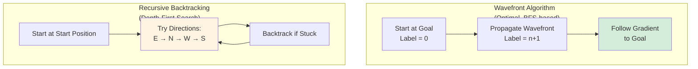
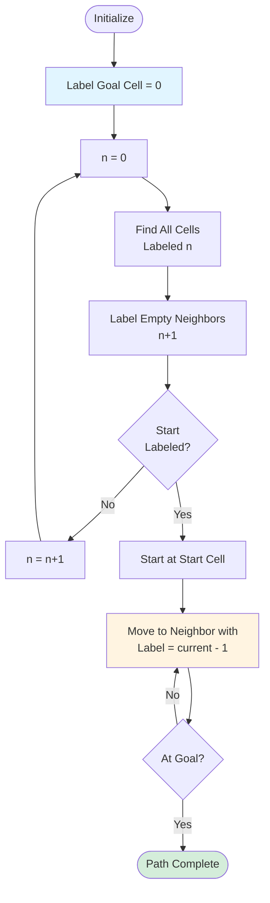
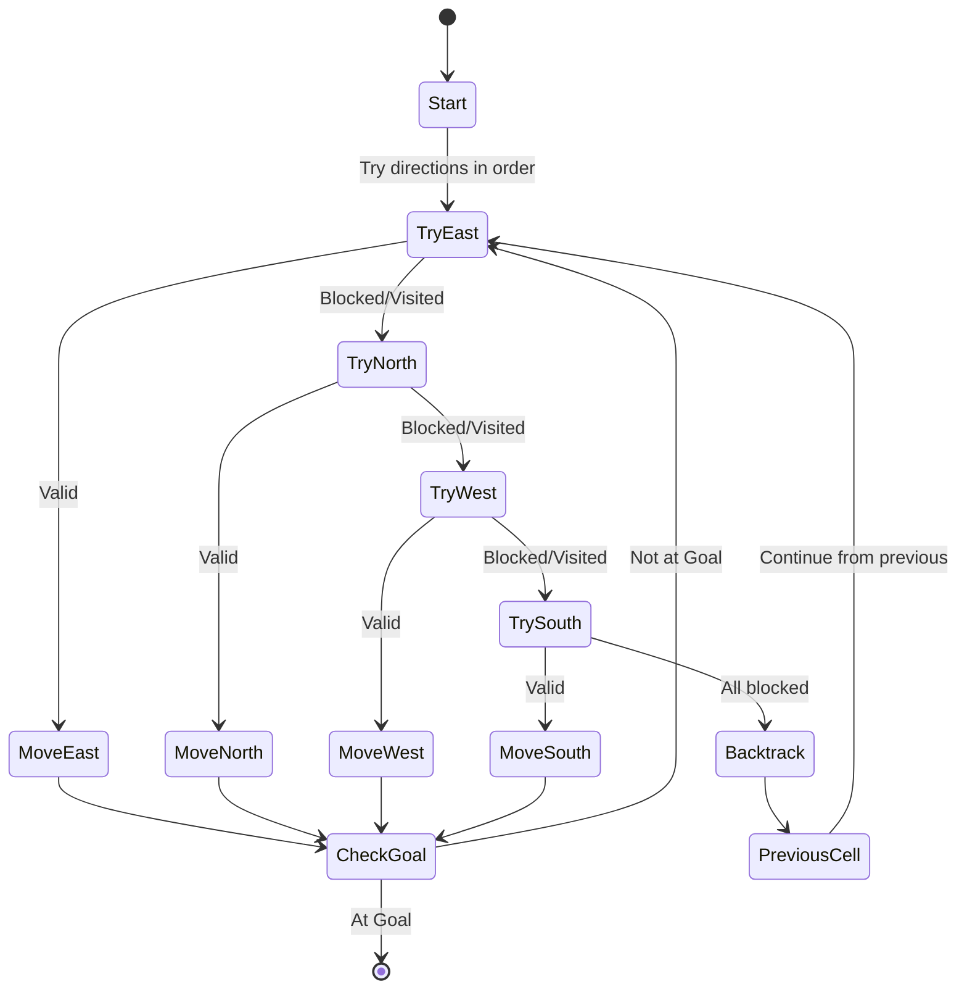

Python, Wavefront, Recursive Backtracking, Randomized Prim, PyGame

**Authors**: Allen Liu, Anuj Natray, Henry Brown, Ishani Narwankar, Leo Li

# Project Description

Implementation of two classical maze-solving algorithms: **Wavefront Propagation** and **Recursive Backtracking** with visualization. The system generates random mazes and finds optimal or feasible paths from start to goal.

## Algorithm Comparison

## Wavefront Algorithm

**Characteristics:**
- **Completeness**: Guaranteed to find a path if one exists
- **Optimality**: Finds the shortest path
- **Method**: Breadth-first propagation from goal to start
- **Steps**:
  1. Label goal cell as 0
  2. Iteratively label empty neighbors with incrementing values
  3. Stop when start cell is labeled
  4. Follow decreasing gradient from start to goal

## Recursive Backtracking Algorithm

**Characteristics:**
- **Completeness**: Guaranteed to find a path (may not be optimal)
- **Priority**: East → North → West → South
- **Method**: Depth-first exploration with backtracking
- **Steps**:
  1. From current position, try directions in priority order
  2. If direction is valid (not wall, not visited), move there
  3. If all directions blocked, backtrack to previous cell
  4. Repeat until goal is reached

# Amination

<iframe width="560" height="315" src="https://www.youtube.com/embed/QBnimOgBjeg?si=DBGshXhhqxGaSYix" title="YouTube video player" frameborder="0" allow="accelerometer; autoplay; clipboard-write; encrypted-media; gyroscope; picture-in-picture; web-share" allowfullscreen></iframe>

# Challenges
 - *Solver algorithm*: When first implementing the algorithm for two solvers, it was difficult for us to understand the concept for the solver so we spent most of time drawing the process on a paper to visualize it. After we had a clear concept about what it was it was a smooth process for all of us.