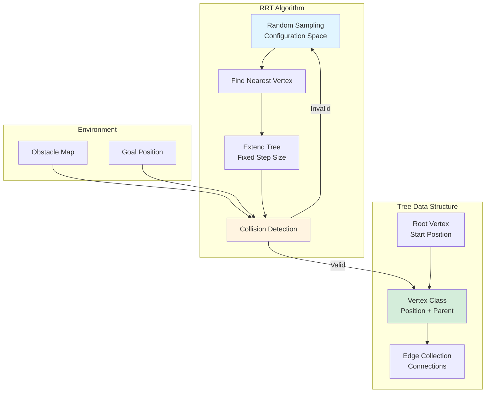

Python, RRT

**Authors**: Allen Liu

**GitHub**: [View This Project on GitHub](https://github.com/nu-jliu/hackathon_RRT)

# Project Description

Implementation of the **Rapidly-Exploring Random Tree (RRT)** path planning algorithm for collision-free navigation in 2D environments with obstacles. The algorithm efficiently explores the configuration space to find feasible paths from start to goal.

## System Architecture

## Algorithm Workflow

## Data Structure

**Tree Structure:**
 - **Tree**: Contains a list of vertices and the root vertex (start position)
 - **Vertex**: Stores position coordinates and parent vertex reference
 - **Edges**: Implicit connections between parent and child vertices

## Algorithm Steps

1. **Random Sampling**: Randomly select a point `q_r` in the configuration space
2. **Nearest Neighbor**: Find the closest existing vertex to `q_r`
3. **Tree Extension**: Create a new vertex by extending a fixed distance (step size = 1) from the nearest vertex toward `q_r`
4. **Collision Detection**: Validate the new edge:
   - Check for collisions with obstacles
   - Check for intersections with existing edges
5. **Tree Growth**: If valid, add the new vertex to the tree
6. **Termination**: Repeat until the goal region is reached

# Amination

## Planing Path on Map with Oval Obstacles

<iframe width="560" height="315" src="https://www.youtube.com/embed/ehhinQ4TM8k?si=cIay6DGo2s0U59jP" title="YouTube video player" frameborder="0" allow="accelerometer; autoplay; clipboard-write; encrypted-media; gyroscope; picture-in-picture; web-share" allowfullscreen></iframe>

## Planning Path on Map with Northwestern Logo

<iframe width="560" height="315" src="https://www.youtube.com/embed/4pJUayLRvhQ?si=pIaZisnh-ZUt4bFK" title="YouTube video player" frameborder="0" allow="accelerometer; autoplay; clipboard-write; encrypted-media; gyroscope; picture-in-picture; web-share" allowfullscreen></iframe>

# Challenges
 - *Obstacle Avoidance*: In this project, I successfully tackled the primary challenge of determining the optimal line segment from a given vertex to a randomly generated point while ensuring avoidance of collisions with obstacles and existing edges. To overcome this obstacle, I leveraged vector calculus to calculate the distance between the line segment and obstacles. Additionally, I adopted a modeling approach, treating all existing vertices as obstacles with a fixed radius of 1. This strategic modeling guarantees the non-collision of newly generated vertices with their existing counterparts, contributing to the overall success of the project.

# Possible improvements.
 - To address the program's suboptimal performance, I plan to implement multi-threading in the future. This approach aims to enhance computational efficiency by enabling simultaneous execution of multiple tasks, ultimately reducing the overall processing time for the entire algorithm. The strategic adoption of multi-threading is anticipated to significantly boost the program's performance, contributing to improved responsiveness and user experience.