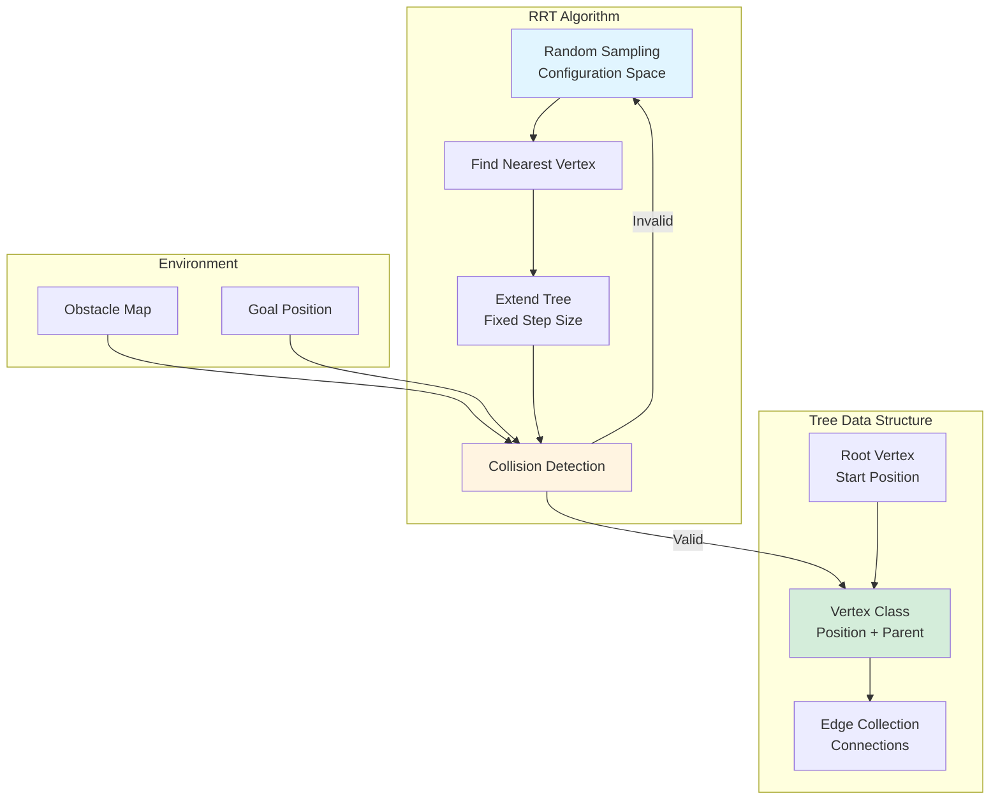
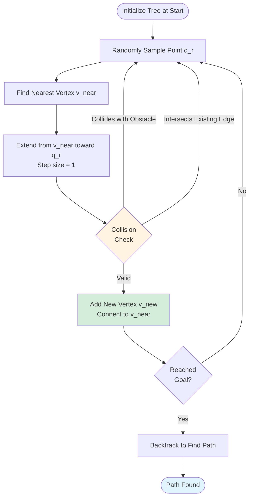

Python, RRT

**Authors**: Allen Liu

**GitHub**: [View This Project on GitHub](https://github.com/nu-jliu/hackathon_RRT)

# Project Description

Implementation of the **Rapidly-Exploring Random Tree (RRT)** path planning algorithm for collision-free navigation in 2D environments with obstacles. The algorithm efficiently explores the configuration space to find feasible paths from start to goal.

## System Architecture

## Algorithm Workflow

## Data Structure

**Tree Structure:**
 - **Tree**: Contains a list of vertices and the root vertex (start position)
 - **Vertex**: Stores position coordinates and parent vertex reference
 - **Edges**: Implicit connections between parent and child vertices

## Algorithm Steps

1. **Random Sampling**: Randomly select a point `q_r` in the configuration space
2. **Nearest Neighbor**: Find the closest existing vertex to `q_r`
3. **Tree Extension**: Create a new vertex by extending a fixed distance (step size = 1) from the nearest vertex toward `q_r`
4. **Collision Detection**: Validate the new edge:
   - Check for collisions with obstacles
   - Check for intersections with existing edges
5. **Tree Growth**: If valid, add the new vertex to the tree
6. **Termination**: Repeat until the goal region is reached

# Amination

## Planing Path on Map with Oval Obstacles

<iframe width="560" height="315" src="https://www.youtube.com/embed/ehhinQ4TM8k?si=cIay6DGo2s0U59jP" title="YouTube video player" frameborder="0" allow="accelerometer; autoplay; clipboard-write; encrypted-media; gyroscope; picture-in-picture; web-share" allowfullscreen></iframe>

## Planning Path on Map with Northwestern Logo

<iframe width="560" height="315" src="https://www.youtube.com/embed/4pJUayLRvhQ?si=pIaZisnh-ZUt4bFK" title="YouTube video player" frameborder="0" allow="accelerometer; autoplay; clipboard-write; encrypted-media; gyroscope; picture-in-picture; web-share" allowfullscreen></iframe>

# Challenges
 - *Obstacle Avoidance*: In this project, I successfully tackled the primary challenge of determining the optimal line segment from a given vertex to a randomly generated point while ensuring avoidance of collisions with obstacles and existing edges. To overcome this obstacle, I leveraged vector calculus to calculate the distance between the line segment and obstacles. Additionally, I adopted a modeling approach, treating all existing vertices as obstacles with a fixed radius of 1. This strategic modeling guarantees the non-collision of newly generated vertices with their existing counterparts, contributing to the overall success of the project.

# Possible improvements.
 - To address the program's suboptimal performance, I plan to implement multi-threading in the future. This approach aims to enhance computational efficiency by enabling simultaneous execution of multiple tasks, ultimately reducing the overall processing time for the entire algorithm. The strategic adoption of multi-threading is anticipated to significantly boost the program's performance, contributing to improved responsiveness and user experience.

Python, RRT

**作者**: Allen Liu

**GitHub**: [在 GitHub 上查看此项目](https://github.com/nu-jliu/hackathon_RRT)

# 项目描述

在带有障碍物的2D环境中实现**快速扩展随机树 (RRT)** 路径规划算法，用于无碰撞导航。该算法高效地探索配置空间，从起点到终点找到可行路径。

## 算法步骤

1. **随机采样**: 在配置空间中随机选择一个点 `q_r`
2. **最近邻**: 找到距离 `q_r` 最近的现有顶点
3. **树扩展**: 从最近顶点向 `q_r` 方向扩展固定距离（步长 = 1）创建新顶点
4. **碰撞检测**: 验证新边:
   - 检查与障碍物的碰撞
   - 检查与现有边的交叉
5. **树生长**: 如果有效，将新顶点添加到树中
6. **终止**: 重复直到到达目标区域

# 动画演示

## 在椭圆障碍物地图上规划路径

<iframe width="560" height="315" src="https://www.youtube.com/embed/ehhinQ4TM8k?si=cIay6DGo2s0U59jP" title="YouTube video player" frameborder="0" allow="accelerometer; autoplay; clipboard-write; encrypted-media; gyroscope; picture-in-picture; web-share" allowfullscreen></iframe>

## 在西北大学 Logo 地图上规划路径

<iframe width="560" height="315" src="https://www.youtube.com/embed/4pJUayLRvhQ?si=pIaZisnh-ZUt4bFK" title="YouTube video player" frameborder="0" allow="accelerometer; autoplay; clipboard-write; encrypted-media; gyroscope; picture-in-picture; web-share" allowfullscreen></iframe>

# 挑战
 - *障碍物避让*: 在这个项目中，我成功地解决了从给定顶点到随机生成点确定最优线段的主要挑战，同时确保避免与障碍物和现有边碰撞。为了克服这个障碍，我利用向量微积分来计算线段与障碍物之间的距离。

# 可能的改进
 - 为了解决程序性能不佳的问题，我计划在未来实现多线程。这种方法旨在通过同时执行多个任务来提高计算效率，最终减少整个算法的总处理时间。

