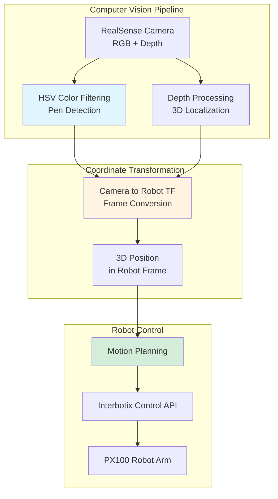
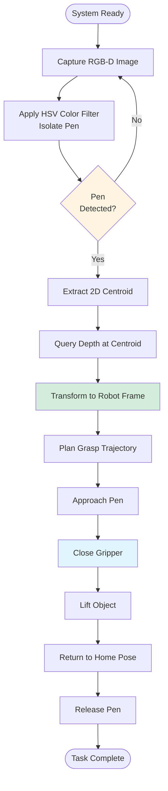

Python, Computer Vision, ROS2, MoveIt2, Interbotix Pincher PX100

**Authors**: Allen Liu

**GitHub**: [View This Project on GitHub](https://github.com/nu-jliu/hackathon_Pen)

# Project Description

This project implements a vision-based robotic manipulation system that detects and retrieves a pen using computer vision and the Interbotix Pincher PX100 robot arm. The system uses color-based object detection with depth sensing for 3D localization.

## System Architecture

## System Workflow

## Technical Implementation

### Computer Vision
 - **HSV Color Filtering**: OpenCV-based color space conversion and thresholding to segment the pen from the background
 - **Depth Integration**: RealSense depth sensor data fused with 2D color detection for accurate 3D position estimation

### Robot Control
 - **Frame Transformation**: Conversion from camera coordinates to robot base frame using calibrated transformation matrix
 - **Motion Execution**: Interbotix control API for commanding the PX100 arm through pick-and-place sequence

# Robot in Action

<iframe width="560" height="315" src="https://www.youtube.com/embed/0IB5zzDqvyM?si=jeceXWgKSJuJdSA3" title="YouTube video player" frameborder="0" allow="accelerometer; autoplay; clipboard-write; encrypted-media; gyroscope; picture-in-picture; web-share" allowfullscreen></iframe>

Python, 计算机视觉, ROS2, MoveIt2, Interbotix Pincher PX100

**作者**: Allen Liu

**GitHub**: [在 GitHub 上查看此项目](https://github.com/nu-jliu/hackathon_Pen)

# 项目描述

该项目实现了一个基于视觉的机器人操作系统，使用计算机视觉和 Interbotix Pincher PX100 机械臂检测和抓取笔。系统使用基于颜色的目标检测结合深度传感进行3D定位。

## 技术实现

### 计算机视觉
 - **HSV 颜色过滤**: 基于 OpenCV 的颜色空间转换和阈值处理，从背景中分割笔
 - **深度集成**: RealSense 深度传感器数据与2D颜色检测融合，实现精确的3D位置估计

### 机器人控制
 - **坐标变换**: 使用标定的变换矩阵从相机坐标转换到机器人基座坐标系
 - **运动执行**: 使用 Interbotix 控制 API 命令 PX100 机械臂完成拾取放置序列

# 机器人演示

<iframe width="560" height="315" src="https://www.youtube.com/embed/0IB5zzDqvyM?si=jeceXWgKSJuJdSA3" title="YouTube video player" frameborder="0" allow="accelerometer; autoplay; clipboard-write; encrypted-media; gyroscope; picture-in-picture; web-share" allowfullscreen></iframe>

