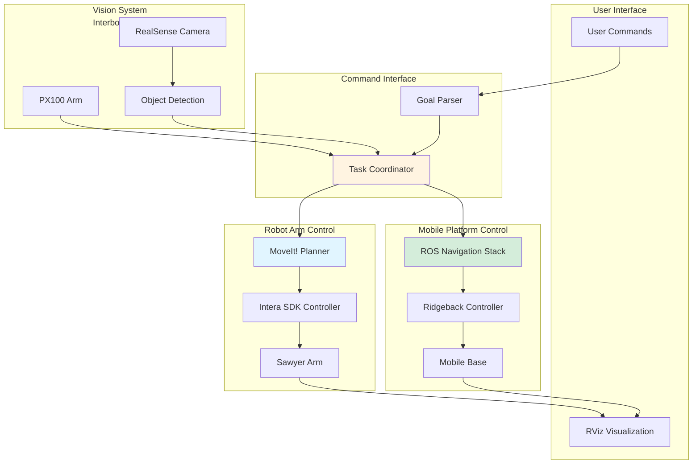
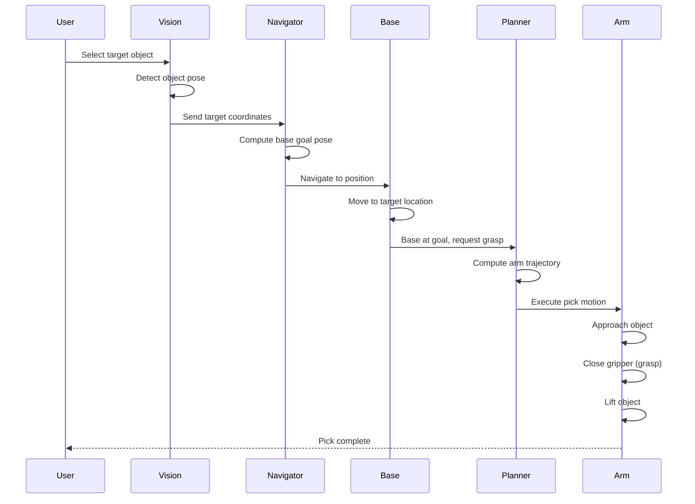
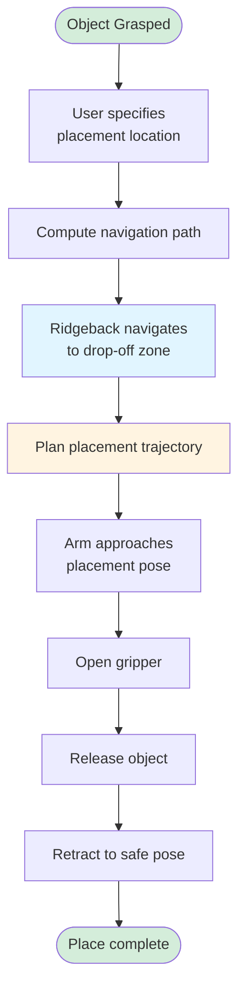
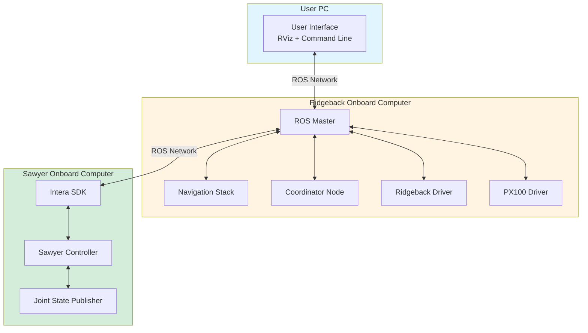

ROS1, ROS Noetic, Linux, Bash Shell, C++, Python, Moveit!, Navigation, Rethink Sawyer Robot Arm, Interbotix PincherX-100 Robot Arm, Clearpath Ridgeback Mobile Platform

[View This Project on GitHub](https://github.com/nu-jliu/Winter_Project.git)

[Sawyer MoveIt!](https://github.com/nu-jliu/sawyer_moveit/tree/allen/Winter_project)

[Intera SDK](https://github.com/nu-jliu/intera_sdk/tree/allen/Winter_Project)

# Description
This project aims for implementing a `pick-and-place` pipline on a mobile manipulator via `ROS Noetic`, which is a `Clearpath Ridgeback Mobile Platform` with `Rethink Sawyer Robot Arm` and `Interbotix PincherX-100 Robot Arm mounted on top of it`.

<!-- `TODO: Add A Figure` -->

# System Architecture

The overall system architecture integrates three primary subsystems to enable coordinated mobile manipulation.

**Key Subsystems:**
 - **Robot Arm Control**: Controls the Sawyer robot arm motion using MoveIt! for motion planning and the Intera SDK for execution
 - **Mobile Platform Control**: Manages Ridgeback mobile base navigation using the ROS Navigation stack
 - **Command Interface**: Receives user goals, coordinates task execution between arm and base controllers
 - **Vision System**: PX100 arm with RealSense camera for object detection and localization

## Software Workflow

### Pick Operation

The user selects a target object, the Ridgeback navigates to the appropriate position, and the Sawyer arm executes the pick motion.

### Place Operation

## Hardware
The overall hardware structure is shown in the figure below, which is a sawyer arm and a px100 arm with a realsense cammera attached mounted on the top of the ridgeback. 

## Network Architecture

The distributed computing system spans three networked machines for coordinated control.

**System Components:**
 - **PC**: User control interface for sending commands and visualization via RViz
 - **Ridgeback Computer**: Hosts ROS Master, performs navigation calculations, coordinates system behavior
 - **Sawyer Computer**: Executes Intera SDK for arm control based on commands from Ridgeback computer

## ROS
Based on the `ROS1` standard, in order for all nodes to be discovered by others, the `ROS_MASTER_URI` must be set to be the same, so that all nodes are running under the same `ROS master`. So that all parameters and topics are served on the same server so that they can listen to others.

### Packages
 - `motion_control`: Used the `ROS Navigation` to control the motion of the mobile platform.
 - `arm_control`: ontrol the motion of the robot arm.
 - `vision_control`: Calibrate the camera and control the motion of the `px100` arm.
 - `object_detection`: Used for detect target pose as for the target object.
 - `picker_interfaces`: Customized interfaces for transporting data between `ROS` nodes
 - `manipulator_description`: Visualizing the robot over `rviz`.

<!-- ## Frames -->

# Final Result

<iframe width="560" height="315" src="https://www.youtube.com/embed/G6C1wfTlVRs?si=QuOxMdutTlqjoj_H&amp;controls=0" title="YouTube video player" frameborder="0" allow="accelerometer; autoplay; clipboard-write; encrypted-media; gyroscope; picture-in-picture; web-share" allowfullscreen></iframe>

<!-- `TODO:` -->

# Technical Challenges

## `Moveit!` with Sawyer
The default `Moveit!` interface configuration for `sawyer` was not compatible with the current configuration of the robot since the robot arm is mounted on the base instead of mounting on the control algorith coming along with the software.

<!-- ## ROS Navigation -->

## Sawyer Hardware
There was a lot of issue setting up the `Rethink Sawyer` robot arm, there was some both mechanical and software issue for fixing it. 

Link: [Fixing Sawyer Arm](https://nu-jliu.github.io/sawyer/)

## Low Bandwidth
The robot is configured to use a 2G wifi to communicate with the laptop, making it difficult to transport large amount of data within short period of time. Which increases the latency between sensor and when data is processed. This will cause inacuracy on SLAM, path planning and motion planning.

ROS1, ROS Noetic, Linux, Bash Shell, C++, Python, MoveIt!, 导航, Rethink Sawyer 机械臂, Interbotix PincherX-100 机械臂, Clearpath Ridgeback 移动平台

[在 GitHub 上查看此项目](https://github.com/nu-jliu/Winter_Project.git)

# 描述
该项目旨在通过 `ROS Noetic` 在移动机械臂上实现拾取放置流程，该机器人由安装在 `Clearpath Ridgeback 移动平台` 上的 `Rethink Sawyer 机械臂` 和 `Interbotix PincherX-100 机械臂` 组成。

# 系统架构

整体系统架构集成了三个主要子系统，实现协调的移动操作。

**主要子系统:**
 - **机械臂控制**: 使用 MoveIt! 进行运动规划，使用 Intera SDK 执行控制 Sawyer 机械臂的运动
 - **移动平台控制**: 使用 ROS 导航栈管理 Ridgeback 移动基座导航
 - **命令接口**: 接收用户目标，协调机械臂和基座控制器之间的任务执行
 - **视觉系统**: PX100 机械臂配备 RealSense 相机，用于目标检测和定位

# 最终结果

<iframe width="560" height="315" src="https://www.youtube.com/embed/G6C1wfTlVRs?si=QuOxMdutTlqjoj_H&amp;controls=0" title="YouTube video player" frameborder="0" allow="accelerometer; autoplay; clipboard-write; encrypted-media; gyroscope; picture-in-picture; web-share" allowfullscreen></iframe>

# 技术挑战

## MoveIt! 与 Sawyer
Sawyer 的默认 MoveIt! 接口配置与机器人当前配置不兼容，因为机械臂是安装在移动基座上的，而不是安装在软件自带的控制算法上。

## Sawyer 硬件
在设置 Rethink Sawyer 机械臂时遇到了很多问题，包括机械和软件方面的问题需要修复。

链接: [修复 Sawyer 机械臂](https://nu-jliu.github.io/sawyer/)

## 低带宽
机器人配置使用 2G wifi 与笔记本电脑通信，导致难以在短时间内传输大量数据。这增加了传感器和数据处理之间的延迟，会导致 SLAM、路径规划和运动规划的不准确。

 