<div class="content-en" markdown="1">

Rust, C++, Robotics, Kinematics, Dynamics, Trajectory Planning, Control, Linear Algebra

**Author**: Allen Liu

[Rust Library on GitHub](https://github.com/nu-jliu/modern-robotics-rs)

[Rust Documentation](https://www.allen-liu.net/modern-robotics-rs/)

[C++ Library on GitHub](https://github.com/nu-jliu/modern-robotics-cpp)

[C++ Documentation](https://www.allen-liu.net/modern-robotics-cpp/)

# Project Overview

This project provides comprehensive implementations of fundamental robotics algorithms in both **Rust** and **C++**, based on the textbook *[Modern Robotics: Mechanics, Planning, and Control](http://hades.mech.northwestern.edu/index.php/Modern_Robotics)* by Kevin M. Lynch and Frank C. Park (2017). These libraries enable roboticists and researchers to perform essential computations for robot kinematics, dynamics, trajectory generation, and control.

**Reference:** [Official Modern Robotics GitHub Repository](https://github.com/NxRLab/ModernRobotics)

The dual-language approach allows developers to choose the implementation that best fits their project requirements:
- **Rust** (`modern-robotics-rs`): Memory-safe, with zero-cost abstractions and modern package management via Cargo
- **C++** (`modern-robotics-cpp`): High-performance with Armadillo linear algebra library, ideal for integration with existing robotics frameworks

# Library Architecture

Both libraries follow the textbook's chapter organization, providing a consistent API across implementations:

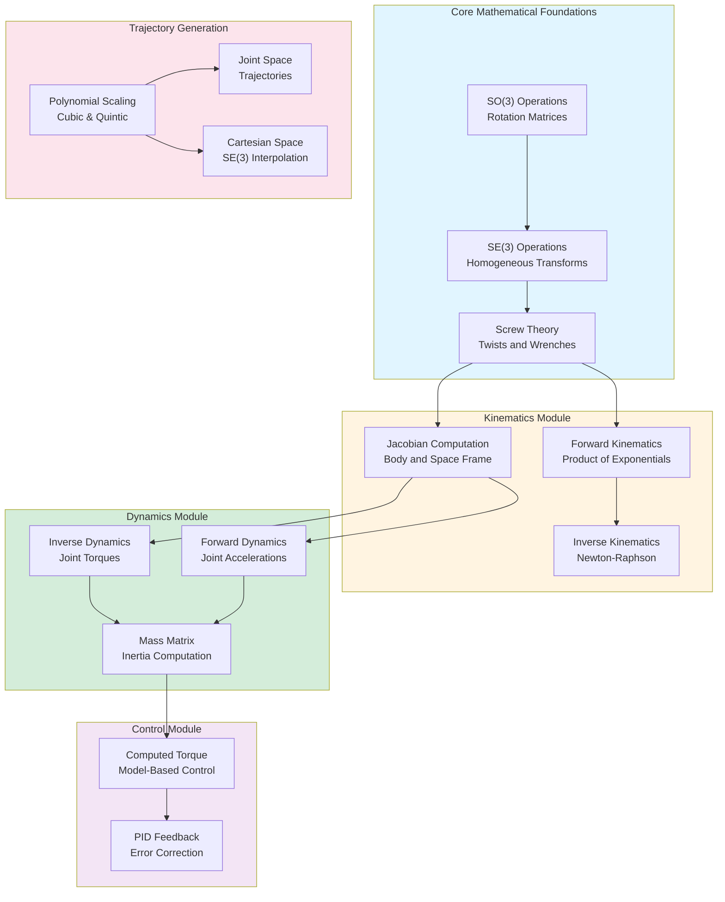

# Mathematical Foundations

## Rigid Body Representations

The libraries implement the mathematical machinery for representing rigid body motions in 3D space:

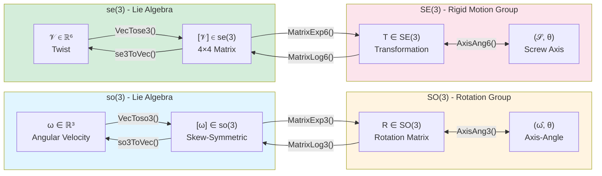

### Key Mathematical Operations

**Rotation Matrix Exponential (Rodrigues' Formula):**

$$
e^{[\hat{\omega}]\theta} = I + \sin\theta[\hat{\omega}] + (1 - \cos\theta)[\hat{\omega}]^2
$$

**Homogeneous Transformation Exponential:**

$$
e^{[\mathcal{S}]\theta} = \begin{bmatrix} e^{[\omega]\theta} & G(\theta)v \\ 0 & 1 \end{bmatrix}
$$

Where:

$$
G(\theta) = I\theta + (1-\cos\theta)[\omega] + (\theta - \sin\theta)[\omega]^2
$$

# Forward Kinematics

The libraries implement forward kinematics using the Product of Exponentials formula, supporting both body and space frame representations:

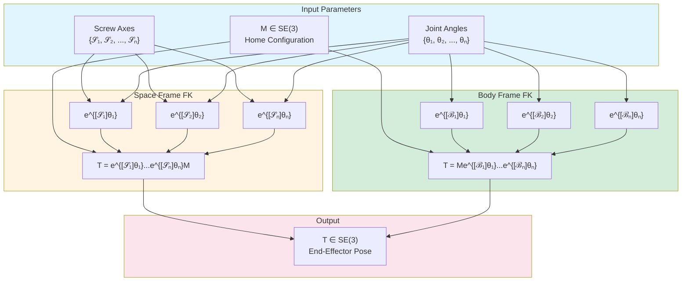

**Product of Exponentials Formula:**

Space Frame:
$$
T(\theta) = e^{[\mathcal{S}_1]\theta_1} e^{[\mathcal{S}_2]\theta_2} \cdots e^{[\mathcal{S}_n]\theta_n} M
$$

Body Frame:
$$
T(\theta) = M e^{[\mathcal{B}_1]\theta_1} e^{[\mathcal{B}_2]\theta_2} \cdots e^{[\mathcal{B}_n]\theta_n}
$$

# Inverse Kinematics

The inverse kinematics solver uses the Newton-Raphson iterative method to find joint angles for a desired end-effector pose:

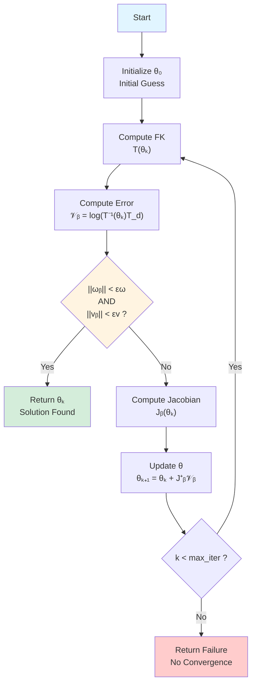

**Newton-Raphson Update:**

$$
\theta_{k+1} = \theta_k + J_b^+(\theta_k) \mathcal{V}_b
$$

Where $ J_b^+ $ is the Moore-Penrose pseudoinverse of the body Jacobian.

# Dynamics

The dynamics module implements both forward and inverse dynamics for open-chain robots:

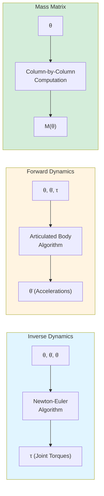

**Equations of Motion:**

$$
\tau = M(\theta)\ddot{\theta} + c(\theta, \dot{\theta}) + g(\theta)
$$

Where:
- $ M(\theta) $ is the mass matrix
- $ c(\theta, \dot{\theta}) $ represents Coriolis and centrifugal terms
- $ g(\theta) $ is the gravity vector

# Trajectory Generation

The libraries support multiple trajectory generation methods:

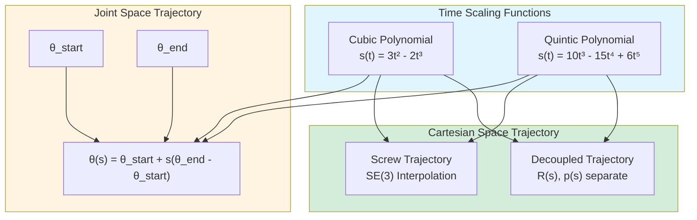

**Quintic Time Scaling (Zero Velocity and Acceleration at Endpoints):**

$$
s(t) = 10\left(\frac{t}{T}\right)^3 - 15\left(\frac{t}{T}\right)^4 + 6\left(\frac{t}{T}\right)^5
$$

# Computed Torque Control

The control module implements computed torque control with PID feedback:

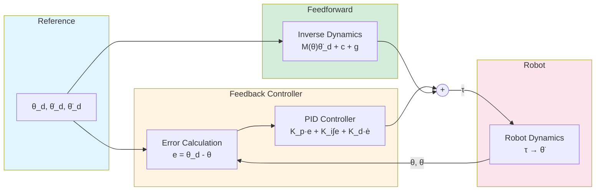

**Computed Torque Control Law:**

$$
\tau = M(\theta)\left(\ddot{\theta}_d + K_p e + K_i \int e \, dt + K_d \dot{e}\right) + c(\theta, \dot{\theta}) + g(\theta)
$$

# API Comparison

| Feature | Rust (`modern-robotics-rs`) | C++ (`modern-robotics-cpp`) |
|---------|----------------------------|----------------------------|
| **Linear Algebra** | nalgebra | Armadillo |
| **Namespace** | `modern_robotics` | `mr` |
| **Matrix Types** | `DVector`, `DMatrix` | `arma::vec`, `arma::mat` |
| **Documentation** | Rust Docs | Doxygen |
| **Testing** | Rust built-in tests | Catch2 |
| **Package Manager** | Cargo | CMake |
| **Tolerance** | Configurable | 1e-6 global |

## Code Examples

### Rust Implementation

```rust
use modern_robotics::{FKinSpace, JacobianSpace};
use nalgebra::{DMatrix, DVector};

// Define screw axes and home configuration
let s_list = DMatrix::from_row_slice(6, 3, &[
    0.0, 0.0, 0.0,  // S1
    0.0, 1.0, 1.0,  // S2
    1.0, 0.0, 0.0,  // S3
    0.0, 0.0, 0.0,  // S4
    0.0, 0.0, 1.0,  // S5
    0.0, 0.0, 0.0,  // S6
]);

let theta = DVector::from_vec(vec![0.1, 0.2, 0.3]);

// Compute forward kinematics
let t_end = FKinSpace(&m, &s_list, &theta);

// Compute Jacobian
let jacobian = JacobianSpace(&s_list, &theta);
```

### C++ Implementation


```cpp
#include <modern_robotics/modern_robotics.hpp>

// Define screw axes and home configuration
arma::mat Slist = {{0, 0, 0, 0, 0, 0},
                   {0, 1, 1, 0, 0, 0},
                   {1, 0, 0, 0, 0, 1}};
Slist = Slist.t();

arma::vec theta = {0.1, 0.2, 0.3};

// Compute forward kinematics
arma::mat T_end = mr::FKinSpace(M, Slist, theta);

// Compute Jacobian
arma::mat Jacobian = mr::JacobianSpace(Slist, theta);
```


# Technical Requirements

## Rust Library

| Component | Requirement |
|-----------|-------------|
| **Rust Edition** | 2021 |
| **Dependencies** | nalgebra 0.34.0, assert_float_eq 1.1.4 |
| **Documentation** | Generated via `cargo doc` |

## C++ Library

| Component | Minimum | Tested |
|-----------|---------|--------|
| **OS** | Ubuntu 22.04+ | Ubuntu 22.04.5 LTS |
| **CMake** | 3.16+ | 3.22.1 |
| **Compiler** | GCC 9+ / Clang 10+ | GCC 11.4.0 |
| **Armadillo** | 9.900+ | 10.8.2 |

# Function Reference

## Rigid-Body Motions (Chapter 3)

| Function | Description |
|----------|-------------|
| `RotInv` | Inverse of rotation matrix |
| `VecToso3` | Convert 3-vector to so(3) matrix |
| `so3ToVec` | Convert so(3) to 3-vector |
| `AxisAng3` | Extract axis-angle from exponential coordinates |
| `MatrixExp3` | Matrix exponential for SO(3) |
| `MatrixLog3` | Matrix logarithm for SO(3) |
| `RpToTrans` | Rotation + position to SE(3) |
| `TransToRp` | SE(3) to rotation + position |
| `TransInv` | Inverse of transformation matrix |
| `VecTose3` | Convert 6-vector to se(3) |
| `se3ToVec` | Convert se(3) to 6-vector |
| `Adjoint` | Adjoint representation |
| `MatrixExp6` | Matrix exponential for SE(3) |
| `MatrixLog6` | Matrix logarithm for SE(3) |

## Kinematics (Chapters 4-6)

| Function | Description |
|----------|-------------|
| `FKinBody` | Forward kinematics (body frame) |
| `FKinSpace` | Forward kinematics (space frame) |
| `JacobianBody` | Body Jacobian |
| `JacobianSpace` | Space Jacobian |
| `IKinBody` | Inverse kinematics (body frame) |
| `IKinSpace` | Inverse kinematics (space frame) |

## Dynamics (Chapter 8)

| Function | Description |
|----------|-------------|
| `MassMatrix` | Compute mass matrix M(θ) |
| `VelQuadraticForces` | Coriolis and centrifugal terms |
| `GravityForces` | Gravity force vector |
| `EndEffectorForces` | End-effector force to joint torques |
| `ForwardDynamics` | θ̈ from θ, θ̇, τ |
| `InverseDynamics` | τ from θ, θ̇, θ̈ |

## Trajectory (Chapter 9)

| Function | Description |
|----------|-------------|
| `CubicTimeScaling` | Cubic polynomial s(t) |
| `QuinticTimeScaling` | Quintic polynomial s(t) |
| `JointTrajectory` | Joint space trajectory |
| `ScrewTrajectory` | SE(3) screw interpolation |
| `CartesianTrajectory` | Decoupled Cartesian trajectory |

## Control (Chapter 11)

| Function | Description |
|----------|-------------|
| `ComputedTorque` | Computed torque control |
| `SimulateControl` | Closed-loop simulation |

# License

Both libraries are released under the **MIT License**.

</div>

<div class="content-zh" markdown="1">

Rust, C++, 机器人学, 运动学, 动力学, 轨迹规划, 控制, 线性代数

**作者**: Allen Liu

[C++ 库 GitHub](https://github.com/nu-jliu/modern-robotics-cpp)

[C++ 文档](https://www.allen-liu.net/modern-robotics-cpp/)

[Rust 库 GitHub](https://github.com/nu-jliu/modern-robotics-rs) 

[Rust 文档](https://www.allen-liu.net/modern-robotics-rs/) 

# 项目概述

本项目提供了基于 Kevin M. Lynch 和 Frank C. Park 所著教材《[现代机器人学：机构、规划与控制](http://hades.mech.northwestern.edu/index.php/Modern_Robotics)》(2017) 的 **Rust** 和 **C++** 双语言实现。这些库使机器人研究人员能够执行机器人运动学、动力学、轨迹生成和控制的基本计算。

**参考:** [官方 Modern Robotics GitHub 仓库](https://github.com/NxRLab/ModernRobotics)

双语言方法允许开发者选择最适合其项目需求的实现：
- **Rust** (`modern-robotics-rs`): 内存安全，零成本抽象，通过 Cargo 进行现代包管理
- **C++** (`modern-robotics-cpp`): 高性能，使用 Armadillo 线性代数库，便于与现有机器人框架集成

# 库架构

两个库都遵循教材的章节组织，提供跨实现的一致 API：

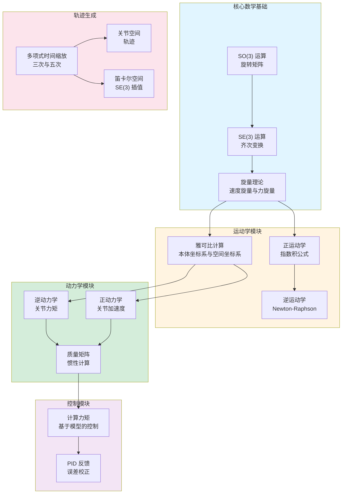

# 数学基础

## 刚体表示

这些库实现了在三维空间中表示刚体运动的数学工具：

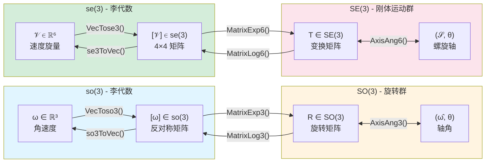

**旋转矩阵指数（罗德里格斯公式）：**

$$
e^{[\hat{\omega}]\theta} = I + \sin\theta[\hat{\omega}] + (1 - \cos\theta)[\hat{\omega}]^2
$$

**齐次变换矩阵指数：**

$$
e^{[\mathcal{S}]\theta} = \begin{bmatrix} e^{[\omega]\theta} & G(\theta)v \\ 0 & 1 \end{bmatrix}
$$

# 正运动学

库使用指数积公式实现正运动学，支持本体坐标系和空间坐标系两种表示：

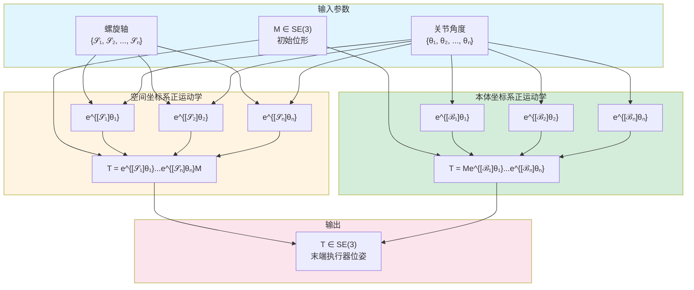

**指数积公式：**

空间坐标系：
$$
T(\theta) = e^{[\mathcal{S}_1]\theta_1} e^{[\mathcal{S}_2]\theta_2} \cdots e^{[\mathcal{S}_n]\theta_n} M
$$

本体坐标系：
$$
T(\theta) = M e^{[\mathcal{B}_1]\theta_1} e^{[\mathcal{B}_2]\theta_2} \cdots e^{[\mathcal{B}_n]\theta_n}
$$

# 逆运动学

逆运动学求解器使用 Newton-Raphson 迭代方法为期望的末端执行器位姿找到关节角度：

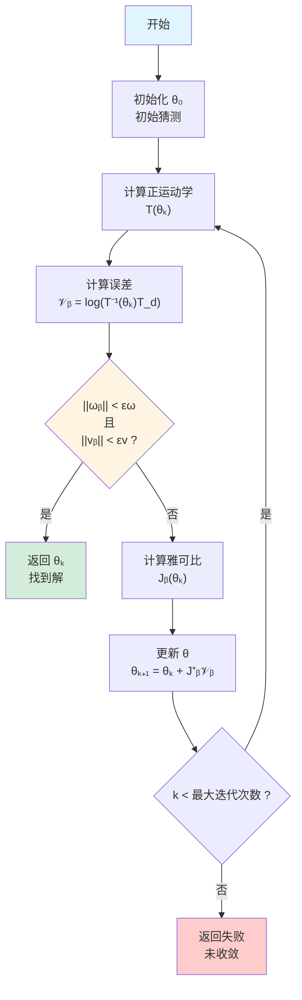

**Newton-Raphson 更新：**

$$
\theta_{k+1} = \theta_k + J_b^+(\theta_k) \mathcal{V}_b
$$

其中 $ J_b^+ $ 是本体雅可比矩阵的 Moore-Penrose 伪逆。

# 动力学

动力学模块为开链机器人实现正动力学和逆动力学：

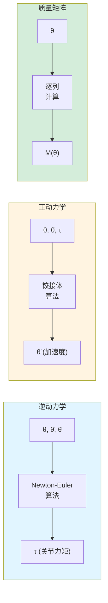

**运动方程：**

$$
\tau = M(\theta)\ddot{\theta} + c(\theta, \dot{\theta}) + g(\theta)
$$

其中：
- $ M(\theta) $ 是质量矩阵
- $ c(\theta, \dot{\theta}) $ 表示科里奥利力和离心力项
- $ g(\theta) $ 是重力向量

# 轨迹生成

库支持多种轨迹生成方法：

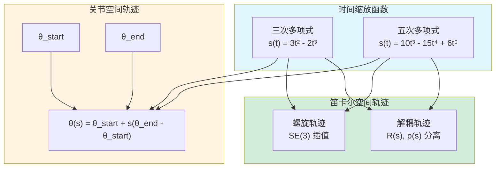

**五次时间缩放（端点处零速度和零加速度）：**

$$
s(t) = 10\left(\frac{t}{T}\right)^3 - 15\left(\frac{t}{T}\right)^4 + 6\left(\frac{t}{T}\right)^5
$$

# 计算力矩控制

控制模块实现带 PID 反馈的计算力矩控制：

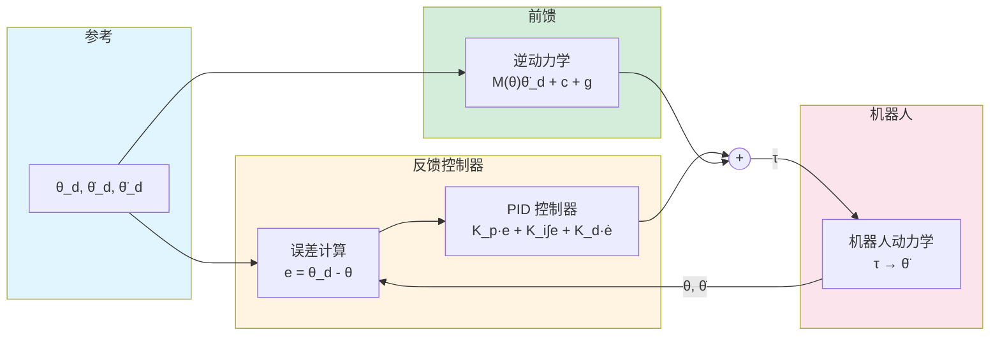

**计算力矩控制律：**

$$
\tau = M(\theta)\left(\ddot{\theta}_d + K_p e + K_i \int e \, dt + K_d \dot{e}\right) + c(\theta, \dot{\theta}) + g(\theta)
$$

# API 比较

| 功能 | Rust (`modern-robotics-rs`) | C++ (`modern-robotics-cpp`) |
|------|----------------------------|----------------------------|
| **线性代数** | nalgebra | Armadillo |
| **命名空间** | `modern_robotics` | `mr` |
| **矩阵类型** | `DVector`, `DMatrix` | `arma::vec`, `arma::mat` |
| **文档** | Rust Docs | Doxygen |
| **测试** | Rust 内置测试 | Catch2 |
| **包管理器** | Cargo | CMake |
| **容差** | 可配置 | 1e-6 全局 |

# 技术要求

## Rust 库

| 组件 | 要求 |
|------|------|
| **Rust 版本** | 2021 |
| **依赖** | nalgebra 0.34.0, assert_float_eq 1.1.4 |
| **文档** | 通过 `cargo doc` 生成 |

## C++ 库

| 组件 | 最低要求 | 测试版本 |
|------|---------|---------|
| **操作系统** | Ubuntu 22.04+ | Ubuntu 22.04.5 LTS |
| **CMake** | 3.16+ | 3.22.1 |
| **编译器** | GCC 9+ / Clang 10+ | GCC 11.4.0 |
| **Armadillo** | 9.900+ | 10.8.2 |

# 许可证

两个库均在 **MIT 许可证** 下发布。

</div>
