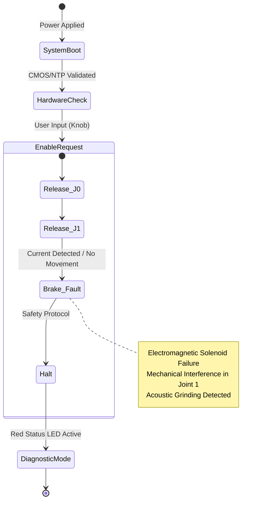
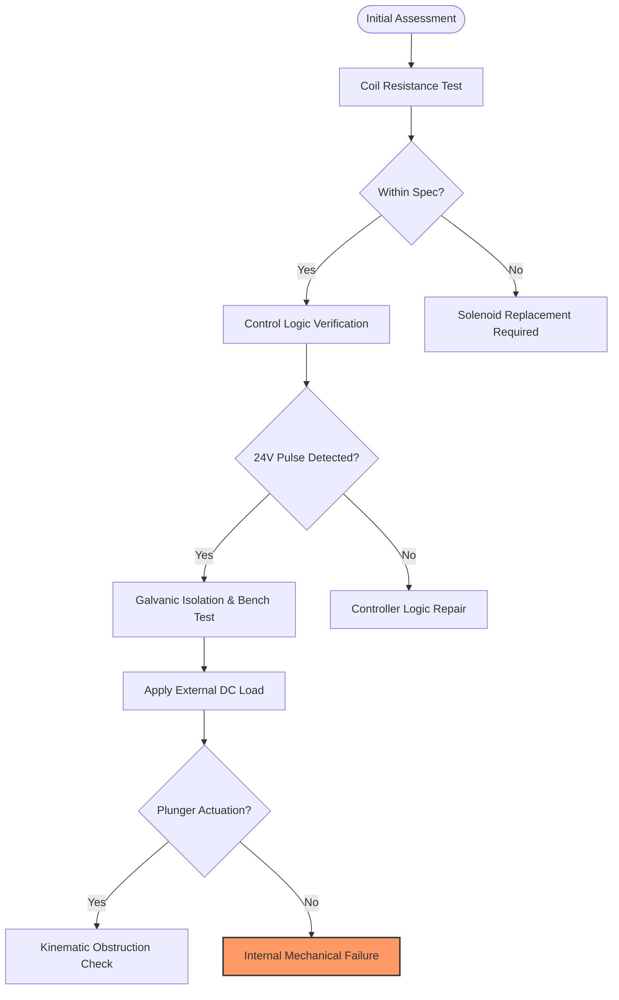

<div class="content-en" markdown="1">

Keywords: CMOS Battery, Rethink Sawyer, Intera OS, Embedded Linux, Robot Hardware, Joint Actuation, Solenoid, Encoder Diagnostics, Fail-safe Brake

# Executive Summary and System Context

This report documents the rigorous diagnostic and remedial procedures executed on a `Rethink Sawyer` high-performance collaborative robot arm. The unit is integrated into the `Sawback` mobile manipulation research platform, which utilizes a `Clearpath Ridgeback` omnidirectional base. The decommissioning of this system revealed critical failures in both the high-level compute synchronization and the low-level joint actuation hardware.

## Systemic Synchronization Failure: CMOS Depletion

Initial deployment attempts were obstructed by a critical boot-up failure within the Intera OS environment. Investigation localized the root cause to a depleted CR2032 CMOS battery on the primary logic board. 

In the Sawyer's embedded Linux architecture, a significant temporal drift (offset) from the hardware clock prevents successful Network Time Protocol (NTP) synchronization and cryptographic handshake sequences essential for the Intera controller to initialize communication with the joint motor controllers (JMCs). Following the replacement of the CMOS cell and subsequent BIOS clock calibration, the system achieved a stable boot state; however, a secondary, hardware-level fault in the kinematic chain was identified.

## Kinematic Chain Anomaly: `right_j1` Actuation Lock

The Sawyer arm employs a fail-safe electromagnetic brake mechanism in each joint. During the transition from the `STANDBY` to `ENABLED` state, the system initiates a sequential release of these brakes. During this procedure, the `right_j1` (Joint 1) failed to transition, triggering a system-wide safety halt with the following diagnostic output:

```
[ERROR] Failed to enable robot, press the knob to try again.
```

### Diagnostic State Machine



The fault was characterized by a persistent red status LED at Joint 1 and an audible grinding sound during manual manipulation attempts, indicating that the mechanical locking pin remained partially or fully engaged despite solenoid energization.

# Component-Level Analysis and Remediation

The failure of the `right_j1` brake to disengage necessitated a complete teardown of the joint's external housing to inspect the electro-mechanical locking assembly.

### Signal Integrity and Encoder Verification
To rule out control-side failures, the `right_j1` absolute optical encoder was first interrogated. Using a high-impedance digital multimeter (DMM), we performed a comprehensive continuity and signal integrity analysis on the wiring harness. The results confirmed that both the 5V logic supply and the differential signal pairs were within nominal specifications, eliminating the encoder or its cabling as the source of the enable error.

### Solenoid-Actuated Brake Diagnostics
The diagnostic focus shifted to the solenoid responsible for retracting the locking pin. This component is designed as a "power-to-release" system, ensuring the arm remains locked in a gravity-compensated state during power loss.

#### Formal Testing Protocol



Electrical verification yielded the following data:
1.  **Coil Integrity:** The solenoid coil exhibited a stable resistance value, confirming no internal shorts or open-circuit conditions.
2.  **Logic Command:** The Intera controller successfully delivered the required voltage pulse to the solenoid terminals upon the "Enable" command.
3.  **Bench Testing:** Despite receiving a clean 24V signal from an external laboratory power supply, the solenoid plunger remained static.

This data conclusively isolated the failure to an internal mechanical seizure within the solenoid housing, independent of electrical input.

#### Root Cause Identification: Helical Spring Deformation
Disassembly of the solenoid unit revealed a critical failure of the internal return spring. The spring had bypassed its retaining shoulder within the cylinder, leading to a catastrophic deformation (flattening). 

This spring provides the counter-force necessary to reset the locking pin. In its deformed state, it created a mechanical wedge that physically obstructed the plunger's travel, preventing the electromagnetic field from overcoming the friction to retract the pin.

### Remediation Procedure
1.  **Spring Restoration:** The deformed spring was precision-reformed to restore its original helical pitch and compressive coefficient.
2.  **Structural Re-seating:** The internal cylinder was modified slightly to ensure more robust retention of the spring base.
3.  **Lubrication and Assembly:** Low-friction synthetic lubricant was applied to the plunger-cylinder interface to prevent future binding.

Post-remediation testing showed a 100% success rate in joint enablement. The `right_j1` joint now exhibits smooth actuation and correct fail-safe behavior, restoring the full kinematic capabilities of the Sawyer arm.

</div>

<div class="content-zh" markdown="1">

关键词: CMOS 电池, Rethink Sawyer, Intera OS, 嵌入式 Linux, 机器人硬件, 关节驱动, 电磁阀, 编码器诊断, 失能制动器

# 执行摘要与系统背景

本报告记录了针对 `Rethink Sawyer` 高性能协作机器人进行的严谨诊断和修复程序。该设备集成在 `Sawback` 移动操作研究平台上。在系统调试过程中，我们发现了涵盖高级计算同步和低级关节执行硬件的关键故障。

## 系统级同步故障：CMOS 耗尽

初始部署由于 Intera OS 环境内的引导失败而受阻。调查发现根本原因是主逻辑板上的 CR2032 CMOS 电池耗尽。在 Sawyer 的嵌入式 Linux 架构中，硬件时钟的严重漂移导致网络时间协议 (NTP) 同步失败，进而无法完成 Intera 控制器与关节电机控制器 (JMC) 之间必要的加密握手。更换 CMOS 电池并重新校准 BIOS 时钟后，系统恢复了稳定的引导状态。

## 运动链异常：`right_j1` 执行机构锁定

Sawyer 机械臂在每个关节中均采用失能安全电磁制动机制。在从 `STANDBY`（待机）切换到 `ENABLED`（启用）状态期间，系统会顺序释放这些制动器。在此过程中，`right_j1`（1号关节）未能成功释放，触发了系统级安全停机。

故障表现为 1 号关节处持续亮起红色状态 LED，且在手动尝试旋转关节时可听到明显的磨损声，表明机械锁定销在电磁阀通电后仍处于部分或全部啮合状态。

# 组件级分析与修复

### 信号完整性与编码器验证
为了排除控制端故障，我们首先对 `right_j1` 绝对式光学编码器进行了测试。使用数字万用表 (DMM) 对线束进行了全面的连续性和信号完整性分析。结果确认 5V 逻辑供电和差分信号对均处于标准参数范围内，排除了编码器及其电缆作为故障源的可能性。

### 电磁制动机构诊断
诊断重点转向负责缩回锁定销的电磁阀。该组件设计为“通电释放”系统，以确保机械臂在断电时保持重力补偿锁定状态。

电气验证结果如下：
1. **线圈完整性：** 电磁阀线圈显示稳定的电阻值，确认无内部短路或断路。
2. **逻辑指令：** 在执行“启用”命令时，控制器成功向电磁阀接线端输送了所需的电压脉冲。
3. **工作台测试：** 尽管从外部实验室电源接收到干净的 24V 信号，电磁阀柱塞仍保持静止。

该数据最终确定故障为电磁阀外壳内部的机械卡死。

#### 根本原因识别：螺旋弹簧变形
拆解电磁阀组件后发现了关键失效点：内部复位弹簧脱离了圆筒内的固定台阶，导致严重的塑性变形（压扁）。变形的弹簧形成了机械楔块，物理上阻碍了柱塞的行程，导致电磁场无法克服摩擦力来缩回销钉。

### 修复程序
1. **弹簧复原：** 对变形的弹簧进行精密修复，恢复其原始螺旋螺距和压缩系数。
2. **结构化重新定位：** 确保弹簧底座在内部圆筒中更牢固地固定。
3. **润滑与组装：** 在柱塞与圆筒界面涂抹低摩擦合成润滑剂，以防止未来发生粘连。

修复后的测试显示关节启用成功率为 100%。`right_j1` 关节现在表现出平滑的执行动作和正确的失效安全行为，恢复了 Sawyer 机械臂的完整运动能力。

</div>
