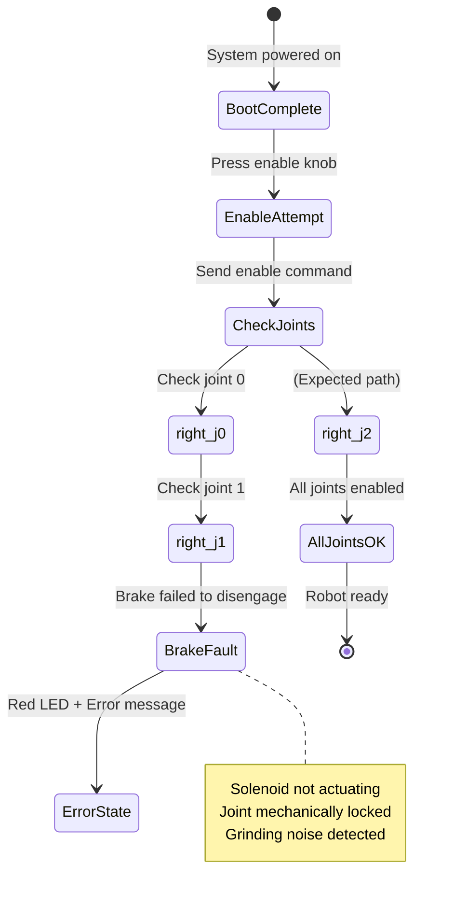
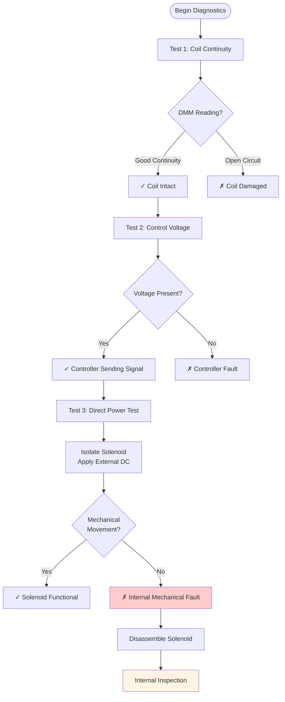

<div class="content-en" markdown="1">

Keywords: CMOS Battery, Rethink Sawyer, Intera OS, Embedded Linux, Robot Hardware, Joint Actuation, Solenoid, Encoder Diagnostics

# System Overview and Initial Problem Description

<!-- {: style="width: 50%"} -->

This document details the diagnostic and repair procedures undertaken for a `Rethink Sawyer` robotic arm, integrated into a `Sawback` mobile manipulator platform (utilizing a `Clearpath Ridgeback` base). Significant challenges were encountered during the initial setup and commissioning of the arm.

## Initial Boot Sequence Failure and Subsequent Control Issues

The primary boot-up sequence of the robot failed due to a depleted CMOS battery, which resulted in system clock synchronization errors. Subsequent to CMOS battery replacement, a secondary issue manifested: the inability to transmit motion commands effectively to the arm.

## Joint Enablement Anomaly: `right_j1`

The Sawyer arm supports two primary operational modes: an SDK mode, facilitating control via the Intera SDK over ROS (Robot Operating System), and an Intera mode, which permits direct control using the integrated human-machine interface (HMI) on the arm. Standard procedure requires enabling the arm via a control knob post-boot. During this process, the system reported the following error:
```
[ERROR] Failed to enable robot, press the knob to try again.
```



Concurrently, a red status LED illuminated, indicating a fault associated with the `right_j1` joint—specifically, an inability for the joint brake to disengage. Preliminary diagnosis indicated the fault originated within the unlatching mechanism of the `right_j1` joint.

Manual articulation attempts of the `right_j1` joint revealed it was seized, accompanied by audible grinding sounds, strongly suggesting an internal mechanical or electro-mechanical fault.

Further investigation involved partial disassembly of the `right_j1` joint for visual inspection of its internal components, with a focus on the brake/locking mechanism. The solenoid responsible for actuating this mechanism exhibited no movement during robot enable attempts. In contrast, observation of the equivalent solenoid in the adjacent, functional `right_j2` joint showed correct actuation. This localized the anomaly to the `right_j1` solenoid assembly or its immediate control circuitry.

# Corrective Actions and Component-Level Repair

The identified problem with the `right_j1` unlatching mechanism necessitated disassembly of the joint to diagnose the specific mechanical or electrical fault.

### Encoder System Verification
Initial diagnostic efforts focused on the `right_j1` joint encoder. The joint housing was opened to access the encoder wiring. A digital multimeter (DMM) was utilized to perform continuity tests across all relevant conductors and connections. These tests confirmed the integrity of the encoder wiring; no open circuits or faulty connections were detected.

### Brake Mechanism Analysis
Subsequent to verifying the encoder system, attention shifted to the joint's solenoid-actuated brake mechanism. This mechanism, by design, engages a mechanical lock on the joint's gearing when the solenoid is de-energized.

#### Solenoid Electrical and Functional Tests



A systematic electrical evaluation of the `right_j1` solenoid was performed prior to full disassembly.
1.  A DMM was used to measure the continuity of the solenoid coil. The coil exhibited good continuity, indicating its electrical integrity.
2.  The DMM was also employed to verify the presence of the energizing voltage signal from the robot's controller during attempts to enable the joint. This voltage was confirmed to be present.

Following these in-situ DMM tests, the solenoid was electrically isolated from the robot and connected to an external DC power supply, with the appropriate voltage applied to directly command actuation. Despite direct energization, and with prior DMM tests confirming coil continuity and the presence of a control signal from the robot, the solenoid demonstrated no mechanical movement.

This comprehensive series of tests conclusively isolated the fault to an internal mechanical issue within the solenoid assembly itself, rather than an electrical fault in its coil, the control signals, or associated wiring. Consequently, the solenoid unit was completely disassembled for detailed inspection of its internal components.

#### Identification and Rectification of Internal Solenoid Fault: Deformed Spring
Upon disassembly of the solenoid, the root cause was identified: the internal actuating spring, while not fractured, had become detached from its retaining cylinder and was severely deformed (flattened), losing its required coiled geometry. This spring is a critical component, as it acts upon an internal plate to retract the brake mechanism when the solenoid is energized. In its deformed and detached state, the spring was incapable of providing the necessary actuation force.

The repair procedure involved:
1.  Careful manual reformation (rewinding) of the flattened spring to restore its original helical shape.
2.  Secure re-attachment of the reformed spring to its designated mounting point on the internal cylinder.

This was a precise operation, requiring careful alignment to ensure the spring was correctly seated against its actuating plate and that the entire mechanism could move without impedance once the solenoid was reassembled. After successful reformation and re-installation of the spring and confirming the plate's freedom of movement, the solenoid and subsequently the entire `right_j1` joint were reassembled.

Post-reassembly, the `right_j1` joint and the Sawyer arm responded correctly to enable commands and subsequent motion control tests.

</div>

<div class="content-zh" markdown="1">

关键词: CMOS 电池, Rethink Sawyer, Intera OS, 嵌入式 Linux, 机器人硬件, 关节驱动, 电磁阀, 编码器诊断

# 系统概述和初始问题描述

本文档详细介绍了对 Rethink Sawyer 机械臂进行的诊断和维修程序，该机械臂集成在 Sawback 移动操作平台上（使用 Clearpath Ridgeback 基座）。在机械臂的初始设置和调试过程中遇到了重大挑战。

## 初始启动序列故障和后续控制问题

机器人的主要启动序列因 CMOS 电池耗尽而失败，导致系统时钟同步错误。更换 CMOS 电池后，出现了第二个问题：无法有效地向机械臂发送运动命令。

## 关节启用异常：`right_j1`

Sawyer 机械臂支持两种主要操作模式：SDK 模式（通过 ROS 使用 Intera SDK 进行控制）和 Intera 模式（使用机械臂上集成的人机界面进行直接控制）。标准程序要求在启动后通过控制旋钮启用机械臂。在此过程中，系统报告了以下错误，并同时亮起红色状态 LED，表示 `right_j1` 关节存在故障——具体来说是关节制动器无法释放。

# 纠正措施和组件级维修

识别出的 `right_j1` 解锁机构问题需要拆卸关节以诊断具体的机械或电气故障。

### 编码器系统验证
初始诊断工作集中在 `right_j1` 关节编码器上。打开关节外壳以检查编码器接线。使用数字万用表对所有相关导体和连接进行了连续性测试。这些测试确认了编码器接线的完整性；未检测到开路或故障连接。

### 制动机构分析
在验证编码器系统后，注意力转向关节的电磁阀驱动制动机构。

#### 内部电磁阀故障的识别和纠正：变形弹簧
拆卸电磁阀后，确定了根本原因：内部驱动弹簧虽然没有断裂，但已从其固定圆筒上脱离并严重变形（压扁），失去了所需的螺旋几何形状。

维修程序包括：
1. 小心地手动重新成型（重绕）压扁的弹簧以恢复其原始螺旋形状。
2. 将重新成型的弹簧牢固地重新连接到内部圆筒上的指定安装点。

重新组装后，`right_j1` 关节和 Sawyer 机械臂正确响应启用命令和后续运动控制测试。

</div>