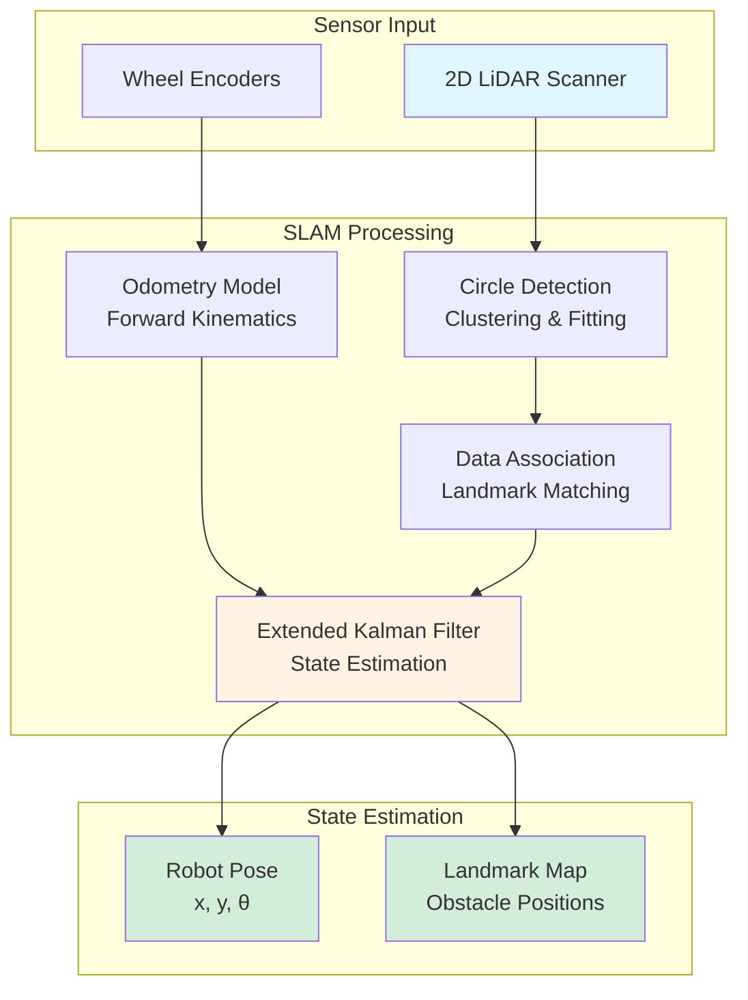
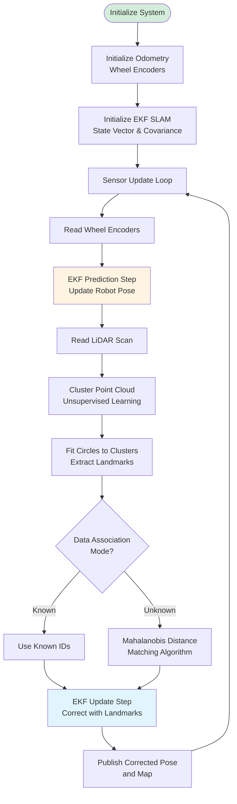
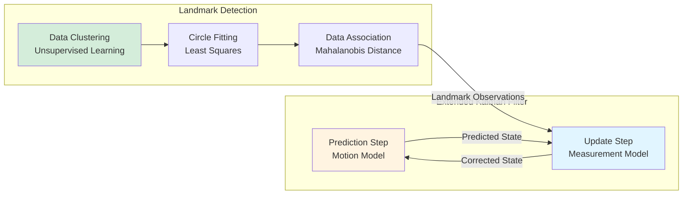
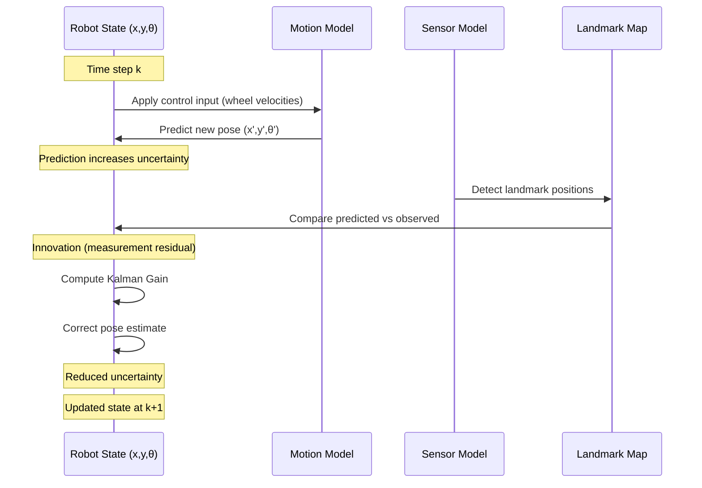

SLAM, EKF, C++, ROS2, Open Robotics Turtlebot3 Burger, 2D LiDar

[View This Project on GitHub](https://github.com/ME495-Navigation/slam-project-nu-jliu.git)

# Description
In this project, I designed and implemented a **Simultaneous Localization and Mapping (SLAM)** algorithm based on the **Extended Kalman Filter (EKF)** over the **ROS2** platform from scratch for a **Turtlebot3 Burger**. This system enables the robot to simultaneously build a map of its environment while localizing itself within that map, using only wheel odometry and 2D LiDAR sensor data.

## System Overview

# Demo Video
This project consists of two main tasks, which are:
 - `SLAM` with known association
 - `SLAM` with unknown association

## SLAM with known data association

<iframe width="560" height="315" src="https://www.youtube.com/embed/wWh1Wt239jg?si=P9O-9KfN2GA8I9Dg" title="YouTube video player" frameborder="0" allow="accelerometer; autoplay; clipboard-write; encrypted-media; gyroscope; picture-in-picture; web-share" allowfullscreen></iframe>

## SLAM with unknown data association

<iframe width="560" height="315" src="https://www.youtube.com/embed/q_HbPRvHKSU?si=Kmc_H2XjPhXWGNoF" title="YouTube video player" frameborder="0" allow="accelerometer; autoplay; clipboard-write; encrypted-media; gyroscope; picture-in-picture; web-share" allowfullscreen></iframe>

## Software Structure

The overall structure of the project is shown in the flowchart below:

Original system structure diagram:

<!-- ### Known Assocication
The structure for `SLAM` with known data asssociation is shown in the figure below.

### Unknown Assosiation
The structure for `SLAM` with unknown data asssociation is shown in the figure below.

 -->

<!-- $$\alpha$$ -->

## Odometry Model
To get the odometry from the wheel angle and velocity, it applied kinematics model from *Modern Robotics* to conduct the `Forward Kinematics` and `Inverse Kinematics` of the robot.

The geometry model of the robot can be present using $$H$$ matrix. 

<!-- $$H=\begin{bmatrix}
    h_1(\theta) \\
    h_2(\theta) 
\end{bmatrix}$$

$$h_i(\theta) = \frac{1}{r_i \cos{\gamma_i}} \begin{bmatrix}
        x_i \sin{\left (\beta_i + \gamma_i \right )} - y_i \cos{\left (\beta_i + \gamma_i \right)} \\
        \cos{\left ( \beta_i + \gamma_i + \theta \right )} \\
        \sin{\left ( \beta_i + \gamma_i + \theta \right )}
    \end{bmatrix}^\text{T}$$ -->

$$\begin{align*}
    H(\theta) &= \begin{bmatrix}
        h_1(\theta) \\
        h_2(\theta)
    \end{bmatrix} \\
    h_i(\theta) &= \frac{1}{r_i \cos{\gamma_i}} \begin{bmatrix}
        x_i \sin{\left (\beta_i + \gamma_i \right )} - y_i \cos{\left (\beta_i + \gamma_i \right)} \\
        \cos{\left ( \beta_i + \gamma_i + \theta \right )} \\
        \sin{\left ( \beta_i + \gamma_i + \theta \right )}
    \end{bmatrix}^\intercal
\end{align*}$$

For the `Turtlebot3`, which is a diff-drive mobile robot. The parameters are defined as

$$
\begin{align*}
    x_1 &= 0 \\
    x_2 &= 0 \\
    y_1 &= d \\
    y_2 &= -d \\ 
    \beta_1 &= 0 \\
    \beta_2 &= 0 \\
    \gamma_1 &= -\pi/2 \\
    \gamma_2 &= -\pi/2 \\
    r_1 &= r \\
    r_2 &= r
\end{align*}
$$

So that $$H(0)$$ can be calculated as 

$$H(0)=\begin{bmatrix}
    -d & 1 & -\infty \\
    d & 1 & -\infty
\end{bmatrix}$$

Where $$d$$ is the one-half of the distance between the wheels and the $$r$$ is the radius of the wheel.

Hence $$F$$ matrix can be calculated by

$$
F=H(0)^\dagger = r \begin{bmatrix}
        -\frac{1}{2d} & \frac{1}{2d} \\
        \frac{1}{2} & \frac{1}{2} \\
        0 & 0
    \end{bmatrix}
$$

### Forward Kinematics
The forward kinematics is to find the tranform from current state to next state $$T_{bb'}$$ given the change in wheel positions $$\left( \Delta\phi_l, \Delta\phi_r\right)$$. 

- Find the body twist $${\cal V}_b$$ from the body frame of the current state to next state:

$${\cal V}_b = F \Delta \phi = r \begin{bmatrix}
            -\frac{1}{2d} & \frac{1}{2d} \\
        \frac{1}{2} & \frac{1}{2} \\
        0 & 0
        \end{bmatrix} \begin{bmatrix}
            \Delta \phi_l \\
            \Delta \phi_r
        \end{bmatrix}$$

- Construct the 3d twist by

$$
{\cal V}_{b6} = \begin{bmatrix}
            0 \\
            0 \\
            {\cal V}_b \\
            0
        \end{bmatrix}
$$

- Then, the transform from current state to next state $$T_{bb'}$$ can be calculated by 

$$
T_{bb'}=e^{[{\cal V}_{b6}]}
$$

### Inverse Kinematics
Inverse kinematics is to find the wheel velocities $$\left(\dot{\phi_l}, \dot{\phi_r} \right)$$ given the body twist $${\cal V}_b$$.

The wheel velocities can be calculated as 

$$
\begin{bmatrix}
        \dot{\phi}_l \\
        \dot{\phi}_r
\end{bmatrix} = H(0){\cal V}_b = \frac{1}{r}\begin{bmatrix}
        -d & 1 & -\infty \\
        d & 1 & -\infty
    \end{bmatrix} \begin{bmatrix}
        \omega_z \\
        v_x \\
        v_y
    \end{bmatrix}
$$

Since this robot is non-holonomic so that it cannot move sideways. Hence $$v_y=0$$, then the wheel velocities $$\left(\dot{\phi_l}, \dot{\phi_r} \right)$$ are:

$$
\begin{align*}
    \dot{\phi}_l &= \frac{1}{r} \left ( -d \omega_z + v_x\right) \\
    \dot{\phi}_r &= \frac{1}{r} \left ( d \omega_z + v_x\right) \\
\end{align*}
$$

## SLAM Algorithms

There are two key algorithms implemented in this project: the **Extended Kalman Filter (EKF)** for state estimation and the **Circle Fitting Algorithm** for landmark detection.

### Extended Kalman Filter (EKF)

The **EKF** algorithm enables the robot to localize itself using the positions of all detected landmarks relative to its current pose. The algorithm operates through conditional probability:

**Key Steps:**
1. **Prediction**: Use odometry to predict the robot's next state based on wheel velocities
2. **Innovation**: Compare predicted landmark positions with actual observations from LiDAR
3. **Correction**: Compute the weighted correction using Kalman gain
4. **Update**: Adjust both robot pose and landmark positions to minimize uncertainty

### Circle Detection

#### Data Clustering
This component employs **Unsupervised Learning** (clustering algorithm) to group LiDAR point cloud data, identifying which points belong to the same cylindrical landmark.

#### Circle Fitting
Using **Least Squares** optimization, the algorithm fits circle parameters (center position and radius) to each cluster of points, extracting precise landmark locations.

#### Data Association
Data association determines which detected circle corresponds to which previously observed landmark:
- **Known Association Mode**: Landmark IDs are pre-assigned
- **Unknown Association Mode**: Uses **Mahalanobis distance** to match observations with the landmark map, handling new landmark initialization when needed 

## Packages
 - `nuturtle_description`: Visualizing the pose of the turtlebot3 burger
 - `turtlelib`: Call customized library functions for kinematics and slam calculations.
 - `nusim`: Simulate the turtlebot in the real world.
 - `nuturtle_control`: Performing the turtlebot kinematics calculation and parsing the command sent to the `turtlebot3`.
 - `nuslam`: Performs the SLAM algorithm for correcting the error odometry.