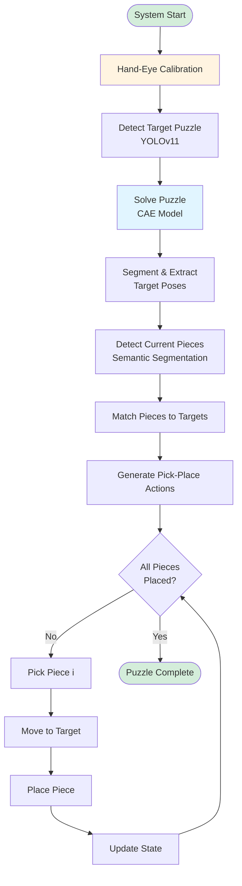
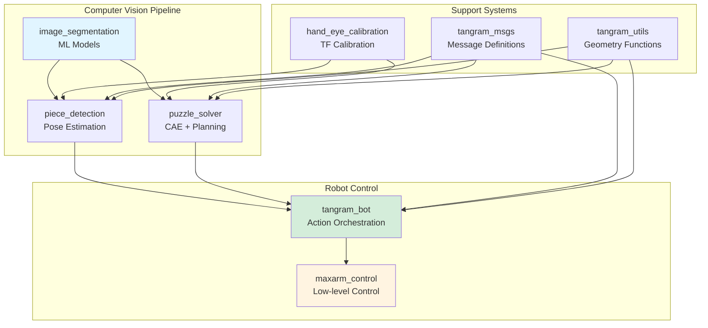
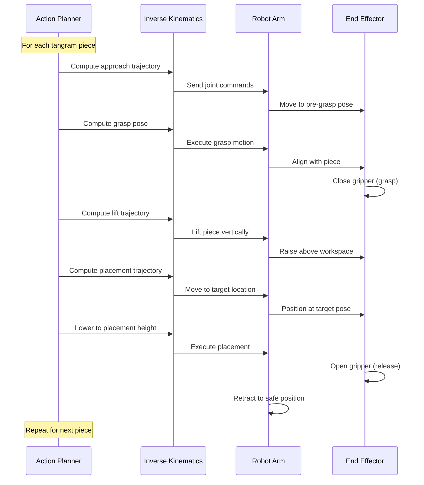

C++, Python, ROS2, YOLO, Convolutional Autoencoder, Sematic Segmentation, Computer Vision, Machine Learning, Robot Kinematics

**Source Code**: The source code for this project can be found here: [GitHub](https://github.com/nu-jliu/Autonomous_Tangram_Solver)

<!-- # Final Video
*Final Video Goes Here* -->

<iframe width="800" height="560" src="https://www.youtube.com/embed/1sL6v5JUFx0?si=-zl5taqeXtQbnnAh" title="YouTube video player" frameborder="0" allow="accelerometer; autoplay; clipboard-write; encrypted-media; gyroscope; picture-in-picture; web-share" referrerpolicy="strict-origin-when-cross-origin" allowfullscreen></iframe>

# Objective
<!-- The program of solving tangram puzzle is known to be **NP**-hard, it would be challenging for a robot to be able to solve the tangram puzzle. The objective of this project is to design and implement a robotic system that is able to solve the tangram puzzle given by the user. This system will use an advanced algorithms to sense, plan and control the robot arm to accurately assemble tangram pieces to match the target tangram puzzle configuraiton. This project aims to demostrate the capability of the robotic system to solve complex tasks by leverging computer vision, machine learning, artifical intelligence and robot manipulation. -->

This project's primary objective is the design and implementation of a robotic system engineered to autonomously solve tangram puzzles as specified by a user. The inherent **NP-hard** nature of tangram puzzles presents a considerable challenge for automated solutions. This work focuses on developing a system that integrates sophisticated algorithms for perception, planning, and robotic control, thereby enabling the precise assembly of tangram components into a target configuration. Through the application of advanced techniques in **computer vision**, **machine learning**, **artificial intelligence**, and **robotic manipulation**, this project endeavors to showcase the capacity of robotic systems to address complex tasks with high levels of precision and operational efficiency.

# Hardware Setup
The hardware configuration, depicted in the accompanying figure, comprises a robotic arm and two cameras: an overhead camera and a front-facing camera.

- Robot Arm: Utilized for manipulating tangram pieces during the puzzle-solving process.
- Overhead Camera: Employed for detecting the poses of the individual tangram pieces.
- Front Camera: Tasked with detecting the outline of the target puzzle.

## Hand-Eye Calibration

The hand-eye calibration procedure involves positioning an **AprilTag** within the robot arm's operational workspace, as illustrated below. The calibration mechanism aligns the robot arm's end-effector with the AprilTag. Subsequent calculation of the homogeneous transformation matrix yields the spatial relationship between the robot frame and the camera frame.

Denoting $ r $ as the robot frame, $ c $ as the camera frame, and $ t $ as the tag frame, the transformation $ T_{rc} $ from the robot frame to the camera frame is determined by the following equation:

$$
\begin{aligned}
    T_{rc} &= T_{rt} \cdot T_{tc} \\
    &= T_{rt} \cdot T_{ct}^{-1}
\end{aligned}
$$

Here:
- $ T_{rt} $: Transformation from the robot frame to the tag frame.
- $ T_{tc} $: Transformation from the tag frame to the camera frame.

This method ensures accurate calibration of the system, enabling precise spatial localization and coordination between the robot arm and the camera.

# System Workflow

The complete tangram solving system integrates multiple subsystems for perception, planning, and manipulation.

Original system workflow diagram:

# Software Architecture

The software architecture for this project is implemented using ROS2, comprising eight interconnected packages. Each package fulfills a specific role in enabling the robotic system to autonomously solve tangram puzzles. The overall system relies on these packages for functionalities ranging from hardware interfacing and image processing to motion planning and execution.

### ROS2 Packages

The core software is modularized into the following ROS2 packages:

*   **`hand_eye_calibration`**: Implements the necessary procedures for hand-eye calibration, which is crucial for determining the precise spatial relationship between the camera's coordinate frame and the robot's coordinate frame.
*   **`image_segmentation`**: Contains and executes the computer vision models utilized in this project. Its primary function is to segment images based on pre-trained models, identifying relevant features such as tangram pieces or puzzle outlines.
*   **`maxarm_control`**: Manages the low-level position control of the robot arm. This package ensures that the robot arm can move to desired positions and orientations with accuracy.
*   **`piece_detection`**: Responsible for detecting the pose (both position and orientation) of all individual tangram pieces within the robot's workspace. This information is vital for the subsequent planning and manipulation stages.
*   **`puzzle_solver`**: Generates the target or goal pose for each tangram piece required to solve the given puzzle. This involves determining the final configuration of all pieces.
*   **`tangram_bot`**: Orchestrates the overall robot behavior. It generates and executes the sequence of actions required to pick up individual tangram pieces and place them in their designated target poses, ultimately assembling the complete puzzle.
*   **`tangram_msgs`**: Defines all custom message types and service interfaces used for Inter-Process Communication (IPC) between the various ROS2 nodes within the system. This ensures seamless data exchange and coordination among the different software modules.
*   **`tangram_utils`**: Provides a library of utility functions specifically for tangram-related geometric calculations. These functions support operations such as pose transformations, shape analysis, and other mathematical computations necessary for the project.

## Tangram Puzzle Detection

<!-- For puzzle detection, I trained a `YOLOv11` object detection model to detect the shape drawn in the whiteboard, and then find the corresponding image in the database. After getting the desired shape image, It will be fed into the model for solving tangram puzzle. -->

For puzzle detection, a **YOLOv11** object detection model was trained to identify shapes drawn on a whiteboard. Upon successful detection, the system queries a database to retrieve the corresponding image. This selected shape image is subsequently input into the tangram puzzle-solving model for analysis and solution generation.

<!--  -->

## Tangram Puzzle Solver

To address the complexities of solving tangram puzzles, this work draws upon methodologies presented in the paper [*Generative Approaches for Solving Tangram Puzzles*](https://link.springer.com/article/10.1007/s44163-024-00107-6). The referenced study introduces a **Convolutional Autoencoder (CAE)** architecture, specifically tailored for tangram puzzle segmentation.

The CAE system accepts a tangram puzzle image as input and produces a segmented representation of its constituent shapes as output. This process facilitates a sequential approach to puzzle resolution. The accompanying figure illustrates this input-output relationship, highlighting the CAE's proficiency in decomposing the puzzle.

The training loss over epochs is depicted in the figure below, demonstrating the model's convergence during training:

### Target Pose Detection

The methodology for determining the configuration of each tangram piece within the robot's reference frame is depicted in the diagram above. This workflow ensures the accurate identification and localization of each piece, crucial for effective robotic manipulation. The sequential steps are as follows:

1.  **Model Prediction (CAE)**: The input puzzle image is processed by a trained **Convolutional Autoencoder (CAE)** to segment the tangram puzzle into its individual components and identify their respective target configurations.
2.  **Erosion**: The boundaries of each segmented mask undergo an erosion operation to prevent the erroneous fusion of adjacent tangram pieces.
3.  **Opening**: Morphological opening is applied to eliminate extraneous white noise from the black background, thereby ensuring a clean segmentation of the puzzle pieces.
4.  **Closing**: Morphological closing is utilized to remove black noise artifacts within the tangram pieces, preserving their geometric integrity.
5.  **Contour Detection**: The `Canny` edge-detection algorithm is employed to accurately locate the contours of each tangram piece, effectively isolating their perimeters.
6.  **Polygon Approximation**: The detected contours are approximated to the nearest polygonal representation, enabling the precise determination of each tangram piece's shape and orientation.

This comprehensive approach leverages the CAE model in conjunction with robust image processing techniques to ensure that tangram pieces are accurately configured within the robot's operational frame, thereby facilitating precise and efficient robotic operations.

## Tangram Piece Detection

To enable the robot arm to accurately pick up tangram pieces, **semantic segmentation** was implemented in combination with **morphological transformations**. This approach effectively identifies the shape and pose of each tangram piece, ensuring precise localization for robotic manipulation.

### Tangram Pose Detection

<!-- The workflow of detecting the pose of tangram includes following steps:

1. *Sematic Segmentation*: Segment the input image into tangram pieces.
2. "Mask Generation": Generate a mask from the segmented image 
3. *Computer Vision*: Use the computer vision algorithm to get pose as expressed in x, y pixel coordinates and shape for each tangram piece.
4. *Deprojection*: Deproject from the x, y pixel coordinate to x, y, z cartesian coordinate in camera frame. -->

As illustrated in the figure above, the workflow for detecting the pose of tangram pieces includes the following steps:

1. **Semantic Segmentation**: Segment the input image to identify individual tangram pieces.
2. **Mask Generation**: Generate a mask from the segmented image to isolate each tangram piece.
3. **Edge Detection**: Apply edge-detection algorithms to identify the contours of the tangram pieces from the masked image.
4. **Contour Analysis**: Analyze each detected contour to determine its centroid, shape, and orientation.
5. **Deprojection**: Transform the $ x, y $ pixel coordinates into $ x, y, z $ Cartesian coordinates within the camera frame, enabling precise 3D localization of the tangram pieces.

### Frame Transformation

From the **Hand-eye Calibration** step, the transformation matrix $ T_{rc} $ (robot frame to camera frame) was obtained. Using this transformation, the position of each tangram piece in the camera frame ($ \vec{p}_c $) can be converted to the corresponding position in the robot frame ($ \vec{p}_r $).

The transformation is computed as follows:

$$
\vec{p}_r = T_{rc} \times \vec{p}_c
$$

This calculation enables accurate localization of tangram pieces in the robot's coordinate frame, ensuring precise robotic manipulation during the assembly process.

The resulting detected position of each tangram piece in the camera frame is shown in the figure below:

## Robot Action Planner

Upon determination of the current poses of the tangram pieces and their respective target positions, a sequence of robotic actions was developed to orchestrate the assembly process.

The workflow encompasses the following stages:
1.  **Pose Mapping**: Leveraging the computed current and target poses, the system calculates an optimal path for each tangram piece.
2.  **Pick-and-Place Strategy**: The robotic arm is programmed to execute precise pick-and-place maneuvers, which include:
    *   Navigating to the detected position of each tangram piece.
    *   Adjusting the gripper mechanism for secure acquisition, based on the specific shape and orientation of the piece.
    *   Lifting the piece while avoiding disturbance to adjacent components.
3.  **Path Planning**: Collision-free trajectories are generated to ensure smooth transit from the current pose to the designated target pose.
4.  **Placement Accuracy**: Upon reaching the target position, the robot arm adjusts the piece's orientation to match the required alignment and executes a gentle placement.

This systematic process enables the robot to sequentially pick up each tangram piece and assemble them into the final puzzle configuration with a high degree of precision and operational efficiency.

## Robot Controller

<!-- Since the robot arm is made of 4 servo motors, that its motion is controlled by the angle of rotation for each servo motor. To accurately control the robot to move to the given x, y, z cartesian coordinate, I implemented the forward and inverse kinematics for the robot arm to precisely control its motion in cartesian space. -->

The robot arm, actuated by four servo motors, is controlled through precise angular adjustments of each motor. To achieve accurate movement to specified $x, y, z$ Cartesian coordinates, **forward and inverse kinematics** were implemented. This ensures precise motion control and positioning of the robot arm within its Cartesian workspace.

### Kinematics

<!-- To implement the forward and inverse kinematics for the robot arm, I refer the [Modern Robotics](https://hades.mech.northwestern.edu/images/7/7f/MR.pdf) to model and implement kinematics algorithm for the robot arm.  -->

To develop the forward and inverse kinematics for the robotic arm, principles from the textbook [*Modern Robotics*](https://hades.mech.northwestern.edu/images/7/7f/MR.pdf) were applied. This reference guided the modeling and implementation of the kinematics algorithms essential for precise control of the robot arm's motion.

#### Robot Modeling

<!-- As illustrated in the figure below, the robot arm is a 4-DOF robot arm, with 4-bar linkage so that the end-effector is always pointing downward.  -->

As depicted in the accompanying figure, the robot arm is a **4-DOF (Degrees of Freedom)** system incorporating a **4-bar linkage mechanism**. This design ensures the end-effector consistently maintains a downward orientation during its operation.

<!-- To take account in the 4-bar linkage, I created a fake joint as shown in the figure to correctly represent the kinematics of the robot arm. -->

To accurately model the kinematics of the robot arm, inclusive of its **4-bar linkage**, a **virtual joint** was introduced (as illustrated in the figure). This adaptation facilitates a precise representation and computation of the robot's motion dynamics.

The home configuration can be denoted as 

$$
M = \begin{bmatrix}
    1 & 0 & 0 & L_3 \\
    0 & -1 & 0 & 0 \\
    0 & 0 & -1 & L_1 + L_2 - L_4 \\
    0 & 0 & 0 & 1
\end{bmatrix}
$$

And the ${\cal S}_{list}$ and ${\cal B}_{list}$ can be represented as 

$$
\begin{align*}
S_{list} &= \begin{bmatrix}
    0 & 1 & 1 & 1 & 0 \\
    0 & 0 & 0 & 0 & 0 \\
    1 & 0 & 0 & 0 & -1 \\
    0 & 0 & 0 & 0 & L_3\\
    0 & L_1 & L_1 + L_2 & L_1 + L_2 & 0\\
    0 & 0 & 0 & -L_3 & 0
\end{bmatrix} \\
B_{list} &= \begin{bmatrix}
    0 & 0 & 0 & 0 & 0 \\
    0 & 1 & 1 & 1 & 0 \\
    -1 & 0 & 0 & 0 & 1 \\
    0 & L_4 - L_2 & 0 & L_4 & 0 \\
    0 & 0 & 0 & 0 & 0\\
    0 & -L_3 & -L_3 & 0 & 0
\end{bmatrix} \\
\end{align*}
$$

#### Forward and Inverse Kinematics

After finishing modeling the robot, we could apply the equations described in book [*Modern Robotics*](https://hades.mech.northwestern.edu/images/7/7f/MR.pdf) for calculating the forward and inverse kinematics
$$
T_{sb}(\theta) = Me^{[{\cal B_1}]\theta_1}e^{[{\cal B_2}]\theta_2}e^{[{\cal B_3}]\theta_3}e^{[{\cal B_4}]\theta_4}e^{[{\cal B_5}]\theta_5}
$$

# Result

The successfully assembled tangram puzzle is presented in the figure below, demonstrating the robotic system's capability to complete the complex task. This outcome highlights the effective integration of advanced algorithms for perception, planning, and manipulation in achieving precise puzzle assembly.

# Future Work

Several components within the project have been identified for potential enhancement in future iterations.

1.  **Robot Control**: Due to inherent hardware limitations, the precision of the robot actuators is insufficient for consistently accurate grasping of all tangram pieces. Future work could involve the implementation of a closed-loop control system. This system would utilize an AprilTag mounted on the robot arm to provide real-time feedback, thereby improving grasp accuracy and overall manipulation reliability.

# References: 

1. Fernanda Miyuki Yamada, Harlen Costa Batagelo, João Paulo Gois, and H. Takahashi, "Generative approaches for solving tangram puzzles," Discover Artificial Intelligence, vol. 4, no. 1, Feb. 2024, doi: https://doi.org/10.1007/s44163-024-00107-6.

2. K. M. Lynch and F. C. Park, Modern robotics : mechanics, planning, and control. Cambridge: University Press, 2017.
‌
‌