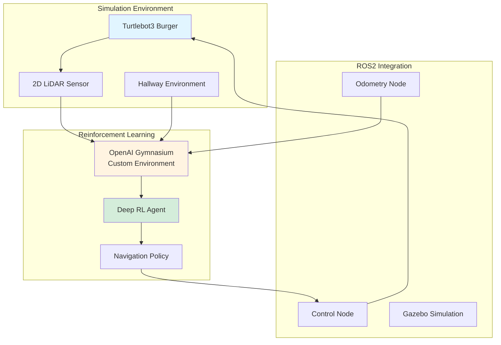
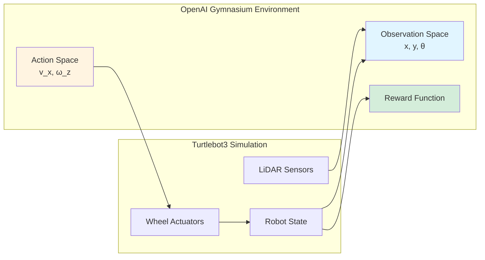
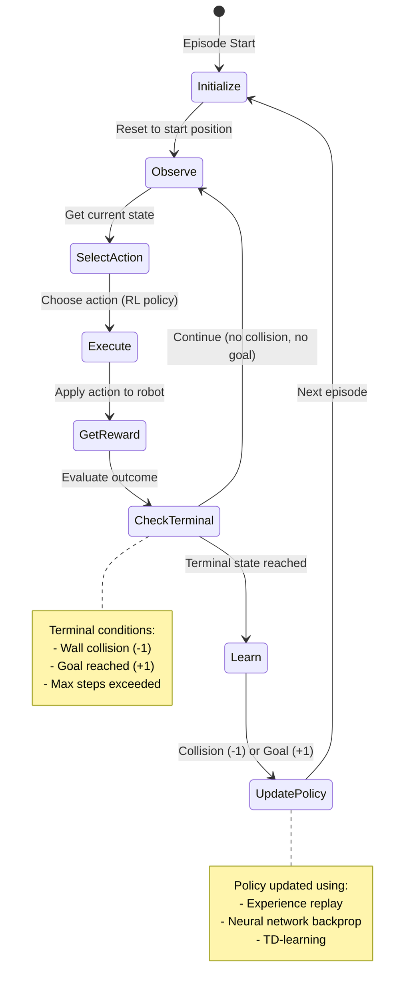

C++, ROS2, Open Robotics Turtlebot3 Burger, 2D LiDar, OpenAI Gymnasium, Deep Reinforcement Learning

[View This Project on GitHub](https://github.com/nu-jliu/deep_reinforce_learning_navigation)

# Description
In this project, I designed and implemented an OpenAI Gymnasium environment for training a Deep Reinforcement Learning model to enable autonomous navigation of a Turtlebot3 Burger through complex hallway environments. The system leverages 2D LiDAR sensors for perception and employs state-of-the-art Deep RL algorithms to learn collision-free navigation policies.

## Project Overview

# Demo Video
The result of this project cam be shown in the video below:

<iframe width="560" height="315" src="https://www.youtube.com/embed/9-lRs6uwU5k?si=knkHRmLo77Qaoplx" title="YouTube video player" frameborder="0" allow="accelerometer; autoplay; clipboard-write; encrypted-media; gyroscope; picture-in-picture; web-share" referrerpolicy="strict-origin-when-cross-origin" allowfullscreen></iframe>

## Odometry Model

For this project, since the focus is the control of a turtlebot3, not localization, so I assume the perfect odometry for this project.

To get the odometry from the wheel angle and velocity, it applied kinematics model from *Modern Robotics* to conduct the `Forward Kinematics` and `Inverse Kinematics` of the robot.

The geometry model of the robot can be present using $H$ matrix. 

<!-- $$H=\begin{bmatrix}
    h_1(\theta) \\
    h_2(\theta) 
\end{bmatrix}$$

$$h_i(\theta) = \frac{1}{r_i \cos{\gamma_i}} \begin{bmatrix}
        x_i \sin{\left (\beta_i + \gamma_i \right )} - y_i \cos{\left (\beta_i + \gamma_i \right)} \\
        \cos{\left ( \beta_i + \gamma_i + \theta \right )} \\
        \sin{\left ( \beta_i + \gamma_i + \theta \right )}
    \end{bmatrix}^\text{T}$$ -->

$$\begin{align*}
    H(\theta) &= \begin{bmatrix}
        h_1(\theta) \\
        h_2(\theta)
    \end{bmatrix} \\
    h_i(\theta) &= \frac{1}{r_i \cos{\gamma_i}} \begin{bmatrix}
        x_i \sin{\left (\beta_i + \gamma_i \right )} - y_i \cos{\left (\beta_i + \gamma_i \right)} \\
        \cos{\left ( \beta_i + \gamma_i + \theta \right )} \\
        \sin{\left ( \beta_i + \gamma_i + \theta \right )}
    \end{bmatrix}^\intercal
\end{align*}$$

For the `Turtlebot3`, which is a diff-drive mobile robot. The parameters are defined as

$$
\begin{align*}
    x_1 &= 0 \\
    x_2 &= 0 \\
    y_1 &= d \\
    y_2 &= -d \\ 
    \beta_1 &= 0 \\
    \beta_2 &= 0 \\
    \gamma_1 &= -\pi/2 \\
    \gamma_2 &= -\pi/2 \\
    r_1 &= r \\
    r_2 &= r
\end{align*}
$$

So that $$H(0)$$ can be calculated as 

$$H(0)=\begin{bmatrix}
    -d & 1 & -\infty \\
    d & 1 & -\infty
\end{bmatrix}$$

Where $$d$$ is the one-half of the distance between the wheels and the $$r$$ is the radius of the wheel.

Hence $$F$$ matrix can be calculated by

$$
F=H(0)^\dagger = r \begin{bmatrix}
        -\frac{1}{2d} & \frac{1}{2d} \\
        \frac{1}{2} & \frac{1}{2} \\
        0 & 0
    \end{bmatrix}
$$

### Forward Kinematics
The forward kinematics is to find the tranform from current state to next state $$T_{bb'}$$ given the change in wheel positions $$\left( \Delta\phi_l, \Delta\phi_r\right)$$. 

- Find the body twist $${\cal V}_b$$ from the body frame of the current state to next state:

$${\cal V}_b = F \Delta \phi = r \begin{bmatrix}
            -\frac{1}{2d} & \frac{1}{2d} \\
        \frac{1}{2} & \frac{1}{2} \\
        0 & 0
        \end{bmatrix} \begin{bmatrix}
            \Delta \phi_l \\
            \Delta \phi_r
        \end{bmatrix}$$

- Construct the 3d twist by

$$
{\cal V}_{b6} = \begin{bmatrix}
            0 \\
            0 \\
            {\cal V}_b \\
            0
        \end{bmatrix}
$$

- Then, the transform from current state to next state $$T_{bb'}$$ can be calculated by 

$$
T_{bb'}=e^{[{\cal V}_{b6}]}
$$

### Inverse Kinematics
Inverse kinematics is to find the wheel velocities $$\left(\dot{\phi_l}, \dot{\phi_r} \right)$$ given the body twist $${\cal V}_b$$.

The wheel velocities can be calculated as 

$$
\begin{bmatrix}
        \dot{\phi}_l \\
        \dot{\phi}_r
\end{bmatrix} = H(0){\cal V}_b = \frac{1}{r}\begin{bmatrix}
        -d & 1 & -\infty \\
        d & 1 & -\infty
    \end{bmatrix} \begin{bmatrix}
        \omega_z \\
        v_x \\
        v_y
    \end{bmatrix}
$$

Since this robot is non-holonomic so that it cannot move sideways. Hence $$v_y=0$$, then the wheel velocities $$\left(\dot{\phi_l}, \dot{\phi_r} \right)$$ are:

$$
\begin{align*}
    \dot{\phi}_l &= \frac{1}{r} \left ( -d \omega_z + v_x\right) \\
    \dot{\phi}_r &= \frac{1}{r} \left ( d \omega_z + v_x\right) \\
\end{align*}
$$

## OpenAI Gymnasium

To start the training pipeline of the turtlebot3, I wrapped the ROS2 turtlebot3 simulation within the OpenAI Gymnasium environment, creating a standardized interface for Deep RL algorithms.

### Observation Space
The observation space for the environment can be defined as:

$$
\begin{align*}
x &= -1 \rightarrow 4 \text{ meters (world x-coordinate)} \\
y &= -0.5 \rightarrow 4.5 \text{ meters (world y-coordinate)} \\
\theta &= -\pi \rightarrow \pi \text{ radians (orientation)}
\end{align*}
$$

### Action Space
The action space can be defined as:

$$
\begin{align*}
\dot{x} &= 0.0 \rightarrow 0.2 \text{ m/s (linear velocity)} \\
\dot{\theta} &= -0.5 \rightarrow 0.5 \text{ rad/s (angular velocity)}
\end{align*}
$$

### Reward Function
The reward structure encourages collision-free goal-reaching behavior:
- **Collision penalty**: -1 (when robot hits a wall)
- **Goal reward**: +1 (when robot reaches the target)
- This sparse reward signal requires the agent to learn exploratory behavior

## Training Process

The Deep Reinforcement Learning training follows an episodic approach where the agent learns through trial and error.

The training process is shown in the figure below, in which every robot will be reset to its original position whenever it hits a wall.

### Training Algorithm

The agent learns through the following cycle:
1. **Initialization**: Robot spawns at the start position
2. **Observation**: Collect state information (position, orientation, LiDAR data)
3. **Action Selection**: Neural network policy outputs velocity commands
4. **Execution**: Robot moves according to the selected action
5. **Reward Evaluation**: System checks for collision or goal achievement
6. **Learning**: Update policy based on reward signal
7. **Reset**: Upon terminal state, reset environment and repeat

## Packages
 - `nuturtle_description`: Visualizing the pose of the turtlebot3 burger
 - `turtlelib`: Call customized library functions for kinematics and slam calculations.
 - `nusim`: Simulate the turtlebot in the real world.
 - `nuturtle_control`: Performing the turtlebot kinematics calculation and parsing the command sent to the `turtlebot3`.
 - `nuslam`: Performs the SLAM algorithm for correcting the error odometry.
 - `nuturtle_interfaces`: All message interfaces for communication between the nodes
 - `nuturtle_slam`: Integrate `slam_toolbox` for setting up learning environment
 - `nuturtle_deeprl`: Wrapped with `OpenAI Gymnasium` for Deep Reinforcement Learning traing environment