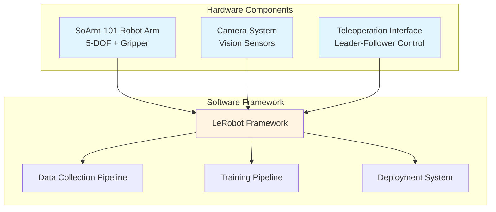
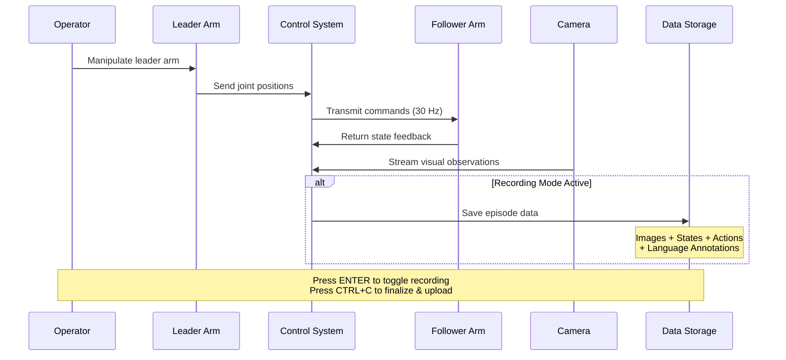
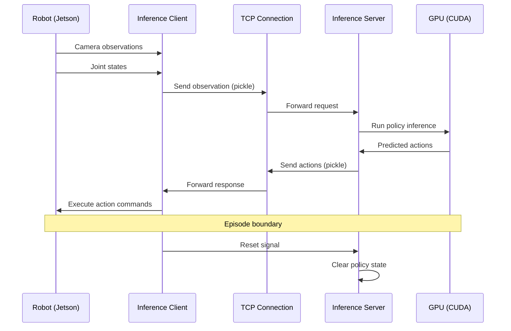
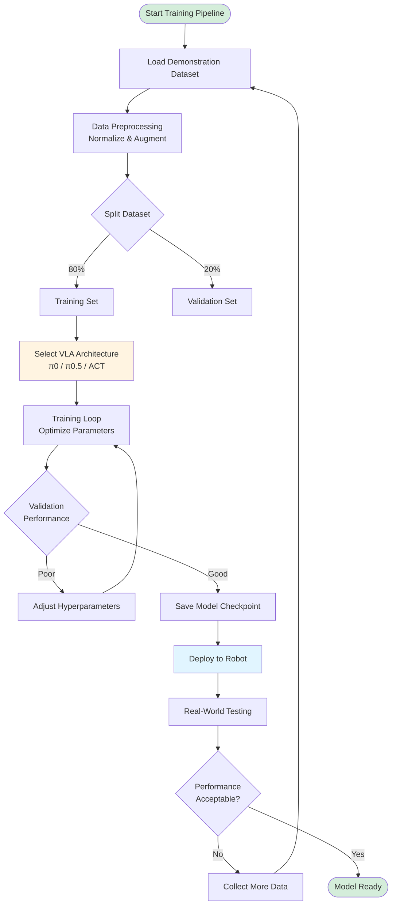

Python, ROS2, LeRobot, Vision-Language-Action, Deep Learning, Robot Manipulation, SoArm-101, Teleoperation, Imitation Learning

[View This Project on GitHub](https://github.com/nu-jliu/allen-vla)

# Description

This project explores the application of state-of-the-art Vision-Language-Action (VLA) models for robotic manipulation tasks using the SoArm-101 robot arm. VLA models represent a new paradigm in robot learning that combines visual perception, natural language understanding, and action prediction to enable robots to perform complex manipulation tasks through learned behaviors.

The project is structured around two primary objectives:

1. **Teleoperation & Data Collection**: Establishing a robust pipeline for teleoperating the SoArm-101 robot and collecting high-quality demonstration datasets using LeRobot
2. **Training & Deployment**: Implementing, training, and benchmarking various VLA model architectures including π0, π0.5, and ACT (Action Chunking Transformer)

# Project Overview

## What are Vision-Language-Action Models?

Vision-Language-Action (VLA) models are a class of neural networks that learn to map visual observations and language instructions directly to robot actions. Unlike traditional robotic systems that rely on hand-engineered perception and control pipelines, VLA models learn end-to-end policies from demonstration data, enabling more flexible and generalizable robot behaviors.

These models typically:
- Process camera images to understand the scene
- Accept natural language commands to specify task goals
- Output low-level robot control commands (joint positions, velocities, etc.)

## Hardware Setup

The project uses the **SoArm-101** robot arm, a compact and accessible robotic manipulator suitable for tabletop manipulation tasks. The system is integrated with LeRobot, an open-source framework designed to facilitate robot learning research.



Key components:
- **SoArm-101 Robot Arm**: 5-DOF robotic arm with gripper
- **Camera System**: Vision sensors for visual perception
- **Teleoperation Interface**: Custom control interface for collecting demonstration data
- **LeRobot Framework**: Provides tools for data collection, training, and deployment

## Project Structure

```
allen-vla/
├── calibration/
│   └── calibrate.py              # Calibration script for SO101 follower arm
├── data_collection/
│   └── collect.py                # Main data collection script
├── policy/
│   └── act/
│       ├── train_act.py          # Training script for ACT policy
│       ├── inference_act.py      # Local inference (policy + robot on same machine)
│       ├── inference_server.py   # TCP server for remote inference (GPU machine)
│       └── inference_client.py   # Robot client (connects to inference server)
├── scripts/
│   ├── deploy_remote.bash        # Deploy project files to remote machine
│   ├── download_data.bash        # Download collected data from remote machine
│   └── download_model.bash       # Download trained models from remote machine
├── teleop/
│   └── teleop.py                 # Teleoperation script for leader-follower control
├── udev/
│   └── 99-so101.rules            # Udev rules for consistent device naming
├── robot_utils.py                # Shared utilities for robot initialization
└── utils.py                      # Common utilities including colored logging
```

# Project Phases

## Phase 1: Teleoperation & Data Collection Pipeline ✓ COMPLETE

The first phase focused on establishing a reliable data collection infrastructure. High-quality demonstration data is crucial for training effective VLA models. **This phase has been successfully completed.**

### Completed Tasks:
- **LeRobot Environment Setup**: Configured LeRobot framework with all necessary dependencies
- **Hardware Integration**: Successfully integrated SoArm-101 with LeRobot's control interfaces
- **Teleoperation Interface**: Developed an intuitive leader-follower teleoperation system where movements on a leader arm transmit to a follower arm in real-time
- **Data Collection Scripts**: Implemented automated scripts (`data_collection.py`) for recording and storing demonstration trajectories at 30 Hz
- **Sample Demonstrations**: Tested the complete pipeline by recording initial demonstration datasets
- **Camera & Sensor Pipeline**: Completed vision system configuration and integration
- **Data Format Standardization**: Implemented consistent data structures compatible with LeRobot's training format
- **Dataset Management**: Created utilities for organizing, versioning, and managing collected datasets with Hugging Face Hub integration

## Phase 2: Training & Deployment Pipeline ⚙️ IN PROGRESS

The second phase involves implementing and evaluating different VLA model architectures. **Major progress has been made with ACT model training and inference pipelines both complete.**

### Model Architectures:

#### ✓ ACT (Action Chunking Transformer) - FULLY IMPLEMENTED
A transformer-based model that predicts sequences of future actions (action chunks) rather than single actions, enabling more coherent and long-horizon behaviors. The ACT pipeline is now fully operational with:
- **Training Pipeline**: Comprehensive hyperparameter control, Weights & Biases integration, GPU-accelerated training with distributed computing support
- **Local Inference**: Direct policy execution with robot and camera on the same machine
- **Client-Server Inference**: Distributed architecture for running inference on a remote GPU while the robot operates on a low-power device (e.g., Jetson)

#### ⧖ π0 (Pi-Zero) - PLANNED
A foundational VLA model architecture that learns visuomotor policies from demonstration data.

#### ⧖ π0.5 (Pi-Zero-Point-Five) - PLANNED
An enhanced version of π0 with improved architecture and training strategies.

### Completed Training Pipeline Components:
- ✓ GPU-accelerated training environment
- ✓ Comprehensive hyperparameter configuration management
- ✓ Model checkpointing and versioning
- ✓ Training visualization with Weights & Biases
- ✓ Resume training from checkpoint support
- ✓ HuggingFace Hub integration for model sharing
- ⧖ Evaluation metrics and benchmarking scripts (in progress)

### Deployment Pipeline:
- ✓ Deployment automation scripts for Jetson devices
- ✓ Udev rules configuration for consistent hardware device naming
- ✓ Local inference pipeline for real-time robot control
- ✓ Client-server inference architecture for distributed computing
- ✓ Multi-client support via threaded TCP server
- ⧖ Safety monitoring and intervention systems (planned)
- ⧖ Performance evaluation on real hardware (in progress)

# Technical Implementation

## LeRobot Integration

LeRobot provides a standardized interface for robot learning research. The integration with SoArm-101 required:

1. **Robot Driver Development**: Custom drivers for SoArm-101 hardware communication
2. **Calibration Procedures**: Kinematic calibration for accurate position control
3. **Data Recording Format**: Standardized format compatible with LeRobot's training pipeline
4. **Real-time Control**: Low-latency control loops for smooth teleoperation and policy execution

## Data Collection Methodology

The teleoperation system enables human operators to:
- Control the robot arm through an intuitive interface
- Demonstrate desired manipulation behaviors
- Record synchronized data streams (images, robot states, actions)
- Annotate demonstrations with task labels and language descriptions

The collected datasets serve as training data for the VLA models, where the models learn to imitate the demonstrated behaviors.



## Usage Workflows

The project provides multiple operational modes:

### Calibration Mode

Before using the robot, the follower arm needs calibration to set joint zero positions:
- Run `python calibration/calibrate.py` with port and ID arguments
- Sets zero positions for each joint for accurate position control

### Teleoperation Mode

Running `python teleop/teleop.py` establishes a leader-follower control system:
- Movements on the leader arm are transmitted to the follower arm in real-time
- Serial port configuration and arm identifiers are customizable via command-line parameters
- Configurable control frequency (default: 20 Hz)
- Enables intuitive control for demonstrating manipulation behaviors

### Data Collection Mode

The `data_collection/collect.py` script captures demonstration episodes:
- Records synchronized data streams at 30 Hz (images, robot states, actions)
- Press ENTER to toggle recording on/off
- Press CTRL+C to finalize the session and upload datasets to Hugging Face Hub
- Datasets are automatically formatted for compatibility with LeRobot's training pipeline

### Training Mode

The `policy/act/train_act.py` script trains ACT policies:
- Supports extensive hyperparameter configuration (batch size, learning rate, chunk size, etc.)
- Weights & Biases integration for experiment tracking
- Checkpoint saving and resume capabilities
- Distributed training support via Accelerate

### Inference Modes

Two inference architectures are supported:

**Local Inference** (`policy/act/inference_act.py`):
- Policy and robot run on the same machine
- Direct camera capture and robot control
- Saves evaluation results as datasets

**Client-Server Inference** (for distributed setups):
- **Server** (`inference_server.py`): Runs on GPU machine, handles inference requests over TCP
- **Client** (`inference_client.py`): Runs on robot machine (e.g., Jetson), sends observations and executes actions
- Multi-client support via threading
- Ideal for resource-constrained robot platforms



## Model Training Workflow

The training workflow follows these steps:

1. **Data Preprocessing**: Normalize images and actions, augment data for robustness
2. **Model Architecture**: Implement the selected VLA model architecture
3. **Training Loop**: Optimize model parameters using collected demonstrations
4. **Validation**: Evaluate model performance on held-out demonstrations
5. **Deployment Testing**: Test trained policies on the physical robot
6. **Iteration**: Refine based on real-world performance



# Current Status

The project has successfully completed Phase 1 and made substantial progress in Phase 2:

**Phase 1 - Complete ✓**
- Teleoperating the SoArm-101 with low latency and configurable control frequencies
- Recording demonstration data in LeRobot-compatible format
- Managing collected datasets with automatic Hugging Face Hub integration
- Robot calibration utilities for accurate joint positioning

**Phase 2 - In Progress ⚙️**
- ACT (Action Chunking Transformer) training pipeline fully implemented
- ACT inference pipeline complete with both local and client-server architectures
- Deployment automation for Jetson devices operational
- Training infrastructure established with GPU acceleration and experiment tracking
- Working on additional VLA models (π0, π0.5) and real-world performance evaluation

The system now provides five main operational modes:
1. **Calibration Mode**: Joint zero position calibration for accurate control
2. **Teleoperation Mode**: Real-time leader-follower control
3. **Data Collection Mode**: Keyboard-controlled episode recording with cloud upload
4. **Training Mode**: ACT model training with comprehensive hyperparameter control
5. **Inference Mode**: Local or distributed policy execution with evaluation recording

# Future Directions

This project aims to:

1. **Benchmark Multiple VLA Architectures**: Compare π0, π0.5, ACT, and potentially other models on standardized tasks
2. **Dataset Expansion**: Collect diverse demonstration datasets covering various manipulation scenarios
3. **Performance Analysis**: Document detailed performance metrics, failure modes, and lessons learned
4. **Open-Source Contributions**: Share trained models, datasets, and implementation insights with the robotics community

# Technical Stack

- **Programming Language**: Python 3.12+
- **Dependency Management**: UV (uv sync)
- **Robot Learning Framework**: LeRobot (v0.4.2+) with Feetech extension
- **Hardware Interface**: Feetech servos via serial communication
- **Deep Learning**: PyTorch (via LeRobot), Accelerate for distributed training
- **Experiment Tracking**: Weights & Biases
- **Dataset Management**: Hugging Face Hub
- **Computer Vision**: OpenCV
- **Version Control**: Git

# Conclusion

This project represents an exploration of cutting-edge VLA models applied to practical robotic manipulation. By combining teleoperation, imitation learning, and state-of-the-art neural architectures, the goal is to develop capable and generalizable robot policies that can learn from demonstration and adapt to new scenarios.

The integration of LeRobot with SoArm-101 provides an accessible platform for robot learning research, and the insights gained from training and evaluating multiple VLA models will contribute to understanding the capabilities and limitations of these emerging approaches.

# License

This project is released under the MIT License, enabling broad usage and modification with proper attribution. The open-source nature of the project encourages collaboration and knowledge sharing within the robotics and machine learning communities.

# References

1. LeRobot: An Open-Source Framework for Robot Learning - [https://github.com/huggingface/lerobot](https://github.com/huggingface/lerobot)
2. Action Chunking Transformer (ACT) - Learning Fine-Grained Bimanual Manipulation
3. Vision-Language-Action Models for Robot Learning
