Python, LeRobot, Vision-Language-Action, Deep Learning, Robot Manipulation, SoArm-101, Teleoperation, Imitation Learning

[View This Project on GitHub](https://github.com/nu-jliu/allen-vla)

[Dataset on Hugging Face Hub](https://huggingface.co/datasets/jliu6718/lerobot-so101-act) | [Trained Model on Hugging Face Hub](https://huggingface.co/jliu6718/lerobot-so101-act)

# Description

This project explores the application of state-of-the-art Vision-Language-Action (VLA) models for robotic manipulation tasks using the SoArm-101 robot arm. VLA models represent a new paradigm in robot learning that combines visual perception, natural language understanding, and action prediction to enable robots to perform complex manipulation tasks through learned behaviors.

The project successfully established a complete pipeline from teleoperation and data collection through model training and real-world deployment, providing valuable insights into the practical challenges of implementing VLA systems on affordable hardware.

# What are Vision-Language-Action Models?

Vision-Language-Action (VLA) models are a class of neural networks that learn to map visual observations and language instructions directly to robot actions. Unlike traditional robotic systems that rely on hand-engineered perception and control pipelines, VLA models learn end-to-end policies from demonstration data, enabling more flexible and generalizable robot behaviors.

These models typically:
- Process camera images to understand the scene
- Accept natural language commands to specify task goals
- Output low-level robot control commands (joint positions, velocities, etc.)

The key insight is that by learning from human demonstrations, robots can acquire complex manipulation skills without explicit programming of every motion primitive.

# Hardware Setup

The project uses the **SoArm-101** robot arm, a compact and accessible robotic manipulator suitable for tabletop manipulation tasks. The system is integrated with LeRobot, an open-source framework designed to facilitate robot learning research.

```mermaid
graph TB
    subgraph Workspace["🏠 Physical Workspace"]
        subgraph Arms["Dual Arm Setup"]
            LEADER["👤 Leader Arm<br/>Torque Disabled<br/>Human Guidance"]
            FOLLOWER["🤖 Follower Arm<br/>Torque Enabled<br/>Mirrors Leader"]
        end

        subgraph Sensors["Perception"]
            CAM["📷 USB Camera<br/>Logitech C920<br/>640×480 @ 30Hz"]
        end

        subgraph Objects["Task Objects"]
            CUBE["🟦 Target Objects<br/>Small Cubes"]
        end
    end

    subgraph Computer["💻 Host Computer"]
        subgraph Ports["USB Ports"]
            USB1["🔌 /dev/ttyACM0<br/>Leader"]
            USB2["🔌 /dev/ttyACM1<br/>Follower"]
            USB3["🔌 /dev/video0<br/>Camera"]
        end

        subgraph Software["Software Stack"]
            PYTHON["🐍 Python 3.10+"]
            LEROBOT["🤗 LeRobot"]
            OPENCV["📹 OpenCV"]
            TORCH["🔥 PyTorch"]
        end
    end

    LEADER ---|"Serial 1Mbps"| USB1
    FOLLOWER ---|"Serial 1Mbps"| USB2
    CAM ---|"USB 2.0"| USB3

    USB1 --> LEROBOT
    USB2 --> LEROBOT
    USB3 --> OPENCV
    OPENCV --> LEROBOT
    LEROBOT --> TORCH

    style LEADER fill:#e8f5e9
    style FOLLOWER fill:#e1f5ff
    style CAM fill:#fff3cd
    style LEROBOT fill:#ffeaa7
    style TORCH fill:#ffcdd2
```

**Key Components:**
- **SO101 Leader Arm**: Manual control arm for teleoperation demonstrations (torque disabled for free movement)
- **SO101 Follower Arm**: 5-DOF robotic arm with gripper (Feetech servos, torque enabled)
- **USB Camera**: OpenCV-based vision capture at 640x480 resolution, 30 FPS
- **LeRobot Framework**: Provides standardized interfaces for data collection, training, and deployment

### Robot Joint Configuration

The SO101 arm features 6 controllable joints:

| Joint | Name | Type | Description |
|-------|------|------|-------------|
| 1 | `shoulder_pan` | Revolute | Base rotation (yaw) |
| 2 | `shoulder_lift` | Revolute | Shoulder elevation (pitch) |
| 3 | `elbow_flex` | Revolute | Elbow bend (pitch) |
| 4 | `wrist_flex` | Revolute | Wrist pitch |
| 5 | `wrist_roll` | Revolute | Wrist rotation (roll) |
| 6 | `gripper` | Prismatic | Gripper open/close |

**Observation Space**: 6D joint positions (radians for revolute, meters for prismatic)
**Action Space**: 6D target positions (same format)

# System Architecture

## End-to-End Pipeline Overview

The complete VLA system spans data collection, cloud-based training, and real-world deployment. This architecture enables a seamless workflow from human demonstrations to autonomous robot operation.

```mermaid
flowchart TB
    subgraph Collection["🎮 Data Collection Phase"]
        direction TB
        LEADER["👤 Human Operator<br/>Leader Arm"]
        FOLLOWER["🤖 Follower Arm<br/>SO101"]
        CAMERA["📷 USB Camera<br/>640x480"]
        TELNET["💻 Telnet Control<br/>Start/Stop/Abort"]
        DATASET["📦 LeRobot Dataset<br/>Parquet + Videos"]

        LEADER -->|"Position Commands"| FOLLOWER
        CAMERA -->|"RGB Frames"| DATASET
        FOLLOWER -->|"Joint States"| DATASET
        TELNET -->|"Recording Control"| DATASET
    end

    subgraph Cloud["☁️ Cloud Services"]
        direction TB
        HF["🤗 Hugging Face Hub<br/>Datasets & Models"]
        WANDB["📊 Weights & Biases<br/>Experiment Tracking"]
    end

    subgraph Training["🧠 Training Phase"]
        direction TB
        GPU["⚡ GPU Server<br/>RTX 3080/4090"]

        subgraph Models["Model Architectures"]
            ACT["🔷 ACT<br/>Action Chunking<br/>Transformer"]
            DIFF["🔶 Diffusion Policy<br/>Denoising<br/>Generation"]
            PI0["🔴 π0 (Planned)<br/>Flow Matching"]
        end

        GPU --> Models
    end

    subgraph Deployment["🚀 Deployment Phase"]
        direction TB
        JETSON["📟 Edge Device<br/>Jetson Nano"]
        ROBOT["🦾 Robot Arm<br/>Autonomous"]
        SERVER["🖥️ Inference Server<br/>TCP/IP"]

        JETSON <-->|"Observations/Actions"| SERVER
        JETSON --> ROBOT
    end

    Collection -->|"Push Dataset"| HF
    HF -->|"Load Dataset"| Training
    Training -->|"Push Model"| HF
    Training -->|"Log Metrics"| WANDB
    HF -->|"Pull Model"| Deployment

    style Collection fill:#e8f5e9
    style Cloud fill:#fff3cd
    style Training fill:#e3f2fd
    style Deployment fill:#fce4ec
```

## Technology Stack

| Layer | Technology | Purpose |
|-------|------------|---------|
| **Framework** |  | Robot learning framework |
| **Deep Learning** |  | Neural network training |
| **Vision** |  | Image capture & processing |
| **Hardware** |  | Servo motors (STS3215) |
| **Dataset** |  | Dataset & model hosting |
| **Tracking** |  | Experiment logging |
| **Edge** |  | Edge deployment |

## Telnet-Based Data Collection Control

One of the key architectural decisions was implementing a **telnet-based command interface** for controlling the data collection process. This design enables operators to control recording sessions remotely without interrupting the teleoperation workflow.

**Command Interface:**
- **`s`** - Start/stop recording episodes
- **`a`** - Abort current episode (discard frames without saving)
- **`q`** - Quit and save dataset

**Why Telnet?** The choice of a text-based telnet protocol over custom software was deliberate:
1. **Cross-platform compatibility**: Any device with a terminal can control the system
2. **Simplicity**: No client software installation required
3. **Reliability**: Standard TCP sockets with well-understood behavior
4. **Debuggability**: Human-readable commands for easy troubleshooting

## Multi-Threaded Architecture

The data collection system employs three concurrent threads to ensure smooth operation:

1. **Image Capture Thread**: Continuously captures camera frames at 30 FPS, decoupled from the control loop to prevent frame drops during servo communication
2. **Command Server Thread**: Listens for telnet connections and processes recording commands with thread-safe state updates
3. **Main Teleoperation Loop**: Runs at 30 Hz, reading leader arm positions and transmitting to the follower while recording synchronized observations

Thread synchronization uses Python locks to protect shared state (recording flag and latest image buffer), preventing race conditions between command processing and data capture.

## Client-Server Inference Architecture

For deployment, the system supports a distributed architecture that separates GPU inference from robot control:

```mermaid
flowchart LR
    subgraph Robot["🤖 Robot Client (Jetson Nano)"]
        direction TB
        ARM["🦾 SO101 Arm<br/>6-DOF Control"]
        CAM["📷 Camera<br/>Frame Capture"]
        CLIENT["📡 TCP Client<br/>Async I/O"]

        subgraph EdgeStack["Edge Software"]
            NUMPY["NumPy"]
            SERIAL["pyserial"]
        end
    end

    subgraph Network["🌐 Network"]
        TCP["TCP/IP<br/>Port 8000<br/>~10ms RTT"]
    end

    subgraph GPU["⚡ GPU Server (RTX 3080/4090)"]
        direction TB
        SERVER["🖥️ TCP Server<br/>Multi-threaded"]

        subgraph Inference["Inference Pipeline"]
            PREPROCESS["📥 Preprocessing<br/>Normalize & Resize"]
            MODEL["🧠 VLA Model<br/>ACT / Diffusion"]
            POSTPROCESS["📤 Postprocessing<br/>Action Scaling"]
        end

        subgraph GPUStack["GPU Software"]
            TORCH2["🔥 PyTorch"]
            CUDA["CUDA 11.8+"]
            HF2["🤗 Transformers"]
        end
    end

    CAM -->|"RGB Frame"| CLIENT
    ARM -->|"Joint State"| CLIENT
    CLIENT <-->|"JSON Protocol"| TCP
    TCP <-->|"Observations ➡️<br/>⬅️ Actions"| SERVER
    SERVER --> PREPROCESS
    PREPROCESS --> MODEL
    MODEL --> POSTPROCESS
    POSTPROCESS --> SERVER
    CLIENT -->|"Target Position"| ARM

    style Robot fill:#e8f5e9
    style GPU fill:#e3f2fd
    style Network fill:#fff3cd
    style MODEL fill:#ffcdd2
```

**Protocol Specification:**

| Message Type | Direction | Format | Example |
|--------------|-----------|--------|---------|
| Observation | Client → Server | `{"image": base64, "state": [6 floats]}` | Joint positions + RGB |
| Action | Server → Client | `{"action": [6 floats]}` | Target joint positions |
| Heartbeat | Bidirectional | `{"ping": timestamp}` | Connection health |

This architecture enables running computationally expensive neural network inference on a powerful GPU server while the robot operates on a resource-constrained edge device like NVIDIA Jetson.

# Model Architectures

The following diagram illustrates the internal architecture of each VLA model used in this project:

```mermaid
flowchart LR
    subgraph Input["📥 Input"]
        IMG["🖼️ Camera Image<br/>640×480 RGB"]
        STATE["📊 Joint State<br/>6D Position"]
        LANG["💬 Language<br/>(Optional)"]
    end

    subgraph ACT_Model["🔷 ACT Architecture"]
        direction TB
        RESNET["ResNet-18<br/>Vision Encoder"]
        POS_EMB["Positional<br/>Embedding"]
        TRANSFORMER["Transformer<br/>Encoder-Decoder"]
        VAE["VAE Latent<br/>Space"]
        CHUNK["Action Chunk<br/>100 Steps"]
    end

    subgraph Diffusion_Model["🔶 Diffusion Policy"]
        direction TB
        UNET["U-Net<br/>Denoiser"]
        NOISE["Gaussian<br/>Noise"]
        DDPM["DDPM<br/>100 Steps"]
        DENOISE["Iterative<br/>Denoising"]
    end

    subgraph Output["📤 Output"]
        ACTIONS["🎯 Action Sequence<br/>Joint Targets"]
    end

    IMG --> RESNET
    STATE --> POS_EMB
    RESNET --> TRANSFORMER
    POS_EMB --> TRANSFORMER
    TRANSFORMER --> VAE
    VAE --> CHUNK
    CHUNK --> ACTIONS

    IMG --> UNET
    STATE --> UNET
    NOISE --> DDPM
    DDPM --> DENOISE
    UNET --> DENOISE
    DENOISE --> ACTIONS

    style ACT_Model fill:#e3f2fd
    style Diffusion_Model fill:#fff3cd
    style Input fill:#e8f5e9
    style Output fill:#fce4ec
```

## ACT (Action Chunking Transformer)

A transformer-based model that predicts sequences of future actions (action chunks) rather than single actions, enabling more coherent and long-horizon behaviors.

**Key Design Choices:**
- **Chunk Size of 100**: Predicts 100 future actions at once, reducing the frequency of policy queries and enabling smoother trajectories
- **VAE Training**: Uses KL divergence loss for latent space regularization, helping the model learn a compact representation of action distributions
- **ResNet-18 Vision Backbone**: Efficient visual feature extraction balancing accuracy and inference speed

The action chunking approach proved particularly effective for manipulation tasks where temporal coherence matters. Rather than predicting one action at a time (which can lead to jerky motion), predicting a sequence of actions allows the robot to execute smooth, purposeful movements.

## Diffusion Policy

A denoising diffusion-based policy that learns to generate robot actions through iterative refinement, enabling smooth and multimodal action distributions.

**Key Design Choices:**
- **Iterative Denoising**: Generates actions by progressively refining random noise, allowing the model to represent complex, multimodal action distributions
- **Horizon of 16 Steps**: Balances prediction accuracy with computational efficiency
- **100 DDPM Inference Steps**: Provides high-quality action generation at the cost of increased inference time

The diffusion approach excels at handling ambiguous situations where multiple valid actions exist. For example, when grasping an object, there may be several valid approach angles - diffusion models can represent this uncertainty naturally.

## Planned: Pi-Zero Models

Future work includes implementing the Pi-Zero (π0) and Pi-Zero-Point-Five (π0.5) architectures from Physical Intelligence, which combine flow matching with pre-trained vision-language backbones for enhanced generalization.

# Development Journey & Challenges

## Hardware Integration

**Calibration Complexity**: The SO101 arm requires careful calibration to establish joint zero positions. Initial attempts without proper calibration led to unpredictable movements and position drift. The solution involved implementing a structured calibration routine that records reference positions and stores them in a standardized format.

**Serial Port Management**: With multiple USB devices (leader arm, follower arm, camera), consistent device naming became essential. Linux udev rules were implemented to assign predictable device paths (`/dev/ttyACM0`, `/dev/ttyACM1`) based on device attributes rather than connection order.

**Timing Synchronization**: Achieving smooth leader-follower tracking required careful tuning of the control loop frequency. Too slow (below 20 Hz) resulted in jerky following behavior; too fast (above 30 Hz) overwhelmed the servo communication bandwidth. The sweet spot of 20-30 Hz provided responsive yet stable control.

## Training Observations

**Dataset Quality Matters**: Early experiments with hastily collected demonstrations yielded poor policy performance. The quality of demonstrations - smooth trajectories, consistent task execution, and varied object positions - proved more important than quantity. A focused dataset of 50 high-quality episodes outperformed 200 rushed demonstrations.

**Chunk Size Impact**: For ACT, the choice of chunk size significantly affected behavior. Smaller chunks (20-30 actions) resulted in more reactive but less smooth motion. Larger chunks (100+ actions) produced smoother trajectories but reduced adaptability to unexpected situations.

**Training Stability**: Both ACT and Diffusion policies showed sensitivity to learning rate. ACT required lower learning rates (1e-5) for stable convergence, while Diffusion Policy tolerated higher rates (1e-4) due to its inherent noise injection during training.

## System Design Decisions

**Why Multi-Threading?**: Initial single-threaded implementations suffered from frame drops during serial communication delays. Separating image capture, command processing, and teleoperation into independent threads with proper synchronization eliminated these issues.

**Why Client-Server for Inference?**: The SO101 is often deployed on Jetson Nano or similar edge devices with limited GPU memory. By offloading inference to a remote GPU server, the robot can run sophisticated VLA models that would otherwise exceed local memory constraints.

**Why LeRobot?**: Building on the LeRobot framework provided immediate access to standardized dataset formats, training utilities, and Hugging Face Hub integration. This accelerated development significantly compared to implementing everything from scratch.

# Results & Performance

## Timing & Latency

| Metric | Value | Notes |
|--------|-------|-------|
| Teleoperation Control Loop | 30 Hz | Stable with servo communication |
| Image Capture Rate | 30 FPS | Decoupled from control loop |
| ACT Inference (Local GPU) | ~50ms | RTX 3080, batch size 1 |
| Diffusion Inference (Local GPU) | ~200ms | 100 DDPM steps |
| Network Round-Trip (Client-Server) | ~10ms | Local network |

## Task Performance

The system was evaluated on a pick-and-place task with small cubes:

| Model | Training Episodes | Success Rate | Notes |
|-------|-------------------|--------------|-------|
| ACT | 50 | 5% (1/20) | Initial baseline with limited data |

**Key Observations:**
- The initial ACT policy achieved a 5% success rate (1 out of 20 attempts), indicating room for improvement
- Failure modes primarily involved grasp positioning errors and timing misalignment
- The policy demonstrated learned approach behaviors but struggled with precise gripper control
- Results suggest the need for more demonstration data and potentially task-specific training refinements

**Analysis of Failures:**
- Most failures occurred during the grasp phase, with the gripper closing too early or too late
- Some attempts showed correct trajectory planning but missed the target object by small margins
- The low success rate highlights the challenge of learning fine manipulation from limited demonstrations

# Lessons Learned

## What Worked Well

1. **Telnet Control Interface**: The simple text-based protocol eliminated friction in the data collection workflow. Operators could control recording from any device without installing custom software.

2. **Multi-Threaded Architecture**: Separating concerns into independent threads with explicit synchronization prevented subtle timing bugs and made the system more robust.

3. **LeRobot Integration**: Building on an established framework saved significant development time and ensured compatibility with the broader ecosystem.

4. **Action Chunking**: Predicting sequences of actions rather than single steps produced noticeably smoother robot behavior.

## Areas for Improvement

1. **Calibration Workflow**: The current calibration process requires manual positioning. An automated calibration routine would reduce setup time and improve reproducibility.

2. **Error Recovery**: Current policies lack explicit error recovery mechanisms. When a grasp fails, the robot continues with the planned trajectory rather than adapting.

3. **Real-Time Adaptation**: Both ACT and Diffusion policies operate open-loop within their prediction horizons. Incorporating feedback during execution could improve robustness.

4. **Inference Latency**: Diffusion Policy's ~200ms inference time limits control responsiveness. Techniques like DDIM sampling or distillation could reduce this.

## Insights on VLA Models

**End-to-End Learning is Powerful but Data-Hungry**: VLA models can learn complex manipulation behaviors without explicit programming, but they require substantial high-quality demonstration data. The quality-over-quantity principle proved essential.

**Architecture Matters for Behavior Characteristics**: ACT's action chunking produces smoother trajectories, while Diffusion's iterative refinement handles ambiguity better. The choice depends on task requirements.

**Deployment Constraints Drive Design**: Real-world deployment considerations (edge compute, network latency, reliability) significantly influenced the system architecture. Elegant algorithms are insufficient without practical deployment paths.

# Current Status

**Completed:**
- Full teleoperation and data collection pipeline with telnet control
- ACT and Diffusion Policy training with Weights & Biases integration
- Local and distributed (client-server) inference pipelines
- Hugging Face Hub integration for dataset and model sharing

**In Progress:**
- Pi-Zero and Pi-Zero-Point-Five model implementations
- Comprehensive benchmarking across task variations
- Real-world performance evaluation with diverse objects

# Future Directions

1. **Expand Model Coverage**: Implement Pi-Zero architectures with flow matching and pre-trained vision-language backbones
2. **Multi-Task Learning**: Train policies that can handle multiple manipulation tasks with language conditioning
3. **Dataset Publication**: Release demonstration datasets and trained models on Hugging Face Hub for community use
4. **Safety Systems**: Develop monitoring and intervention mechanisms for safer autonomous operation

# Conclusion

This project demonstrates that state-of-the-art VLA models can be successfully deployed on affordable robotic hardware with careful system design. The combination of teleoperation for data collection, GPU-accelerated training, and distributed inference enables a complete learning pipeline from demonstration to deployment.

Key takeaways include the importance of data quality over quantity, the impact of architectural choices on robot behavior characteristics, and the necessity of practical deployment considerations in system design. The telnet-based control interface and multi-threaded architecture proved particularly valuable for reliable operation.

The insights gained from implementing and comparing ACT and Diffusion policies provide a foundation for future work on more sophisticated VLA architectures and multi-task robot learning.

# References

1. **LeRobot**: An Open-Source Framework for Robot Learning - [GitHub](https://github.com/huggingface/lerobot)
2. **Action Chunking Transformer (ACT)**: Learning Fine-Grained Bimanual Manipulation - [Paper](https://arxiv.org/abs/2304.13705)
3. **Diffusion Policy**: Visuomotor Policy Learning via Action Diffusion - [Paper](https://arxiv.org/abs/2303.04137)
4. **Pi-Zero**: A Vision-Language-Action Flow Model for General Robot Control - [Physical Intelligence](https://www.physicalintelligence.company/blog/pi0)
5. **Hugging Face Hub**: Model and dataset hosting platform - [huggingface.co](https://huggingface.co)
6. **Project Dataset**: SO101 ACT demonstration data - [Hugging Face Hub](https://huggingface.co/datasets/jliu6718/lerobot-so101-act)
7. **Trained ACT Model**: Pre-trained ACT policy for SO101 - [Hugging Face Hub](https://huggingface.co/jliu6718/lerobot-so101-act)
