Python, LeRobot, Vision-Language-Action, Deep Learning, Robot Manipulation, SoArm-101, Teleoperation, Imitation Learning

[View This Project on GitHub](https://github.com/nu-jliu/allen-vla)

[🤗 Dataset on Hugging Face Hub](https://huggingface.co/datasets/jliu6718/lerobot-so101-act) | [🤗 Trained Model on Hugging Face Hub](https://huggingface.co/jliu6718/lerobot-so101-act)

# Description

This project explores the application of state-of-the-art Vision-Language-Action (VLA) models for robotic manipulation tasks using the SoArm-101 robot arm. VLA models represent a new paradigm in robot learning that combines visual perception, natural language understanding, and action prediction to enable robots to perform complex manipulation tasks through learned behaviors.

The project is structured around two primary objectives:

1. **Teleoperation & Data Collection**: Establishing a robust pipeline for teleoperating the SoArm-101 robot and collecting high-quality demonstration datasets using 🤗 LeRobot
2. **Training & Deployment**: Implementing, training, and benchmarking various VLA model architectures including π0, π0.5, ACT (Action Chunking Transformer), and Diffusion Policy

# Project Overview

## What are Vision-Language-Action Models?

Vision-Language-Action (VLA) models are a class of neural networks that learn to map visual observations and language instructions directly to robot actions. Unlike traditional robotic systems that rely on hand-engineered perception and control pipelines, VLA models learn end-to-end policies from demonstration data, enabling more flexible and generalizable robot behaviors.

These models typically:
- Process camera images to understand the scene
- Accept natural language commands to specify task goals
- Output low-level robot control commands (joint positions, velocities, etc.)

## Hardware Setup

The project uses the **SoArm-101** robot arm, a compact and accessible robotic manipulator suitable for tabletop manipulation tasks. The system is integrated with 🤗 LeRobot, an open-source framework designed to facilitate robot learning research.

```mermaid
graph TB
    subgraph Hardware["🔧 Hardware Components"]
        subgraph RobotArms["Robot Arms"]
            LEADER["👆 SO101 Leader Arm<br/>Manual Control"]
            FOLLOWER["🤖 SO101 Follower Arm<br/>5-DOF + Gripper"]
        end
        CAM["📷 USB Camera<br/>640×480 @ 30Hz"]
        SERIAL["🔌 Serial Interface<br/>/dev/ttyACM0-1"]
    end

    subgraph Software["💻 Software Stack"]
        subgraph LeRobot["🤗 LeRobot Framework"]
            FEETECH["Feetech Extension<br/>Servo Communication"]
            DATASET["LeRobot Dataset<br/>Episode Storage"]
        end
        subgraph Pipeline["Processing Pipeline"]
            DC["📊 Data Collection"]
            TR["🧠 Training"]
            DP["🚀 Deployment"]
        end
    end

    subgraph Cloud["☁️ Cloud Services"]
        HF["🤗 Hugging Face Hub<br/>Models & Datasets"]
        WANDB["📈 Weights & Biases<br/>Experiment Tracking"]
    end

    LEADER -->|Position Commands| SERIAL
    SERIAL -->|30 Hz Control| FOLLOWER
    SERIAL --> FEETECH
    CAM -->|RGB Frames| DC
    FEETECH --> DATASET
    DATASET --> DC
    DC -->|Episodes| HF
    HF -->|Load Dataset| TR
    TR -->|Checkpoints| HF
    TR -.->|Metrics| WANDB
    HF -->|Load Model| DP
    DP --> FOLLOWER

    style LEADER fill:#e8f5e9
    style FOLLOWER fill:#e1f5ff
    style CAM fill:#fff3e0
    style HF fill:#ffeaa7
    style WANDB fill:#a29bfe
```

Key components:
- **SO101 Leader Arm**: Manual control arm for teleoperation demonstrations (torque disabled)
- **SO101 Follower Arm**: 5-DOF robotic arm with gripper (Feetech servos)
- **USB Camera**: OpenCV-based vision capture at 640×480 resolution
- **🤗 LeRobot Framework**: Provides standardized interfaces for data collection, training, and deployment
- **🤗 Hugging Face Hub**: Cloud storage for datasets and trained models

### Robot Joint Specification

The SO101 arm features 6 controllable joints:

```mermaid
graph LR
    subgraph Joints["🤖 SO101 Joint Configuration"]
        J1["1️⃣ shoulder_pan<br/>Base rotation"]
        J2["2️⃣ shoulder_lift<br/>Shoulder elevation"]
        J3["3️⃣ elbow_flex<br/>Elbow bend"]
        J4["4️⃣ wrist_flex<br/>Wrist pitch"]
        J5["5️⃣ wrist_roll<br/>Wrist rotation"]
        J6["6️⃣ gripper<br/>Open/Close"]
    end

    J1 --> J2 --> J3 --> J4 --> J5 --> J6

    style J1 fill:#e1f5ff
    style J2 fill:#e1f5ff
    style J3 fill:#e1f5ff
    style J4 fill:#e1f5ff
    style J5 fill:#e1f5ff
    style J6 fill:#e8f5e9
```

| Joint | Name | Type | Description |
|-------|------|------|-------------|
| 1 | `shoulder_pan` | Revolute | Base rotation (yaw) |
| 2 | `shoulder_lift` | Revolute | Shoulder elevation (pitch) |
| 3 | `elbow_flex` | Revolute | Elbow bend (pitch) |
| 4 | `wrist_flex` | Revolute | Wrist pitch |
| 5 | `wrist_roll` | Revolute | Wrist rotation (roll) |
| 6 | `gripper` | Prismatic | Gripper open/close |

**Observation Space**: 6D joint positions (radians for revolute, meters for prismatic)
**Action Space**: 6D target positions (same format)

## Project Structure

```
allen-vla/
├── assets/
│   ├── data_collection_video.gif # Data collection demo
│   └── inference_demo.gif        # Inference demo
├── calibration/
│   └── calibrate.py              # Joint zero position calibration
├── data_collection/
│   └── collect.py                # Episode recording with 🤗 Hub integration
├── policy/
│   ├── act/
│   │   ├── train.py              # ACT training with Accelerate & W&B
│   │   ├── inference.py          # Local inference (same machine)
│   │   ├── inference_server.py   # TCP server for remote GPU inference
│   │   └── inference_client.py   # Robot client for distributed setup
│   └── diffusion/
│       ├── train.py              # Diffusion policy training
│       ├── inference.py          # Local inference for diffusion
│       ├── inference_server.py   # TCP server for diffusion inference
│       └── inference_client.py   # Robot client for diffusion
├── scripts/
│   ├── deploy_remote.bash        # rsync deployment to Jetson
│   ├── download_data.bash        # Sync datasets from remote
│   └── download_model.bash       # Sync trained models from remote
├── teleop/
│   └── teleop.py                 # Leader-follower teleoperation (20 Hz)
├── example/
│   ├── calibrate.bash            # Example: calibration
│   ├── teleop.bash               # Example: teleoperation
│   ├── collect.bash              # Example: data collection
│   ├── train.bash                # Example: training
│   ├── inference.bash            # Example: local inference
│   ├── server.bash               # Example: inference server
│   └── client.bash               # Example: inference client
├── docs/
│   └── act.md                    # Detailed ACT documentation
├── udev/
│   └── 99-so101.rules            # Consistent device naming
├── __init__.py                   # Package initialization
├── main.py                       # Main entry point
├── robot_utils.py                # Robot initialization utilities
├── utils.py                      # Logging & feature configuration
├── pyproject.toml                # UV dependency management
└── uv.lock                       # Locked dependency versions
```

**Total codebase**: ~2,600 lines of Python across core modules

# Project Phases

## Phase 1: Teleoperation & Data Collection Pipeline ✓ COMPLETE

The first phase focused on establishing a reliable data collection infrastructure. High-quality demonstration data is crucial for training effective VLA models. **This phase has been successfully completed.**

### Completed Tasks:
- **LeRobot Environment Setup**: Configured LeRobot framework with all necessary dependencies
- **Hardware Integration**: Successfully integrated SoArm-101 with LeRobot's control interfaces
- **Teleoperation Interface**: Developed an intuitive leader-follower teleoperation system where movements on a leader arm transmit to a follower arm in real-time
- **Data Collection Scripts**: Implemented automated scripts (`data_collection.py`) for recording and storing demonstration trajectories at 30 Hz
- **Sample Demonstrations**: Tested the complete pipeline by recording initial demonstration datasets
- **Camera & Sensor Pipeline**: Completed vision system configuration and integration
- **Data Format Standardization**: Implemented consistent data structures compatible with LeRobot's training format
- **Dataset Management**: Created utilities for organizing, versioning, and managing collected datasets with Hugging Face Hub integration

## Phase 2: Training & Deployment Pipeline ⚙️ IN PROGRESS

The second phase involves implementing and evaluating different VLA model architectures. **Major progress has been made with both ACT and Diffusion policy training and inference pipelines complete.**

### Model Architectures

<details>
<summary><strong>✓ ACT (Action Chunking Transformer) - FULLY IMPLEMENTED</strong></summary>

A transformer-based model that predicts sequences of future actions (action chunks) rather than single actions, enabling more coherent and long-horizon behaviors.

```mermaid
graph LR
    subgraph Encoder["🔍 Encoder"]
        IMG["📷 Image<br/>640×480×3"]
        STATE["🤖 Joint State<br/>6 DOF"]
        IMG --> CNN["CNN Backbone<br/>ResNet-18"]
        CNN --> VIS_EMB["Visual<br/>Embedding"]
        STATE --> STATE_EMB["State<br/>Embedding"]
    end

    subgraph Transformer["🧠 Transformer"]
        VIS_EMB --> CONCAT["Concatenate"]
        STATE_EMB --> CONCAT
        CONCAT --> ENCODER["Transformer<br/>Encoder"]
        ENCODER --> DECODER["Transformer<br/>Decoder"]
    end

    subgraph ActionChunk["🎯 Action Chunk"]
        DECODER --> FC["Fully Connected"]
        FC --> CHUNK["Action Chunk<br/>T × 6 DOF"]
    end

    style IMG fill:#fff3e0
    style STATE fill:#e1f5ff
    style CHUNK fill:#e8f5e9
```

**Key Features:**
- **Chunk Size**: Predicts 100 future actions at once (configurable)
- **VAE Training**: Uses KL divergence loss for latent space regularization
- **Training**: GPU-accelerated with Accelerate library
- **Logging**: Weights & Biases integration for experiment tracking

**Hyperparameters:**

| Parameter | Default | Description |
|-----------|---------|-------------|
| `chunk_size` | 100 | Number of future actions to predict |
| `n_action_steps` | 100 | Steps per policy query |
| `lr` | 1e-5 | Learning rate |
| `batch_size` | 8 | Training batch size |
| `kl_weight` | 10.0 | VAE KL divergence weight |
| `dropout` | 0.1 | Transformer dropout rate |

**Pipeline Status:**
- ✓ Training script with comprehensive configuration
- ✓ Local inference pipeline
- ✓ Client-server distributed inference
- ✓ 🤗 Hub integration for model sharing
- ✓ Checkpoint resume support

</details>

<details>
<summary><strong>✓ Diffusion Policy - FULLY IMPLEMENTED</strong></summary>

A denoising diffusion-based policy that learns to generate robot actions through iterative refinement, enabling smooth and multimodal action distributions.

```mermaid
graph LR
    subgraph Encoder["🔍 Encoder"]
        IMG["📷 Image<br/>640×480×3"]
        STATE["🤖 Joint State<br/>6 DOF"]
        IMG --> CNN["CNN Backbone<br/>ResNet-18"]
        CNN --> VIS_EMB["Visual<br/>Embedding"]
        STATE --> STATE_EMB["State<br/>Embedding"]
    end

    subgraph Diffusion["🎲 Diffusion Process"]
        VIS_EMB --> CONCAT["Concatenate"]
        STATE_EMB --> CONCAT
        CONCAT --> NOISE["Add Noise<br/>Forward Process"]
        NOISE --> DENOISE["U-Net Denoiser<br/>Reverse Process"]
    end

    subgraph ActionGen["🎯 Action Generation"]
        DENOISE --> SAMPLE["Iterative<br/>Sampling"]
        SAMPLE --> ACTION["Action Sequence<br/>T × 6 DOF"]
    end

    style IMG fill:#fff3e0
    style STATE fill:#e1f5ff
    style ACTION fill:#e8f5e9
```

**Key Features:**
- **Denoising Process**: Learns to iteratively denoise random samples into valid actions
- **Multimodal Actions**: Can represent multiple valid action modes for ambiguous situations
- **Smooth Trajectories**: Generates temporally coherent action sequences
- **Training**: GPU-accelerated with Accelerate library

**Hyperparameters:**

| Parameter | Default | Description |
|-----------|---------|-------------|
| `horizon` | 16 | Prediction horizon length |
| `n_obs_steps` | 2 | Number of observation steps |
| `n_action_steps` | 8 | Steps per policy query |
| `num_inference_steps` | 100 | DDPM inference steps |
| `lr` | 1e-4 | Learning rate |
| `batch_size` | 64 | Training batch size |

**Pipeline Status:**
- ✓ Training script with comprehensive configuration
- ✓ Local inference pipeline
- ✓ Client-server distributed inference
- ✓ 🤗 Hub integration for model sharing
- ✓ Checkpoint resume support

</details>

<details>
<summary><strong>⧖ π0 (Pi-Zero) - PLANNED</strong></summary>

A foundational VLA model architecture that learns visuomotor policies from demonstration data. Implementation planned using the Physical Intelligence approach.

**Expected Features:**
- Flow matching-based action generation
- Pre-trained vision-language backbone
- Diffusion policy integration

</details>

<details>
<summary><strong>⧖ π0.5 (Pi-Zero-Point-Five) - PLANNED</strong></summary>

An enhanced version of π0 with improved architecture and training strategies.

**Expected Improvements:**
- Enhanced visual reasoning
- Better generalization to unseen objects
- Improved multi-task learning

</details>

### Completed Training Pipeline Components
- ✓ GPU-accelerated training environment (Accelerate)
- ✓ Comprehensive hyperparameter configuration management
- ✓ Model checkpointing and versioning
- ✓ Training visualization with 📈 Weights & Biases
- ✓ Resume training from checkpoint support
- ✓ 🤗 Hugging Face Hub integration for model sharing
- ⧖ Evaluation metrics and benchmarking scripts (in progress)

### Deployment Pipeline
- ✓ Deployment automation scripts for Jetson devices
- ✓ Udev rules configuration for consistent hardware device naming
- ✓ Local inference pipeline for real-time robot control
- ✓ Client-server inference architecture for distributed computing
- ✓ Multi-client support via threaded TCP server
- ⧖ Safety monitoring and intervention systems (planned)
- ⧖ Performance evaluation on real hardware (in progress)

# Technical Implementation

## End-to-End System Architecture

```mermaid
graph TB
    subgraph Human["👤 Human Operator"]
        OPERATOR["Demonstrator"]
    end

    subgraph Hardware["🔧 Hardware Layer"]
        subgraph Arms["Robot Arms"]
            LEADER["👆 Leader Arm<br/>Manual Control"]
            FOLLOWER["🤖 Follower Arm<br/>5-DOF + Gripper"]
        end
        CAM["📷 Camera<br/>640×480"]
        SERIAL["🔌 Serial<br/>/dev/ttyACM*"]
    end

    subgraph DataPipeline["📊 Data Pipeline"]
        TELEOP["Teleoperation<br/>20 Hz control"]
        COLLECT["Data Collection<br/>30 Hz recording"]
        DATASET["LeRobot Dataset<br/>Episodes"]
    end

    subgraph Cloud["☁️ Cloud Services"]
        HF_DATA["🤗 Hub<br/>Datasets"]
        HF_MODEL["🤗 Hub<br/>Models"]
        WANDB["📈 W&B<br/>Metrics"]
    end

    subgraph Training["🧠 Training Pipeline"]
        LOAD["Load Dataset"]
        PREPROCESS["Preprocess<br/>Normalize"]
        ACT["ACT Policy<br/>Transformer"]
        DIFF["Diffusion Policy<br/>Denoising"]
        CHECKPOINT["Checkpoint<br/>Every 5K steps"]
    end

    subgraph Inference["🚀 Inference Pipeline"]
        subgraph Local["Local Mode"]
            LOCAL_INF["inference.py"]
        end
        subgraph Distributed["Distributed Mode"]
            SERVER["GPU Server<br/>TCP:8000"]
            CLIENT["Robot Client<br/>Jetson"]
        end
    end

    %% Data Collection Flow
    OPERATOR --> LEADER
    LEADER --> SERIAL
    SERIAL --> TELEOP
    TELEOP --> FOLLOWER
    CAM --> COLLECT
    FOLLOWER --> COLLECT
    COLLECT --> DATASET
    DATASET --> HF_DATA

    %% Training Flow
    HF_DATA --> LOAD
    LOAD --> PREPROCESS
    PREPROCESS --> ACT
    PREPROCESS --> DIFF
    ACT --> CHECKPOINT
    DIFF --> CHECKPOINT
    ACT -.-> WANDB
    DIFF -.-> WANDB
    CHECKPOINT --> HF_MODEL

    %% Inference Flow
    HF_MODEL --> LOCAL_INF
    HF_MODEL --> SERVER
    LOCAL_INF --> FOLLOWER
    SERVER <-->|TCP| CLIENT
    CLIENT --> FOLLOWER
    CAM --> LOCAL_INF
    CAM --> CLIENT

    style OPERATOR fill:#e8f5e9
    style HF_DATA fill:#ffeaa7
    style HF_MODEL fill:#ffeaa7
    style WANDB fill:#a29bfe
    style ACT fill:#fff4e1
    style DIFF fill:#e8f5e9
    style SERVER fill:#e1f5ff
    style CLIENT fill:#e1f5ff
```

## 🤗 LeRobot Integration

LeRobot provides a standardized interface for robot learning research. The integration with SO101 required:

```mermaid
graph TB
    subgraph LeRobotCore["🤗 LeRobot Core"]
        ROBOT_API["Robot API<br/>ManipulatorRobot"]
        DATASET_API["Dataset API<br/>LeRobotDataset"]
        POLICY_API["Policy API<br/>PreTrainedPolicy"]
    end

    subgraph SO101Integration["🔧 SO101 Integration"]
        FEETECH["Feetech Extension<br/>lerobot[feetech]"]
        LEADER_CFG["SO101LeaderConfig"]
        FOLLOWER_CFG["SO101FollowerConfig"]
        CALIB["Calibration<br/>Joint Zero Positions"]
    end

    subgraph Features["📊 Feature Configuration"]
        ROBOT_STATE["Robot State<br/>6 DOF Positions"]
        CAMERA["Camera Feature<br/>H×W×C Images"]
        ACTIONS["Action Space<br/>6 DOF Commands"]
    end

    FEETECH --> ROBOT_API
    LEADER_CFG --> FEETECH
    FOLLOWER_CFG --> FEETECH
    CALIB --> FOLLOWER_CFG
    ROBOT_STATE --> DATASET_API
    CAMERA --> DATASET_API
    ACTIONS --> DATASET_API
    DATASET_API --> POLICY_API

    style LeRobotCore fill:#ffeaa7
    style FEETECH fill:#e1f5ff
```

**Integration Components:**

1. **Feetech Extension**: Uses `lerobot[feetech]` for servo communication
2. **Calibration System**: Joint zero position calibration for accurate control
3. **Feature Configuration**: Standardized observation/action spaces via `utils.py`
4. **Real-time Control**: 20-30 Hz control loops for smooth operation

## Data Collection Methodology


The teleoperation system enables human operators to:
- Control the robot arm through an intuitive leader-follower interface
- Demonstrate desired manipulation behaviors at 30 Hz
- Record synchronized data streams (images, robot states, actions)
- Automatically upload datasets to 🤗 Hugging Face Hub

The collected datasets serve as training data for the VLA models, where the models learn to imitate the demonstrated behaviors.

```mermaid
sequenceDiagram
    participant 👤 as Operator
    participant 👆 as Leader Arm
    participant 💻 as Control System
    participant 🤖 as Follower Arm
    participant 📷 as Camera Thread
    participant 🤗 as HuggingFace Hub

    👤->>👆: Manipulate leader arm
    👆->>💻: Read joint positions
    💻->>🤖: Send commands @ 30 Hz
    🤖->>💻: Return state feedback

    par Camera Capture
        📷->>📷: Capture RGB frame
        📷->>💻: Add to observation buffer
    end

    alt Press ENTER → Recording ON
        💻->>💻: Start new episode (UUID)
        loop Every timestep
            💻->>💻: Record observation + action
        end
    end

    alt Press ENTER → Recording OFF
        💻->>💻: Save episode to LeRobotDataset
    end

    alt Press CTRL+C → Finalize
        💻->>💻: Consolidate all episodes
        💻->>🤗: Push dataset to Hub
        Note over 🤗: username/dataset-name
    end
```

**Data Collection Architecture:**

```mermaid
graph LR
    subgraph Input["📥 Input Streams"]
        CAM_THREAD["📷 Camera Thread<br/>Non-blocking capture"]
        LEADER["👆 Leader Arm<br/>Joint positions"]
    end

    subgraph Processing["⚙️ Processing"]
        OBS_BUF["Observation Buffer<br/>RGB + State"]
        ACTION["Action Buffer<br/>Target positions"]
        EPISODE["Episode Manager<br/>UUID-based"]
    end

    subgraph Storage["💾 Storage"]
        LOCAL["Local Dataset<br/>data/{repo-id}/"]
        CLOUD["🤗 Hub<br/>Remote storage"]
    end

    CAM_THREAD -->|RGB frames| OBS_BUF
    LEADER -->|6 DOF| OBS_BUF
    LEADER -->|6 DOF| ACTION
    OBS_BUF --> EPISODE
    ACTION --> EPISODE
    EPISODE -->|Episodes| LOCAL
    LOCAL -->|Push| CLOUD

    style CAM_THREAD fill:#fff3e0
    style CLOUD fill:#ffeaa7
```

## Usage Workflows

The project provides multiple operational modes with example commands:

### Calibration Mode

Before using the robot, the follower arm needs calibration to set joint zero positions:

```bash
# Calibrate the follower arm
uv run python calibration/calibrate.py \
    --port /dev/ttyACM0 \
    --id so101_follower
```

### Teleoperation Mode

Establishes a leader-follower control system for real-time robot operation:

```bash
# Start teleoperation at 20 Hz
uv run python teleop/teleop.py \
    --leader-port /dev/ttyACM0 \
    --follower-port /dev/ttyACM1 \
    --frequency 20
```

### Data Collection Mode

Captures demonstration episodes with automatic 🤗 Hub upload:

```bash
# Collect demonstrations and push to HuggingFace Hub
uv run python data_collection/collect.py \
    --repo-id username/my-dataset \
    --leader-port /dev/ttyACM0 \
    --follower-port /dev/ttyACM1 \
    --camera-index 0 \
    --push
```

**Controls:**
- Press `ENTER` to toggle recording on/off
- Press `CTRL+C` to finalize and upload

### Training Mode

<details>
<summary><strong>Training ACT Policy</strong></summary>

```bash
# Train ACT policy with Weights & Biases logging
uv run python policy/act/train.py \
    --repo-id username/my-dataset \
    --output-dir ./outputs/act_v1 \
    --batch-size 32 \
    --steps 100000 \
    --chunk-size 100 \
    --lr 1e-5 \
    --wandb-enable \
    --wandb-project vla-training
```

**Resume from checkpoint:**

```bash
uv run python policy/act/train.py \
    --repo-id username/my-dataset \
    --output-dir ./outputs/act_v1 \
    --resume
```

</details>

### Inference Modes


Two inference architectures are supported:

<details>
<summary><strong>Local Inference</strong></summary>

Policy and robot run on the same machine:

```bash
# Run local inference
uv run python policy/act/inference.py \
    --checkpoint ./outputs/act_v1/pretrained_model \
    --robot-port /dev/ttyACM0 \
    --camera-index 0 \
    --num-episodes 10 \
    --repo-id username/eval-results \
    --push
```

</details>

<details>
<summary><strong>Client-Server Inference (Distributed)</strong></summary>

For running inference on a remote GPU while the robot operates on a low-power device (e.g., Jetson):

**On GPU Machine (Server):**

```bash
uv run python policy/act/inference_server.py \
    --checkpoint ./outputs/act_v1/pretrained_model \
    --host 0.0.0.0 \
    --port 8000
```

**On Robot Machine (Client):**

```bash
uv run python policy/act/inference_client.py \
    --server-host 192.168.1.100 \
    --server-port 8000 \
    --robot-port /dev/ttyACM0 \
    --camera-index 0
```

**Features:**
- Multi-client support via threading
- Thread-safe policy access with locks
- Graceful client disconnect handling
- Ideal for resource-constrained robot platforms

</details>

**Client-Server Communication Flow:**

```mermaid
sequenceDiagram
    participant 🤖 as Robot (Jetson)
    participant 📡 as TCP Client
    participant 🌐 as Network
    participant 🖥️ as TCP Server
    participant 🎮 as GPU (CUDA)

    🤖->>📡: Camera RGB + Joint state
    📡->>🌐: pickle(observation)
    Note over 🌐: 4-byte length prefix<br/>+ serialized data
    🌐->>🖥️: Forward request
    🖥️->>🎮: Policy forward pass
    🎮->>🖥️: Action chunk [T×6]
    🖥️->>🌐: pickle(actions)
    🌐->>📡: Forward response
    📡->>🤖: Execute actions

    Note over 🤖,🎮: Episode boundary
    📡->>🖥️: Reset signal
    🖥️->>🖥️: Clear policy state
```

## Model Training Workflow

The training workflow follows an iterative cycle from data collection to real-world evaluation:

```mermaid
flowchart TD
    subgraph DataPhase["📊 Data Phase"]
        START([Start]) --> COLLECT["👤 Teleoperation<br/>Collect Demos"]
        COLLECT --> UPLOAD["🤗 Push to Hub"]
    end

    subgraph TrainPhase["🧠 Training Phase"]
        UPLOAD --> LOAD["Load Dataset<br/>LeRobotDataset"]
        LOAD --> PREPROC["Preprocess<br/>Normalize Images"]
        PREPROC --> SPLIT{"Train/Val<br/>Split"}
        SPLIT -->|80%| TRAIN["Training Set"]
        SPLIT -->|20%| VAL["Validation Set"]
        TRAIN --> MODEL["🎯 ACT/Diffusion Policy<br/>Select Architecture"]
        MODEL --> LOOP["Training Loop<br/>Accelerate + GPU"]
        LOOP --> WANDB["📈 W&B Logging"]
        LOOP --> CHECK{"Validation<br/>Loss"}
        CHECK -->|High| HYPER["Tune Hyperparams"]
        HYPER --> LOOP
        CHECK -->|Low| SAVE["💾 Save Checkpoint"]
    end

    subgraph DeployPhase["🚀 Deploy Phase"]
        SAVE --> PUSH_MODEL["🤗 Push Model"]
        PUSH_MODEL --> DEPLOY{"Deploy<br/>Mode"}
        DEPLOY -->|Local| LOCAL["Same Machine<br/>inference.py"]
        DEPLOY -->|Remote| SERVER["🖥️ GPU Server"]
        SERVER --> CLIENT["🤖 Robot Client"]
        LOCAL --> TEST["Real-World Test"]
        CLIENT --> TEST
    end

    subgraph EvalPhase["📋 Evaluation"]
        TEST --> EVAL{"Success<br/>Rate?"}
        EVAL -->|Low| COLLECT
        EVAL -->|High| END([Production Ready])
    end

    style START fill:#d4edda
    style END fill:#d4edda
    style MODEL fill:#fff4e1
    style WANDB fill:#a29bfe
    style PUSH_MODEL fill:#ffeaa7
    style UPLOAD fill:#ffeaa7
```

**Training Pipeline Steps:**

1. **Data Collection**: Teleoperate robot, record demos, push to 🤗 Hub
2. **Data Loading**: LeRobotDataset with automatic normalization
3. **Policy Selection**: Choose ACT or Diffusion architecture based on task requirements
4. **Training**: GPU-accelerated with Accelerate, logged to W&B
5. **Checkpointing**: Save every 5K steps, push best to 🤗 Hub
6. **Deployment**: Local or distributed inference architecture
7. **Evaluation**: Real-world testing, iterate on failures

# Current Status

The project has successfully completed Phase 1 and made substantial progress in Phase 2:

```mermaid
graph LR
    subgraph Phase1["✅ Phase 1 - Complete"]
        P1A["Teleoperation<br/>20-30 Hz control"]
        P1B["Data Collection<br/>30 Hz recording"]
        P1C["🤗 Hub Integration<br/>Auto upload"]
        P1D["Calibration<br/>Joint zeros"]
    end

    subgraph Phase2["⚙️ Phase 2 - In Progress"]
        P2A["✅ ACT Training<br/>Fully implemented"]
        P2B["✅ ACT Inference<br/>Local + Distributed"]
        P2F["✅ Diffusion Policy<br/>Fully implemented"]
        P2C["✅ Jetson Deploy<br/>Scripts ready"]
        P2D["⏳ π0/π0.5<br/>Planned"]
        P2E["⏳ Benchmarks<br/>In progress"]
    end

    Phase1 --> Phase2

    style P1A fill:#d4edda
    style P1B fill:#d4edda
    style P1C fill:#d4edda
    style P1D fill:#d4edda
    style P2A fill:#d4edda
    style P2B fill:#d4edda
    style P2F fill:#d4edda
    style P2C fill:#d4edda
    style P2D fill:#fff3cd
    style P2E fill:#fff3cd
```

**Phase 1 - Complete ✅**
- Teleoperating the SO101 with low latency and configurable control frequencies
- Recording demonstration data in LeRobot-compatible format at 30 Hz
- Managing collected datasets with automatic 🤗 Hugging Face Hub integration
- Robot calibration utilities for accurate joint positioning

**Phase 2 - In Progress ⚙️**
- ✅ ACT (Action Chunking Transformer) training pipeline fully implemented
- ✅ ACT inference pipeline complete with both local and client-server architectures
- ✅ Diffusion Policy training and inference pipelines fully implemented
- ✅ Deployment automation scripts for Jetson devices operational
- ✅ Training infrastructure established with GPU acceleration and 📈 W&B tracking
- ⏳ Working on additional VLA models (π0, π0.5)
- ⏳ Real-world performance evaluation in progress

**Operational Modes:**

| Mode | Script | Description |
|------|--------|-------------|
| Calibration | `calibration/calibrate.py` | Set joint zero positions |
| Teleoperation | `teleop/teleop.py` | Leader-follower control |
| Data Collection | `data_collection/collect.py` | Record demos + 🤗 upload |
| ACT Training | `policy/act/train.py` | ACT training with W&B |
| ACT Local Inference | `policy/act/inference.py` | Same-machine execution |
| ACT Server Inference | `policy/act/inference_server.py` | GPU server for distributed |
| ACT Client Inference | `policy/act/inference_client.py` | Robot client for distributed |
| Diffusion Training | `policy/diffusion/train.py` | Diffusion policy training |
| Diffusion Local Inference | `policy/diffusion/inference.py` | Same-machine execution |
| Diffusion Server Inference | `policy/diffusion/inference_server.py` | GPU server for distributed |
| Diffusion Client Inference | `policy/diffusion/inference_client.py` | Robot client for distributed |

# Future Directions

```mermaid
graph LR
    subgraph Current["✅ Current"]
        ACT_DONE["ACT Policy<br/>Complete"]
        DIFF_DONE["Diffusion Policy<br/>Complete"]
    end

    subgraph ShortTerm["🔜 Short Term"]
        PI0["π0 Model<br/>Flow Matching"]
        BENCH["Benchmarks<br/>Success Rate"]
    end

    subgraph LongTerm["🎯 Long Term"]
        PI05["π0.5 Model<br/>Enhanced"]
        MULTI["Multi-Task<br/>Learning"]
        SHARE["🤗 Hub<br/>Publish Models"]
    end

    ACT_DONE --> PI0
    DIFF_DONE --> PI0
    ACT_DONE --> BENCH
    DIFF_DONE --> BENCH
    PI0 --> PI05
    BENCH --> MULTI
    PI05 --> SHARE
    MULTI --> SHARE

    style ACT_DONE fill:#d4edda
    style DIFF_DONE fill:#d4edda
    style PI0 fill:#fff3cd
    style BENCH fill:#fff3cd
    style SHARE fill:#ffeaa7
```

This project aims to:

1. **Benchmark Multiple VLA Architectures**: Compare π0, π0.5, ACT, Diffusion Policy, and potentially other models on standardized tasks
2. **Dataset Expansion**: Collect diverse demonstration datasets covering various manipulation scenarios
3. **Performance Analysis**: Document detailed performance metrics, failure modes, and lessons learned
4. **Open-Source Contributions**: Share trained models, datasets, and implementation insights on 🤗 Hugging Face Hub

# Technical Stack

```mermaid
graph TB
    subgraph Core["🐍 Core Framework"]
        PYTHON["Python 3.12+"]
        UV["UV Package Manager"]
    end

    subgraph Robot["🤖 Robot Learning"]
        LEROBOT["🤗 LeRobot v0.4.2+"]
        FEETECH["Feetech Extension"]
        OPENCV["OpenCV 4.12+"]
    end

    subgraph DL["🧠 Deep Learning"]
        TORCH["PyTorch"]
        ACCEL["Accelerate"]
    end

    subgraph Cloud["☁️ Cloud Services"]
        HF["🤗 Hugging Face Hub"]
        WANDB["📈 Weights & Biases"]
    end

    PYTHON --> UV
    UV --> LEROBOT
    LEROBOT --> FEETECH
    LEROBOT --> TORCH
    TORCH --> ACCEL
    LEROBOT --> HF
    ACCEL --> WANDB
    OPENCV --> LEROBOT

    style PYTHON fill:#3776ab,color:#fff
    style LEROBOT fill:#ffeaa7
    style TORCH fill:#ee4c2c,color:#fff
    style HF fill:#ffeaa7
    style WANDB fill:#a29bfe
```

| Component | Technology | Version |
|-----------|-----------|---------|
| **Language** | Python | 3.12+ |
| **Package Manager** | UV | Latest |
| **Robot Framework** | 🤗 LeRobot | v0.4.2+ |
| **Servo Interface** | Feetech Extension | Via LeRobot |
| **Deep Learning** | PyTorch | Latest |
| **Distributed Training** | Accelerate | Latest |
| **Experiment Tracking** | 📈 Weights & Biases | Optional |
| **Model/Dataset Hub** | 🤗 Hugging Face Hub | v0.35.3+ |
| **Computer Vision** | OpenCV | 4.12+ |
| **Input Handling** | pynput | v1.8.1+ |

# Conclusion

This project represents an exploration of cutting-edge VLA models applied to practical robotic manipulation. By combining teleoperation, imitation learning, and state-of-the-art neural architectures including ACT and Diffusion Policy, the goal is to develop capable and generalizable robot policies that can learn from demonstration and adapt to new scenarios.

The integration of 🤗 LeRobot with SO101 provides an accessible platform for robot learning research, and the insights gained from training and evaluating multiple VLA models (ACT, Diffusion, and future π0/π0.5 implementations) will contribute to understanding the capabilities and limitations of these emerging approaches.

# License

This project is released under the MIT License, enabling broad usage and modification with proper attribution. The open-source nature of the project encourages collaboration and knowledge sharing within the robotics and machine learning communities.

# References

1. 🤗 **LeRobot**: An Open-Source Framework for Robot Learning - [GitHub](https://github.com/huggingface/lerobot)
2. **Action Chunking Transformer (ACT)**: Learning Fine-Grained Bimanual Manipulation - [Paper](https://arxiv.org/abs/2304.13705)
3. **π0**: A Vision-Language-Action Flow Model for General Robot Control - [Physical Intelligence](https://www.physicalintelligence.company/blog/pi0)
4. 🤗 **Hugging Face Hub**: Model and dataset hosting platform - [huggingface.co](https://huggingface.co)
5. 📈 **Weights & Biases**: Experiment tracking for ML - [wandb.ai](https://wandb.ai)
6. 🤗 **Project Dataset**: SO101 ACT demonstration data - [Hugging Face Hub](https://huggingface.co/datasets/jliu6718/lerobot-so101-act)
7. 🤗 **Trained ACT Model**: Pre-trained ACT policy for SO101 - [Hugging Face Hub](https://huggingface.co/jliu6718/lerobot-so101-act)
