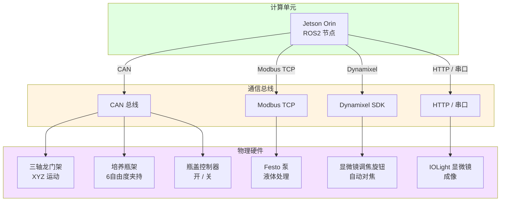

Keywords: Robotics, Cell Culture Automation, Life Sciences, SLAS2026, Whelix, Lab Automation, AI, Autonomous Systems, ROS2, Jetson Orin, Spring Boot, Electron, React

[Learn more at whelix.co](https://whelix.co/products#associan)

# Overview

As **Head of Robotic Engineer at [Whelix](https://whelix.co)**, I lead the design, development, and deployment of the robotic software stack powering our flagship product. In February 2026, the Whelix team brought the **Associan** — our end-to-end fully autonomous cell culture robotic system — to **SLAS 2026** (Society for Laboratory Automation and Screening Annual Conference), one of the premier stages for laboratory automation and life science innovation.

Over three days on the expo floor, the Associan attracted **1,000+ audience members** and generated significant interest from industry leaders including **Festo**, **ThermoFisher Scientific**, and **Boston Children's Hospital**. This post chronicles the engineering story behind the system, the logistics of getting it there, and the reception it received from the global life science community.

# What is Whelix Associan?

The Whelix Associan is an **AI robotic scientist** built specifically for life scientists — enabling truly hands-free, 24/7 autonomous cell culture. At its core, the Associan is built on **Teknician™**, our proprietary AI-powered liquid handling platform designed for cell culture flasks and well plates.

The system integrates every component a cell culture lab needs:

- **Automated incubator** — CO₂-controlled environment with robotic access
- **Refrigerator & heat bath** — reagent storage and pre-warming
- **3-axis gantry robot** — high-precision XYZ motion for flask transport
- **Gripper system** — multi-DOF flask handling and cap control
- **Festo pump** — precision liquid aspiration and dispensing
- **IOLight microscope** — real-time confluency imaging
- **Waste management** — fully closed loop, no manual intervention

**Key specifications** (as shown on the booth sign):

| Specification | Value |
|---------------|-------|
| Flask / Plate Capacity | 45+ cell culture flasks or plates |
| Execution Consistency | >99% |
| Manual Work Reduction | Over 95% |
| Robot Integration | Compatible with external robots |

The Associan supports **45+ flask formats** across multiple manufacturers and well plates, and can scale to:
- **>1 billion cells per run** from a single expansion campaign, OR
- **Parallel expansion of 45+ distinct cell lines** simultaneously

Scientists interact with the system through natural language — describing their protocol via speech or text — and the AI assistant translates that into precise robotic instructions. Real-time confluency imaging and cell count analysis ensure the system acts at the right biological moment, not on a fixed schedule.

# Software Architecture

As Head of Robotic Engineer, I designed and implemented the **entire software stack** for the Associan. The system spans five architectural layers, from the desktop client to the physical hardware, with cloud integration for AI vision and data storage.

This work is a close collaboration with **Enyuare**, our hardware and integration partner, who built the physical hardware platform that my software stack runs on top of.

## High-Level System Architecture

**Layer breakdown:**

- **Desktop App (Electron + React)**: Cross-platform GUI for protocol setup, live monitoring, and result visualization. The AI Assistant layer accepts speech or text input and uses an LLM service to generate structured protocol definitions.
- **Cloud Gateway (Spring Boot)**: Handles authentication, user management, database persistence, and forwards robot commands to the on-device proxy. Also coordinates image uploads to Google Cloud.
- **Robot System (Nginx + Microservices + ROS2)**: On-device services running on the Jetson Orin. Nginx routes requests to domain-specific microservices (robot motion, incubator control, microscope, fluid handling). ROS2 nodes translate high-level commands to hardware control.
- **Hardware Layer**: Physical devices controlled via CAN bus, Modbus TCP, Dynamixel SDK, and HTTP/Serial.
- **Cloud (Google Cloud)**: Stores microscope images and runs Vision AI for confluency analysis and cell counting.

## Autonomous Cell Culture Workflow

The following flowchart illustrates what the Associan does end-to-end — from scientist intent to biological outcome:

Every step — from retrieving flasks, imaging cells, making passage decisions, to dispensing reagents and returning flasks — is executed autonomously. Scientists are notified on completion and can review results (cell counts, confluency trends, images) in the desktop app.

## Hardware Device Communication

The robot-side communication layer maps each hardware device to its appropriate bus protocol:

The **NVIDIA Jetson Orin** serves as the on-device compute brain, running all ROS2 nodes. High-precision motion (gantry, flask holders, cap controller) runs over CAN bus for deterministic timing. The Festo pump uses Modbus TCP for precise volumetric control. Microscope focus is driven by Dynamixel servos, and the IOLight imaging unit communicates over HTTP.

# The Engineering Journey: Build → Pack → Ship → Setup

Getting a precision robotic system from our lab to the SLAS 2026 expo floor in San Diego involved as much engineering as building it.

## Packing and Shipping

The Associan is a large, sensitive system with a 3-axis gantry, precision liquid-handling components, glassware, and an automated incubator. Every joint, every pump line, and every optical component needed to survive a cross-country truck shipment without losing calibration.

We secured the system to a standard pallet with industrial ratchet straps, wrapped exposed components in moving blankets and foam, and documented the configuration to enable rapid reassembly on-site.

## On-Site Setup

Arriving at the SLAS 2026 expo hall, we found our pallet in an empty hall before the crowds arrived. The unboxing process — unwrapping, positioning, reconnecting pneumatic and electrical lines, and recalibrating the gantry — took several hours of focused work.

After physical assembly, the software stack came up cleanly: the Jetson booted, ROS2 nodes initialized, and all microservices connected. We ran calibration routines for the gantry home position, flask holder alignment, and microscope focus. By the time the expo doors opened, the Associan was running live cell passaging demonstrations.

# SLAS 2026 Expo

SLAS (Society for Laboratory Automation and Screening) is the premier conference for laboratory automation professionals, attracting thousands of researchers, engineers, and industry leaders from across the life sciences.

Over three days of live demos, the Whelix booth became a gathering point for anyone interested in the future of autonomous biology.

**By the numbers:**
- **3 days** of continuous live demonstrations
- **1,000+ attendees** engaged with the booth
- **Dozens of in-depth technical conversations** with researchers, engineers, and executives

Live demonstrations included autonomous cell passaging (flask retrieval → imaging → media exchange → splitting → return) and real-time confluency analysis — showing the full end-to-end loop with no human intervention.

# Notable Visitors

The Associan attracted serious interest from organizations across the life science and industrial automation space:

**Festo** — A global leader in industrial and process automation. Their interest centered on the robotic integration layer and potential for their pneumatic and motion components to be incorporated into future Associan configurations.

**ThermoFisher Scientific** — The world's largest supplier of scientific instrumentation and life science reagents. The conversation explored how the Associan could accelerate workflows that today require ThermoFisher benchtop equipment operated manually.

**Boston Children's Hospital** — Pediatric research teams are among the most resource-constrained in academic biology. Their interest focused on using the Associan to enable small teams to run large-scale cell culture experiments that would otherwise require dedicated technician time around the clock.

Additional visitors included biotech companies, contract research organizations (CROs), academic research groups, and automation engineers — representing nearly every sector that touches cell culture today.

# Impact and Significance

Cell culture is the backbone of biological research and manufacturing — from developing cancer therapies and regenerative medicine to producing recombinant proteins and viral vectors. Yet it remains one of the most labor-intensive, error-prone, and time-constrained tasks in any life science lab.

The Associan changes this equation:

- A scientist who previously spent 2–4 hours daily on cell maintenance can now redirect that time entirely to experimental design and analysis
- A single operator can oversee 4–5 Associan robots simultaneously, dramatically multiplying research throughput
- The >99% execution consistency metric means variability from human technique is effectively eliminated
- 24/7 operation means cell passaging happens at the biologically optimal moment — not when a technician is available

One researcher from CMU noted that the system could allow a single graduate student to manage cell culture workloads that previously required a dedicated lab technician.

# What's Next

The SLAS 2026 debut marks the beginning of Associan's presence in the life science automation market. The conversations and partnerships initiated on the expo floor are continuing into formal pilot programs and integration discussions.

If you're interested in learning more about the Whelix Associan or exploring how it might fit your lab's needs, visit [whelix.co/products#associan](https://whelix.co/products#associan).

关键词: 机器人, 细胞培养自动化, 生命科学, SLAS2026, Whelix, 实验室自动化, AI, 自主系统, ROS2, Jetson Orin, Spring Boot, Electron, React

[了解更多请访问 whelix.co](https://whelix.co/products#associan)

# 概述

作为 **[Whelix](https://whelix.co) 机器人工程负责人**，我主导了驱动我们旗舰产品 **Associan** 的机器人软件栈的设计、开发与部署。2026年2月，Whelix 团队将 Associan —— 我们的端到端全自主细胞培养机器人系统 —— 带到了 **SLAS 2026**（实验室自动化与筛选协会年度大会），这是实验室自动化和生命科学创新领域最重要的舞台之一。

在为期三天的展览中，Associan 吸引了超过 **1,000 名观众**，并引起了行业领导者的高度关注，包括 **Festo**、**赛默飞世尔科技（ThermoFisher Scientific）** 和 **波士顿儿童医院**。本文记录了这一系统背后的工程故事、将其运抵展会的物流过程，以及它在全球生命科学界获得的反响。

# Whelix Associan 是什么？

Whelix Associan 是专为生命科学家打造的 **AI 机器人科学家** —— 实现真正的全天候、24/7 自主细胞培养。其核心是 **Teknician™**，我们自主研发的 AI 驱动液体处理平台，专为细胞培养瓶和多孔板设计。

该系统集成了细胞培养实验室所需的每一个组件：

- **自动化培养箱** —— 带机器人访问接口的 CO₂ 控制环境
- **冷藏柜与恒温水浴** —— 试剂储存与预热
- **三轴龙门机器人** —— 高精度 XYZ 运动，用于培养瓶搬运
- **夹持系统** —— 多自由度培养瓶操作与瓶盖控制
- **Festo 泵** —— 精确液体吸取与分配
- **IOLight 显微镜** —— 实时汇合度成像
- **废液管理** —— 完全闭环，无需人工干预

**关键规格**（如展台标牌所示）：

| 规格 | 数值 |
|------|------|
| 培养瓶/板容量 | 45+ 个细胞培养瓶或培养板 |
| 执行一致性 | >99% |
| 减少人工操作 | 超过 95% |
| 机器人集成 | 兼容外部机器人 |

Associan 支持多个厂商的 **45+ 种培养瓶格式**和多孔板，可扩展到：
- 单次扩增 **超过 10 亿个细胞**，或
- 同时**平行扩增 45+ 种不同细胞系**

科学家通过自然语言与系统交互 —— 通过语音或文字描述实验方案 —— AI 助手将其转化为精确的机器人指令。实时汇合度成像和细胞计数分析确保系统在生物学最佳时机采取行动，而不是按固定时间表执行。

# 软件架构

作为机器人工程负责人，我设计并实现了 Associan 的**完整软件栈**。系统跨越五个架构层，从桌面客户端到物理硬件，并集成云端 AI 视觉和数据存储。

这项工作是与 **Enyuare** 的紧密合作成果，Enyuare 是我们的硬件与集成合作伙伴，构建了运行我软件栈的物理硬件平台。

## 高层系统架构

**各层说明：**

- **桌面应用（Electron + React）**：跨平台 GUI，用于实验方案设置、实时监控和结果可视化。AI 助手层接受语音或文字输入，使用 LLM 服务生成结构化的方案定义。
- **云网关（Spring Boot）**：处理认证、用户管理、数据库持久化，并将机器人命令转发到设备端代理，同时协调图像上传到 Google Cloud。
- **机器人系统（Nginx + 微服务 + ROS2）**：运行在 Jetson Orin 上的设备端服务。Nginx 将请求路由到特定领域的微服务（机器人运动、培养箱控制、显微镜、液体处理）。ROS2 节点将高级命令转化为硬件控制。
- **硬件层**：通过 CAN 总线、Modbus TCP、Dynamixel SDK 和 HTTP/串口控制的物理设备。
- **云端（Google Cloud）**：存储显微镜图像并运行 Vision AI 进行汇合度分析和细胞计数。

## 自主细胞培养工作流

以下流程图说明了 Associan 从头到尾的工作过程 —— 从科学家意图到生物学结果：

每一步 —— 从取出培养瓶、对细胞成像、做出传代决策，到分配试剂和送回培养瓶 —— 都是自主执行的。科学家在完成时收到通知，并可以在桌面应用中查看结果（细胞计数、汇合度趋势、图像）。

## 硬件设备通信

机器人端通信层将每个硬件设备映射到其对应的总线协议：

**NVIDIA Jetson Orin** 作为设备端计算大脑，运行所有 ROS2 节点。高精度运动（龙门架、培养瓶架、瓶盖控制器）通过 CAN 总线运行，保证确定性时序。Festo 泵使用 Modbus TCP 进行精确的体积控制。显微镜调焦由 Dynamixel 伺服电机驱动，IOLight 成像单元通过 HTTP 通信。

# 工程历程：构建 → 打包 → 运输 → 安装

将一套精密机器人系统从我们的实验室运到圣地亚哥的 SLAS 2026 展览现场，其工程挑战不亚于构建系统本身。

## 打包与运输

Associan 是一套大型精密系统，包含三轴龙门架、精密液体处理组件、玻璃器皿和自动化培养箱。每个关节、每条泵管和每个光学组件都需要在跨越全国的货运过程中保持校准状态。

我们用工业棘轮绑带将系统固定在标准托盘上，用搬运毯和泡沫包裹暴露的组件，并记录配置以便在现场快速重装。

## 现场安装

抵达 SLAS 2026 展厅时，我们在观众涌入前的空旷展厅中找到了我们的托盘。拆箱过程 —— 拆包、定位、重新连接气动和电气线路、重新校准龙门架 —— 耗费了数小时的专注工作。

物理组装完成后，软件栈顺利启动：Jetson 正常开机，ROS2 节点初始化，所有微服务连接成功。我们对龙门架归零位置、培养瓶架对齐和显微镜对焦进行了校准例程。展会大门开放时，Associan 已经在运行实时细胞传代演示。

# SLAS 2026 展览

SLAS（实验室自动化与筛选协会）是面向实验室自动化专业人士的顶级会议，吸引了来自整个生命科学领域的数千名研究人员、工程师和行业领导者。

在三天的现场演示中，Whelix 展台成为所有对自主生物学未来感兴趣者的聚集地。

**数字概述：**
- **3天** 持续现场演示
- **超过 1,000 名参会者** 参与展台互动
- **数十场深度技术交流** 与研究人员、工程师和高管进行

现场演示包括自主细胞传代（培养瓶取出 → 成像 → 培养基更换 → 分瓶 → 送回）和实时汇合度分析 —— 展示了全端到端闭环，无需任何人工干预。

# 重要访客

Associan 吸引了来自生命科学和工业自动化领域各组织的高度关注：

**Festo** —— 工业和过程自动化领域的全球领导者。他们的兴趣集中在机器人集成层以及他们的气动和运动组件未来可能整合进 Associan 配置的可能性。

**赛默飞世尔科技（ThermoFisher Scientific）** —— 全球最大的科学仪器和生命科学试剂供应商。交流探讨了 Associan 如何加速当今需要手动操作赛默飞世尔台式设备的工作流程。

**波士顿儿童医院** —— 儿科研究团队是学术生物学领域资源最受限的群体之一。他们的兴趣集中在使用 Associan 使小团队能够进行大规模细胞培养实验，而这些实验原本需要全天候专职技术人员的时间。

其他访客包括生物技术公司、合同研究组织（CRO）、学术研究小组和自动化工程师 —— 代表了当今几乎每个涉及细胞培养的行业。

# 影响与意义

细胞培养是生物研究和生产制造的基础 —— 从开发癌症疗法和再生医学，到生产重组蛋白和病毒载体。然而，它仍然是任何生命科学实验室中劳动强度最高、最易出错、时间约束最严格的任务之一。

Associan 改变了这一等式：

- 以前每天花费 2-4 小时进行细胞维护的科学家，现在可以将全部时间转向实验设计和分析
- 单个操作员可以同时监管 4-5 台 Associan 机器人，大幅提升研究产出
- >99% 执行一致性意味着人工操作技术带来的变异性被有效消除
- 24/7 运行意味着细胞传代在生物学最佳时机发生 —— 而不是在技术人员方便的时候

卡内基梅隆大学的一位研究人员指出，该系统可以让一名研究生管理以前需要专职实验室技术人员才能完成的细胞培养工作量。

# 下一步计划

SLAS 2026 的亮相标志着 Associan 在生命科学自动化市场存在的开始。在展台上发起的对话和合作正在继续推进为正式的试点项目和集成讨论。

如果您有兴趣了解更多关于 Whelix Associan 的信息，或探索它如何适合您实验室的需求，请访问 [whelix.co/products#associan](https://whelix.co/products#associan)。

