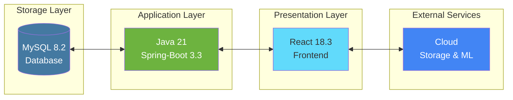
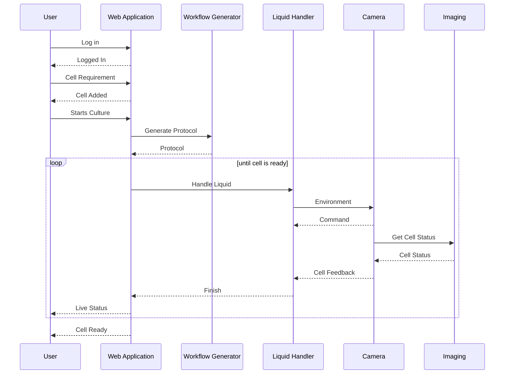

C++, Python, ROS2, YOLO, OpenCV, React, Java, React, SpringBoot, MySQL, UART, ATMega2560

**Author**: Allen Liu

The goal of this project is to build a robotic system to automate the process of the cell culture. The robotic system a gantry robot to perform the liquid and flask handling, flask platform to hold and manuver the flasks, a custom-built microscope to validate the cell organism as well as a web application for user-interaction and teleoperation.

# Architecture

This system can be split into four parts: 
1. Robotic Control software using `ROS2 Iron` on `Nvidia Jetson Orin Nano`
2. Motor control embedded software using embedded `C++`
3. A 3-tier web application using `React.js`, `Java Spring-Boot` and `MySQL`
4. Micrroscope Controller software

The overall software architecture is shown in the diagram below:

```mermaid
graph TB
    subgraph WebTier["Web Application Tier"]
        MYSQL[(MySQL<br/>Database)]
        SPRING[Java SpringBoot<br/>Backend]
        REACT[React.js<br/>Frontend]
    end

    subgraph Bridge["Communication Layer"]
        HTTP_BRIDGE[ROS2 HTTP Bridge]
    end

    subgraph RoboticsTier["Robotics Tier<br/>Nvidia Jetson Orin Nano"]
        ROS2[ROS2 Iron]
        MCU[Micro-Controller]
        GANTRY[Gantry Liquid Handler]
        REALSENSE[Realsense2<br/>Camera]
        MQTT[MQTT]
        MICROSCOPE[Microscope]
    end

    subgraph CloudTier["Cloud Services"]
        CLOUD[Cloud Storage]
        ML[Machine Learning<br/>Cell Analysis]
    end

    MYSQL --> SPRING
    SPRING <--> REACT
    REACT <--> HTTP_BRIDGE
    HTTP_BRIDGE <--> ROS2

    ROS2 --> MCU
    MCU --> GANTRY
    ROS2 --> REALSENSE
    ROS2 --> MQTT
    MQTT --> MICROSCOPE

    ROS2 --> CLOUD
    CLOUD --> ML
    ML --> CLOUD
    CLOUD --> REACT

    style MYSQL fill:#4479A1
    style SPRING fill:#6DB33F
    style REACT fill:#61DAFB
    style ROS2 fill:#22314E
    style CLOUD fill:#4285F4
```

In this system the robotic software and web application will be communicated via HTTP protocol that web application can send command to  the robotic software while robotic software will stream the live status of the robot to the web and display it to the user. On the cloud side, the cell image will be taken from the microscope control software and upload it to cloud while cloud will perform the analysis using AI and send the result and image to the web.

## Robotic Control Software Architecture

The robotic software is intregated over `ROS2 Iron` platform to ensure seamless communication between processes. The `ROS2` platform is using `Fast DDS` to implement the Inter-Process Communication (IPC), that all process can be easily communicate with each other as long as they are on the same subnet.

The architecture of the Robotic control software follows the ROS2 node communication pattern with topics and services connecting the various packages.

The entire software consists of 10 packages:

 - `dynamixel_control`: Package to control the dynamixel motor on flask and pump operation.
   - Communicates with the `dynamixel` motors via `RS485`
 - `festo_control`: Package to control the festo pump to dispense and aspirate liquid.
 - `gantry_control`: Package to do the motion control of the gantry robot.
   - Communicates with the microcontroller via serial port.
 - `gantry_interfaces`: Custom interfaces for transporting data between processes.
 - `microscope_control`: Control the actions of the microscope.
   - Communicate with microscope via `MQTT 2.0`
 - `protocol_executer`: Execute the high-level protocols of the robot system.
   - Handles the external request over `HTTP 1.0`
 - `robot_control`: Launch all controller of the robot.
 - `robot_vision`: Perform the computer vision calculation of the robot.
   - `YOLOv8` object detection model to detect flask
   - `YOLOv8` classification model to classify cell
   - Segment the cells using `OpenCV` for calculating confluency
 - `robot_viz`: Visualize the robot system.

## Web Application Architecture

 The web application is a 3-tier software architectutre with Presentation layer written in `React.js`, application layer written by `Java 21` using `Spring-Boot 3.0` framework and a storage layer using `MySQL`.

## Robot Workflow

This robotic system allows user to customize their own workflow to perform a particular protocol on various cell culture process. The sequence diagram shows the general workflow for one particular cell culture process.

This work flow consists of following steps:

1. User logs into the system.
2. User inputs the information and requirements of the cell to be culcured. (e.g. Cell type, desired confluency, etc.)
3. System will generate a workflow for the specific task defined by user.
4. When user send the request to start cell culture process, the system will follow each step on the workflow.
5. During each step, system will perform a self-inspection of the current cell.
6. If the cell is ready system will terminate the task.
7. Finally System will send the message to user indicating the cell culcture is finished.

C++, Python, ROS2, YOLO, OpenCV, React, Java, SpringBoot, MySQL, UART, ATMega2560

**作者**: Allen Liu

该项目的目标是构建一个机器人系统来自动化细胞培养过程。机器人系统包括一个龙门机器人来执行液体和培养瓶处理，一个培养瓶平台来固定和操作培养瓶，一个定制显微镜来验证细胞有机体，以及一个用于用户交互和遥操作的 Web 应用程序。

# 架构

该系统可以分为四个部分：
1. 使用 `ROS2 Iron` 在 `Nvidia Jetson Orin Nano` 上的机器人控制软件
2. 使用嵌入式 `C++` 的电机控制嵌入式软件
3. 使用 `React.js`、`Java Spring-Boot` 和 `MySQL` 的三层 Web 应用程序
4. 显微镜控制软件

## 机器人控制软件架构

机器人软件集成在 `ROS2 Iron` 平台上，确保进程之间的无缝通信。`ROS2` 平台使用 `Fast DDS` 实现进程间通信（IPC），只要所有进程在同一子网上，就可以轻松地相互通信。

整个软件由 10 个软件包组成：

 - `dynamixel_control`: 控制培养瓶和泵操作上的 dynamixel 电机
 - `festo_control`: 控制 festo 泵进行液体分配和吸取
 - `gantry_control`: 进行龙门机器人的运动控制
 - `gantry_interfaces`: 用于进程间数据传输的自定义接口
 - `microscope_control`: 控制显微镜的动作
 - `protocol_executer`: 执行机器人系统的高级协议
 - `robot_control`: 启动机器人的所有控制器
 - `robot_vision`: 执行机器人的计算机视觉计算
 - `robot_viz`: 可视化机器人系统

## Web 应用程序架构

Web 应用程序是一个三层软件架构，表示层使用 `React.js` 编写，应用层使用 `Java 21` 和 `Spring-Boot 3.0` 框架编写，存储层使用 `MySQL`。

## 机器人工作流程

该机器人系统允许用户自定义自己的工作流程，在各种细胞培养过程中执行特定协议。

此工作流程包括以下步骤：

1. 用户登录系统。
2. 用户输入要培养的细胞的信息和要求（例如：细胞类型、期望汇合度等）
3. 系统将为用户定义的特定任务生成工作流程。
4. 当用户发送开始细胞培养过程的请求时，系统将遵循工作流程中的每个步骤。
5. 在每个步骤中，系统将对当前细胞进行自检。
6. 如果细胞准备就绪，系统将终止任务。
7. 最后，系统将向用户发送消息，表明细胞培养已完成。

